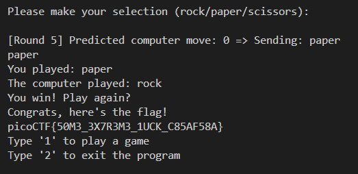

### 🧠 Challenge Summary:

You're playing a game of Rock-Paper-Scissors against a server. If you **win 5 times in a row**, you get the **flag**.

---

### 🕳️ Vulnerability in the Code

Here's the key vulnerable code in C:

```c
srand(time(0));  // Seeds random number generator with current time
int computer_turn = rand() % 3;
```

This line is **run every time** the function `play()` is called.

The issue:

* `srand(time(0))` seeds `rand()` using the **current UNIX timestamp in seconds**.
* If the attacker can **predict the exact second**, then `rand()` becomes **fully predictable**.

---

### 💥 Exploitation Strategy

1. You know the computer move is `rand() % 3`, where `rand()` is seeded with `time(0)`.
2. So, you can just simulate that locally using `int(time.time()) % 3`.
3. You then **choose the move that beats** the computer's predicted move.

For example:

| `rand() % 3` | Computer Move | Your Move (to win) |
| ------------ | ------------- | ------------------ |
| 0            | rock          | paper              |
| 1            | paper         | scissors           |
| 2            | scissors      | rock               |

This logic is stored in:

```python
loses = ["paper", "scissors", "rock"]
```

So:

```python
def counter_move(computer_move):
    return loses[computer_move]
```

---

### 🛠️ How the Script Works (Step-by-Step)

1. **Connect** to the challenge server using `socket`.
2. **For 5 rounds**, it:

   * Sends `1` to play.
   * Waits for the prompt asking for your move.
   * Predicts the computer's move with `predict_computer_move(round_num)` which just does `time.time() + round_num % 3`.
   * Sends the **winning move**.
   * Reads the result and waits for the next prompt.
3. After 5 wins, the **server gives you the flag.**

---

### 🔁 About Time Syncing

The only tricky part is making sure your local clock is synchronized with the server’s clock — because even a 1-second drift means you’ll predict the wrong move.

The script uses:

```python
seed = int(time.time()) + round_num
```

to **adjust forward slightly** for each round, assuming the `time(0)` on the server was when the game was initiated and each call is made about a second apart.

If you ever get wrong predictions, try adjusting with:

```python
seed = int(time.time()) + round_num - 1
```

or

```python
seed = int(time.time()) + round_num + 1
```

---

### ✅ Final Goal


---


### 🔒 Mitigation for This Vulnerability


1. Use srand() only once globally
Calling srand(time(0)) every time the user plays allows the attacker to predict the seed easily. Instead, it should only be called once at the beginning of the program.

```c
int main() {
    srand(time(0));  // Seed once
    while (1) {
        play();
    }
}
```
This way, rand() produces a pseudo-random sequence instead of repeating the same number if time doesn’t change between calls.

