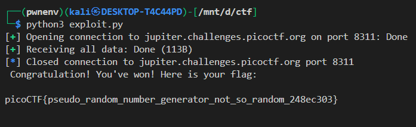

# **PicoCTF 2024 — seed-sPRiNG Write-Up**


## **1. Challenge Overview**

We’re given a binary called `seed_sPRiNG` and told:

> The most revolutionary game is finally available: seed sPRiNG is open right now! Guess the height 30 times to win.

When running the binary locally, we see:

```
LEVEL (1/30)
Guess the height: 
```

If we guess wrong:

```
WRONG! Sorry, better luck next time!
```

To get the flag, we must guess **30 correct numbers in a row**.

---

## **2. Reverse Engineering the Binary**

Loading the binary into **Ghidra**, we find the relevant snippet in `main()`:

```c
local_18 = time((time_t *)0x0);
srand(local_18);

while (level <= 30) {
    random_val = rand();
    random_val = random_val & 0xf;  // Only keep last 4 bits (0-15)

    printf("Guess the height: ");
    scanf("%d", &guess);

    if (random_val != guess) {
        puts("WRONG! Sorry, better luck next time!");
        exit(-1);
    }
    level++;
}
```

---

### **Key Observations**

1. **PRNG Seeding** — `srand(time(0))` seeds the RNG with the current Unix timestamp (seconds).
2. **Predictable Output** — If we know the seed, we can exactly replicate `rand()` outputs.
3. **Small Output Range** — The `& 0xf` means only 16 possible values (0–15), but since the RNG sequence is deterministic, guessing becomes trivial if we sync the seed.

---

## **3. The Vulnerability**

The weakness here is **time-based seeding**.
If both the server and attacker call:

```c
srand(time(0));
```

at roughly the same second, the attacker can run `rand()` locally and get the **same sequence**.

This is a textbook **Predictable PRNG Seed** vulnerability (CWE-338).

---

## **4. Exploit Strategy**

The plan:

1. **Connect to the remote challenge**.
2. **Guess the seed**:

   * Most likely `current_time ± a few seconds` (to handle latency).
3. **Reproduce the RNG sequence locally** using the guessed seed.
4. **Send the correct guesses back to the server** for all 30 rounds.
5. **Receive the flag**.

---

## **5. Exploit Code**

We use **pwntools** for networking and **ctypes** to directly use C’s `srand()` and `rand()` for 1:1 matching.

```python
from pwn import *
import ctypes
import time

# Connect to the challenge
r = remote("jupiter.challenges.picoctf.org", 8311)

# Load C's rand/srand
libc = ctypes.CDLL("libc.so.6")

# Sync our seed to the current second
seed = int(time.time())
libc.srand(seed)

# Predict the next 30 numbers
guesses = [(libc.rand() & 0xF) for _ in range(30)]

# Now send them all, reading prompts in between
for guess in guesses:
    r.recvuntil(b"Guess the height:")
    r.sendline(str(guess).encode())

# Print any remaining output (flag)
print(r.recvall().decode())
```

---

## **6. Reliability Improvements**

Since network delay can cause a **1-second mismatch**, we can improve it:

```python
possible_seeds = [seed-1, seed, seed+1]
for s in possible_seeds:
    libc.srand(s)
    guesses = [(libc.rand() & 0xF) for _ in range(30)]
    # Try sending guesses...
```

This way, we check ±1 second around the current time.

---

## **7. Example Output**

When it works, the program auto-plays the game:



---

## **8. Lessons Learned**

* **Never use `time(0)` for security-sensitive RNG** — predictable seeds make output trivial to guess.
* **PRNG ≠ CSPRNG** — `rand()` in libc is not cryptographically secure.
* In real-world systems, predictable RNG has led to **broken encryption**, **bypassed authentication**, and **lottery fraud**.
* Always use cryptographically secure RNG functions like:

  * `arc4random()` (BSD)
  * `/dev/urandom` (Linux)
  * `CryptGenRandom` (Windows)
  * Python’s `secrets` module

---
