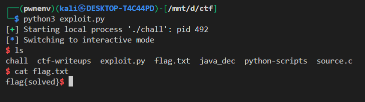

# ELF x86 - Stack buffer overflow basic 3

**Challenge:** small vulnerable binary that prompts `Enter your name:` and reads bytes in a loop into local variables:

* `char buffer[64];`
* `int check;`
* `int i = 0;`
* `int count = 0;`

Program behavior (relevant parts):

* Each input byte is `read(..., &i, 1)` (1 byte written into `int i`).
* `switch(i)` handles special bytes:

  * `'\n'` → bell
  * `0x08` (backspace) → `count--;` and print backspace
  * `0x04` → prints tab and `count++;`
  * default → `buffer[count] = i; count++;`
* At top of loop it checks `if (check == 0xbffffabc) shell();`

Goal: make the program call `shell()` (i.e., make `check == 0xbffffabc`) without any privileged interaction.
We control the input bytes sent to stdin.

---

## Vulnerability summary

1. **Out-of-bounds index / negative index write**
   The program uses `count` as an index into `buffer` but does not bound check nor prevent `count` from going negative. Special handling of backspace (`0x08`) decrements `count`. By sending backspace bytes we can make `count` negative. Subsequent `default` writes use `buffer[count]` with a negative index — writing before the `buffer` area on the stack and corrupting other local variables (in this case `check`).

2. **Uninitialized `check`**
   `check` is never initialized by the program, so its value is undefined at start — the program relies on `check` equalling a magic value to spawn a shell. We can *set* `check` by writing bytes into the appropriate stack location using negative `count`.

3. **`read(..., &i, 1)` writes a single byte into the least-significant byte of an `int`**
   That is odd but workable: the byte read is subsequently used in the `switch` and stored into the buffer/index. Because the code stores `i` into `buffer[count]` (promoted/truncated as needed) this reads and writes single bytes.

**Net effect:** using backspace bytes to drive `count` negative, then sending the 4 bytes of the magic value in **little-endian** order will write those bytes into the `check` variable on the stack. When the loop reaches the `if (check == 0xbffffabc)` test, it will be true and `shell()` will be called.

---

## Exploit idea (high level)

1. Send `0x08` (backspace character) repeated `N` times so `count` becomes `-N`.
2. Send 4 bytes that represent `0xbffffabc` in little-endian (`\xbc\xfa\xff\xbf`). Those bytes will be stored by `buffer[count]`, `buffer[count+1]`, ... which map to memory locations before `buffer` — overwriting `check`.
3. The next loop iteration checks `if (check == 0xbffffabc)` and calls `shell()`.

---

## exploit

```python
#!/usr/bin/env python3
from pwn import *

context.log_level = 'info'

p = process('./chall')

p.recvuntil(b"Enter your name: ")

payload = b""

for _ in range(4):
    payload += b'\x08'
    
payload += p32(0xbffffabc)
p.send(payload)
p.interactive()
```


