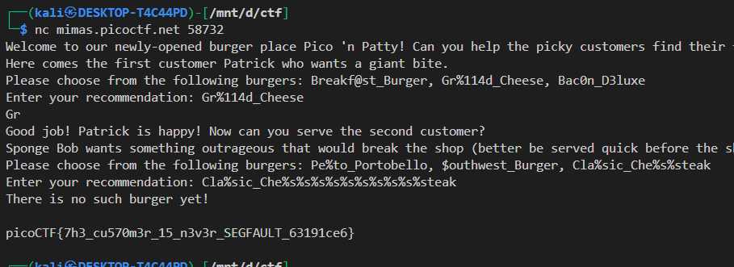

## 🧠 Format String Exploit Write-up: **format-string-0**

### 📁 Challenge Overview

You're given a binary called `format-string-0` with the source code, and the objective is to **leak the flag**.

### 🔍 Vulnerable Code Summary

The binary simulates a burger shop where:

* You serve **two customers**: Patrick and SpongeBob.
* If you make Patrick happy, you get to serve SpongeBob.
* If SpongeBob crashes the shop (causing a segfault), the **`SIGSEGV` handler prints the flag**:

```c
void sigsegv_handler(int sig) {
    printf("\n%s\n", flag);
    exit(1);
}
```

### 🐞 The Vulnerabilities

#### 1. `printf(choice1)` and `printf(choice2)` are **unfiltered format strings**:

```c
int count = printf(choice1);   // in serve_patrick()
printf(choice2);               // in serve_bob()
```

These are directly controlled by user input **without format string protections**.

#### 2. Patrick's check uses:

```c
if (count > 2 * BUFSIZE)
```

So if the `printf(choice1)` **prints more than 64 characters**, you proceed to SpongeBob.

#### 3. SpongeBob's burger names in `menu2[]` include format specifiers:

```c
"Cla%sic_Che%s%steak"
```

So you can input that *exact string* to pass the menu check, but it also gets evaluated as a format string!

---

## 🧪 Exploitation Steps

### 🧱 Step 1: Trigger Patrick's condition

Input a burger that is on the menu, **but with a long format string** to make `printf(choice1)` print >64 characters.

✅ Input:

```
Gr%114d_Cheese
```

This prints a long string due to `%114d`, satisfying the `count > 64` check and calls `serve_bob()`.

---

### 🧱 Step 2: Trigger the crash in Bob's order

You're given this valid menu item:

```
Cla%sic_Che%s%steak
```

Now, add **more format specifiers** (e.g., `%s%s%s...`) to force `printf(choice2)` to read invalid stack memory and crash.

✅ Input:

```
Cla%sic_Che%s%s%s%s%s%s%s%s%s%steak
```

This causes a **segmentation fault** when an invalid address is read from the stack, and the `SIGSEGV` handler prints the flag.

---

## 🏁 Flag Output


---

## 🧨 Summary

| Step    | Action                                                                |
| ------- | --------------------------------------------------------------------- |
| Patrick | Use a valid burger with `%Nd` to increase output                      |
| Bob     | Use the valid `Cla%sic_Che%s%steak` name, spam `%s` to cause segfault |
| Result  | Segfault triggers signal handler, flag printed                        |

---

## 💡 Key Takeaways

* Format string bugs can be triggered even through *intended* user input if the format string is not sanitized.
* `printf()` returning a character count can be abused as a logic gate.
* If a signal handler is used on crash (SIGSEGV), it becomes an exploit vector for unintended behavior like leaking secrets.

