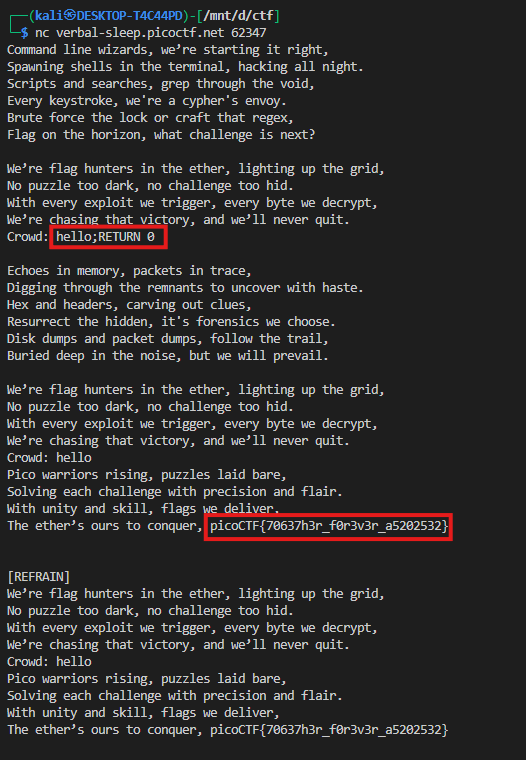

# **Flag Hunters**

We were given a Python program that prints lyrics from a song-like structure. The lyrics include labels like `[VERSE1]` and `[REFRAIN]`, along with pseudo-commands like `REFRAIN;`, `RETURN`, and `CROWD`. The challenge description hinted that:

> “Lyrics jump from verses to the refrain kind of like a subroutine call. There's a hidden refrain this program doesn't print by default. Can you get it to print it?”

The goal was to extract the **flag**, which is hidden in a “refrain” block at the top of the song.

---

## **Step 1: Analyze the code**

Looking at the script:

* `song_flag_hunters` contained lyrics with labeled sections `[VERSE1]` and `[REFRAIN]`.
* The first `[REFRAIN]` block contains `secret_intro`, which includes the flag:

```python
secret_intro = '''Pico warriors rising, puzzles laid bare,
Solving each challenge with precision and flair.
With unity and skill, flags we deliver,
The ether’s ours to conquer, ''' + flag + '\n'
```

* The function `reader(song, startLabel)` does the following:

  1. Starts at a given label (e.g., `[VERSE1]`).
  2. Iterates line by line.
  3. If it sees `REFRAIN;`, it jumps to `[REFRAIN]`.
  4. If it sees `RETURN`, it jumps back to the line after the call.
  5. If it sees a line starting with `CROWD`, it prompts the user for input:

```python
elif re.match(r"CROWD.*", line):
    crowd = input('Crowd: ')
```

* Essentially, the program **simulates subroutine calls** where `[REFRAIN]` is a function and `RETURN` is the return.

---

## **Step 2: Understand the flow**

1. The program starts at `[VERSE1]`.
2. It prints the verse lines.
3. When it sees `REFRAIN;`, it jumps to `[REFRAIN]`.
4. In `[REFRAIN]`, it prints the lyrics, then hits:

```text
CROWD (Singalong here!);
```

* At this point, the program pauses and asks for input:

```
Crowd: 
```

* After providing any input, it continues printing, eventually reaching the **hidden `secret_intro`**, which contains the flag.

---

## **Step 3: Extract the flag**

From the remote session:

```
Crowd: hello;RETURN 0
Pico warriors rising, puzzles laid bare,
Solving each challenge with precision and flair.
With unity and skill, flags we deliver,
The ether’s ours to conquer, picoCTF{70637h3r_f0r3v3r_a5202532}
```

`RETURN 0` is the “return address” to go back to flag.


* **Flag extracted:**



* The program repeats the `[REFRAIN]` for each `REFRAIN;` call in `[VERSE1]` and subsequent verses, showing that the logic simulates **subroutine calls**.

---