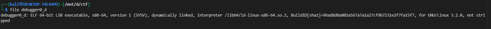
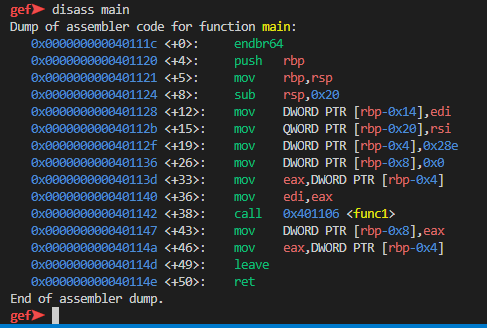
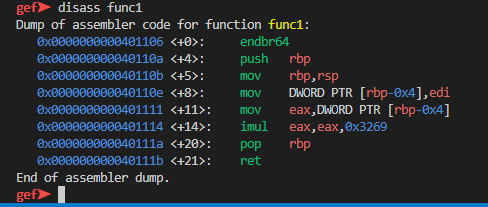
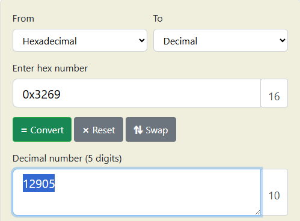

# **GDB baby step 4**


this challange is same as [GDB baby step 1](../7/) & [GDB baby step 2](../8/) & [GDB baby step 3](../9/)

### Description

> main calls a function that multiplies eax by a constant. The flag for this challenge is that constant in decimal base. If the constant you find is 0x1000, the flag will be picoCTF{4096}.

 


you can download gdb from [here](https://www.sourceware.org/gdb/) 

i will use [gef](https://github.com/hugsy/gef.git) a modern experience for GDB with advanced debugging capabilities for exploit devs & reverse engineers on Linux




here we can see that 

```bash
call   0x401106 <func1>
```

this is the function that multiplies eax by a constant.

so we have to dissemble this function



here we can see that `imul   eax,eax,0x3269` 

eax is multiplied by `0x3269`




so the flag would be `picoCTF{12905}`